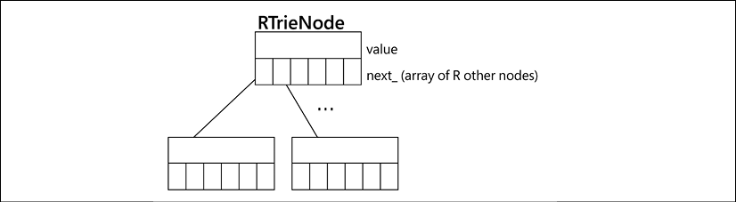

本章，我们将探索在 Python 中表达思想的方式，以及它自己的特点。如果您熟悉完成编程中某些任务的标准方法（例如获取列表的最后一个元素、迭代和搜索），或者您来自其他编程语言（例如 C、C++ 和 Java），然后你会发现，总的来说，Python 为大多数常见任务提供了自己的机制。

在编程中，习惯用法是编写代码以执行特定任务的特殊方式。每次都重复并遵循相同的结构是很常见的事情。有些人甚至可以争论并称它们为模式，但要小心，因为它们不是设计模式（我们将在后面探讨）。主要区别在于设计模式是高级思想，独立于语言（某种程度上），但它们不会立即转化为代码。另一方面，习语实际上是经过编码的。这是当我们想要执行特定任务时应该写的东西。

由于习语是代码，因此它们依赖于语言。每种语言都有自己的习惯用法，这意味着在该特定语言中处理事情的方式（例如，您将如何用 C 或 C++ 打开和编写文件）。当代码遵循这些惯用语时，它被称为惯用语，在 Python 中通常称为 Pythonic。

遵循这些建议并首先编写 Pythonic 代码有多种原因（正如我们将看到和分析的），因为以惯用方式编写代码通常效果更好。它也更紧凑，更容易理解。这些是我们在代码中一直想要的特性，以便它有效地工作。

其次，如前一章所述，让整个开发团队习惯相同的代码模式和结构很重要，因为这将有助于他们专注于问题的真正本质，并有助于他们避免犯错误.

本章的目标如下：

- 了解索引和切片，并正确实现可编入索引的对象
- 实现序列和其他可迭代对象
- 了解上下文管理器的良好用例，以及如何编写有效的用例。
- 通过魔法方法实现更惯用的代码
- 避免 Python 中导致不良副作用的常见错误

我们将在下一节中探索列表中的第一项（索引和切片）。

## 索引和切片

在 Python 中，与在其他语言中一样，某些数据结构或类型支持通过索引访问其元素。 它与大多数编程语言的另一个共同点是第一个元素放在索引号 0 中。然而，与这些语言不同的是，当我们想要以与平常不同的顺序访问元素时，Python 提供了额外的功能。

例如，您将如何访问 C 中数组的最后一个元素？ 这是我第一次尝试 Python 时所做的事情。 以与 C 相同的方式思考，我将在数组长度减一的位置获取元素。 在 Python 中，这也适用，但我们也可以使用负索引号，它将从最后一个元素开始计数，如以下命令所示：

```python
>>> my_numbers = (4, 5, 3, 9)
>>> my_numbers[-1]
9
>>> my_numbers[-3]
5
```

这是 Pythonic 做事方式的一个例子。

除了只获取一个元素，我们还可以使用 slice 获取多个元素，如下命令所示：

```python
>>> my_numbers = (1, 1, 2, 3, 5, 8, 13, 21)
>>> my_numbers[2:5]
(2, 3, 5)
```

在这种情况下，方括号上的语法意味着我们获得元组上的所有元素，从第一个数字的索引（包括）开始，直到第二个数字的索引（不包括它）。 通过排除所选间隔的结尾，切片在 Python 中以这种方式工作。

您可以排除间隔，开始或停止之一，在这种情况下，它将分别从序列的开头或结尾开始，如以下命令所示：

```python
>>> my_numbers[:3]
(1, 1, 2)
>>> my_numbers[3:]
(3, 5, 8, 13, 21)
>>> my_numbers[::]  # also my_numbers[:], returns a copy
(1, 1, 2, 3, 5, 8, 13, 21)
>>> my_numbers[1:7:2]
(1, 3, 8)
```

在第一个示例中，它将获取位置编号 3 中的索引之前的所有内容。在第二个示例中，它将获取从位置 3（含）到末尾的所有数字。 在倒数第二个示例中，两端都被排除在外，它实际上是在创建原始元组的副本。

最后一个示例包含第三个参数，即步骤。 这表示在迭代间隔时要跳转的元素数量。 在这种情况下，这意味着获取位置 1 和 7 之间的元素，跳跃两个。

在所有这些情况下，当我们将区间传递给序列时，实际发生的是我们传递的是切片。 注意 slice 是 Python 中的一个内置对象，你可以自己构建并直接传递：

```python
>>> interval = slice(1, 7, 2)
>>> my_numbers[interval]
(1, 3, 8)
>>> interval = slice(None, 3)
>>> my_numbers[interval] == my_numbers[:3]
True
```

请注意，当缺少其中一个元素（开始、停止或步骤）时，它被视为无。

> 你应该始终更喜欢对切片使用这种内置语法，而不是手动尝试在 for 循环内迭代元组、字符串或列表，手动排除元素。

### 创建您自己的序列

我们刚刚讨论的功能之所以有效，要归功于一个名为 \_\_getitem\_\_ 的魔法方法（魔法方法是用双下划线包围的方法，Python 用于保留特殊行为）。这是在调用 myobject[key] 之类的东西时调用的方法，将键（方括号内的值）作为参数传递。一个序列，特别是，是一个同时实现 \_\_getitem\_\_ 和 \_\_len\_\_ 的对象，因此，它可以被迭代。列表、元组和字符串是标准库中序列对象的示例。

在本节中，我们更关心通过键从对象中获取特定元素，而不是构建序列或可迭代对象，这是第 7 章生成器、迭代器和异步编程中探讨的主题。

如果要在域中的自定义类中实现 \_\_getitem\_\_，则必须考虑一些注意事项才能遵循 Pythonic 方法。

如果您的类是标准库对象的包装器，您最好将行为尽可能多地委托给底层对象。这意味着如果您的类实际上是列表上的包装器，请调用该列表上的所有相同方法以确保它保持兼容。在下面的清单中，我们可以看到一个对象如何包装列表的示例，对于我们感兴趣的方法，我们只需将其委托给列表对象上的相应版本：

```python
from collections.abc import Sequence
class Items(Sequence):
    def __init__(self, *values):
        self._values = list(values)
    def __len__(self):
        return len(self._values)
    def __getitem__(self, item):
        return self._values.__getitem__(item)
```

为了声明我们的类是一个序列，它实现了 collections.abc 模块（https://docs.python.org/3/library/collections.abc.html）中的 Sequence 接口。对于您编写的旨在作为标准类型对象（容器、映射等）的类，实现该模块中的接口是一个好主意，因为这揭示了该类的意图，也因为使用接口将迫使您实现所需的方法。

此示例使用组合（因为它包含一个列表的内部协作者，而不是从列表类继承）。另一种方法是通过类继承，在这种情况下，我们将不得不扩展 collections.UserList 基类，以及本章最后一部分提到的注意事项和注意事项。

但是，如果您要实现自己的序列而不是包装器或不依赖于任何下面的内置对象，请记住以下几点：

1. 按范围索引时，结果应该是类的相同类型的实例
2. 在 slice 提供的范围内，尊重 Python 使用的语义，不包括末尾的元素

第一点是一个微妙的错误。想一想——当你得到一个列表的一部分时，结果是一个列表；当您要求元组中的范围时，结果是一个元组；当您请求一个子字符串时，结果是一个字符串。在每种情况下，结果与原始对象的类型相同是有意义的。如果您正在创建一个表示日期间隔的对象，并且您要求该间隔的范围，则返回列表或元组或其他内容将是错误的。相反，它应该返回具有新间隔集的同一类的新实例。最好的例子是标准库中的 range 函数。如果您使用间隔调用 range，它将构造一个可迭代对象，该对象知道如何生成选定范围内的值。当您为范围指定一个区间时，您会得到一个新的范围（这是有道理的），而不是一个列表：

```python
>>> range(1, 100)[25:50]
range(26, 51)
```

第二条规则也是关于一致性的——如果你的代码与 Python 本身一致，你的代码的用户会发现它更熟悉、更容易使用。作为 Python 开发人员，我们已经习惯了切片如何工作、范围函数如何工作等概念。在自定义类上创建异常会造成混乱，这意味着它会更难记住，并且可能会导致错误。

现在我们了解了索引和切片，以及如何创建我们自己的切片，在下一节中，我们将采用相同的方法，但用于上下文管理器。首先，我们将了解标准库中的上下文管理器是如何工作的，然后我们将进入下一个级别并创建我们自己的。

## 上下文管理器

上下文管理器是 Python 提供的一个非常有用的特性。它们如此有用的原因是它们正确地响应了一个模式。在某些情况下，我们希望运行一些具有前置条件和后置条件的代码，这意味着我们希望分别在某个主要操作之前和之后运行事物。上下文管理器是在这些情况下使用的好工具。

大多数时候，我们会看到围绕资源管理的上下文管理器。例如，在我们打开文件的情况下，我们希望确保它们在处理后关闭（因此我们不会泄漏文件描述符）。或者，如果我们打开与服务（甚至是套接字）的连接，我们也希望确保相应地关闭它，或者在处理临时文件时，等等。

在所有这些情况下，你通常必须记住释放所有分配的资源，这只是考虑最好的情况——但是异常和错误处理呢？ 鉴于处理程序的所有可能组合和执行路径使调试变得更加困难，解决此问题的最常见方法是将清理代码放在 finally 块中，以便我们确保不会错过它。 例如，一个非常简单的案例如下所示：

```python
fd = open(filename)
try:
    process_file(fd)
finally:
    fd.close()
```

尽管如此，还有一种更优雅和 Pythonic 的方式来实现同样的事情：

```python
with open(filename) as fd:
    process_file(fd)
```

with 语句 (PEP-343) 进入上下文管理器。在这种情况下，open 函数实现了上下文管理器协议，这意味着文件将在块完成时自动关闭，即使发生异常。

上下文管理器由两个魔法方法组成：\_\_enter__ 和 \_\_exit\_\_。在上下文管理器的第一行，with 语句将调用第一个方法 \_\_enter\_\_，并且该方法返回的任何内容都将分配给标记为 as 之后的变量。这是可选的——我们真的不需要返回任何特定于 \_\_enter\_\_ 方法的东西，即使我们这样做了，如果不需要，仍然没有严格的理由将它分配给一个变量。

执行此行后，代码进入一个新的上下文，可以在其中运行任何其他 Python 代码。在该块上的最后一条语句完成后，上下文将退出，这意味着 Python 将调用我们第一次调用的原始上下文管理器对象的 \_\_exit\_\_方法。

如果上下文管理器块内部出现异常或错误，仍会调用 \_\_exit\_\_ 方法，这方便安全地管理条件的清理。事实上，这个方法接收在块上触发的异常，以防我们想以自定义方式处理它。

尽管在处理资源时经常会发现上下文管理器（如我们提到的文件、连接等示例），但这并不是它们拥有的唯一应用程序。我们可以实现我们自己的上下文管理器来处理我们需要的特定逻辑。

上下文管理器是分离关注点和隔离应该保持独立的代码部分的好方法，因为如果我们混合它们，那么逻辑将变得更难维护。

例如，考虑一种情况，我们希望使用脚本运行数据库备份。需要注意的是，备份是离线的，这意味着我们只能在数据库未运行时进行备份，为此我们必须停止它。运行备份后，我们要确保再次启动该过程，而不管备份本身的过程如何。

现在，第一种方法是创建一个巨大的单体函数，尝试在同一个地方做所有事情，停止服务，执行备份任务，处理异常和所有可能的边缘情况，然后再次尝试重新启动服务。你可以想象这样一个函数，因此，我不会告诉你细节，而是直接提出一种可能的方法来解决这个问题，上下文管理器：

```python
def stop_database():
    run("systemctl stop postgresql.service")
def start_database():
    run("systemctl start postgresql.service")
class DBHandler:
    def __enter__(self):
        stop_database()
        return self
    def __exit__(self, exc_type, ex_value, ex_traceback):
        start_database()
def db_backup():
    run("pg_dump database")
def main():
    with DBHandler():
        db_backup()
```

在这个例子中，我们不需要块内的上下文管理器的结果，这就是为什么我们可以考虑，至少对于这个特殊情况，\_\_enter\_\_ 的返回值是无关紧要的。这是在设计上下文管理器时需要考虑的事情——一旦块启动，我们需要什么？作为一般规则，总是在 \_\_enter\_\_上返回一些东西应该是一个好习惯（虽然不是强制性的）。

在这个块中，我们只运行备份任务，独立于维护任务，正如我们之前看到的。我们还提到，即使备份任务有错误，\_\_exit\_\_ 仍会被调用。

注意 \_\_exit\_\_ 方法的签名。它接收在块上引发的异常的值。如果块上没有异常，它们都没有。

\_\_exit\_\_ 的返回值是需要考虑的。通常，我们希望保持方法原样，而不特别返回任何内容。如果此方法返回 True，则意味着可能引发的异常不会传播到调用者，而是会在那里停止。有时，这是想要的效果，甚至可能取决于引发的异常类型，但一般来说，吞下异常并不是一个好主意。请记住：错误永远不应该静默传递。

> 请记住不要在 \_\_exit\_\_ 上意外返回 True。 如果您这样做，请确保这正是您想要的，并且有充分的理由。

### 实现上下文管理器

一般来说，我们可以像上一个例子中那样实现上下文管理器。我们所需要的只是一个实现 \_\_enter\_\_ 和 \_\_exit\_\_ 魔法方法的类，然后该对象将能够支持上下文管理器协议。虽然这是上下文管理器最常见的实现方式，但它不是唯一的方式。

在本节中，我们不仅会看到实现上下文管理器的不同（有时更紧凑）方式，还会看到如何通过使用标准库（尤其是使用 contextlib 模块）来充分利用它们。

contextlib 模块包含许多辅助函数和对象，用于实现上下文管理器或使用已经提供的帮助我们编写更紧凑代码的函数和对象。

让我们先看看 contextmanager 装饰器。

当 contextlib.contextmanager 装饰器应用于函数时，它将该函数上的代码转换为上下文管理器。所讨论的函数必须是一种称为生成器函数的特殊函数，它将分别将语句分成 \_\_enter\_\_ 和 \_\_exit\_\_ 魔法方法中的内容。

如果此时您不熟悉装饰器和生成器，这不是问题，因为我们将要查看的示例将是自包含的，并且无论如何都可以应用和理解配方或习语。这些主题在第 7 章生成器、迭代器和异步编程中详细讨论。

可以使用 contextmanager 装饰器重写上一个示例的等效代码，如下所示：

```python
import contextlib
@contextlib.contextmanager
def db_handler():
    try:
        stop_database()
        yield
    finally:
       start_database()
with db_handler():
    db_backup()
```

在这里，我们定义了生成器函数并将 @contextlib.contextmanager 装饰器应用于它。该函数包含一个 yield 语句，这使它成为一个生成器函数。同样，在这种情况下，生成器的详细信息不相关。我们需要知道的是，当应用这个装饰器时，yield 语句之前的所有内容都将像 \_\_enter\_\_ 方法的一部分一样运行。然后，产生的值将是上下文管理器评估的结果（\_\_enter\_\_ 将返回什么），如果我们选择像 x 一样分配变量，将会分配给变量什么：-在这种情况下，什么都没有产生（这意味着生成的值将是 none，隐式），但如果我们愿意，我们可以生成一个语句，该语句将成为我们可能想要在上下文管理器块中使用的内容。

此时，生成器函数被挂起，进入上下文管理器，我们再次运行数据库的备份代码。完成后，执行将恢复，因此我们可以认为 yield 语句之后的每一行都将成为 \_\_exit\_\_ 逻辑的一部分。

像这样编写上下文管理器的优点是更容易重构现有函数、重用代码，并且通常当我们需要一个不属于任何特定对象的上下文管理器时这是一个好主意（否则，您将创建一个没有真正目的的“假”类，在面向对象的意义上）。

添加额外的魔法方法将使我们领域的另一个对象更加耦合，承担更多责任，并支持它可能不应该做的事情。当我们只需要一个上下文管理器功能，而不保留许多状态，并且完全独立于我们的其他类时，这可能是一个很好的方法。

然而，我们可以通过更多的方式来实现上下文管理器，答案再次出现在标准库中的 contextlib 包中。

我们可以使用的另一个助手是 contextlib.ContextDecorator。这是一个基类，它提供了将装饰器应用于函数的逻辑，该函数将使其在上下文管理器中运行。上下文管理器本身的逻辑必须通过实现上述魔法方法来提供。结果是一个类作为函数的装饰器，或者可以混合到其他类的类层次结构中，使它们充当上下文管理器。

为了使用它，我们必须扩展这个类并在所需的方法上实现逻辑：

```python
class dbhandler_decorator(contextlib.ContextDecorator):
    def __enter__(self):
        stop_database()
        return self
    def __exit__(self, ext_type, ex_value, ex_traceback):
        start_database()
@dbhandler_decorator()
def offline_backup():
    run("pg_dump database")
```

您是否注意到与前面的示例不同的地方？ 没有 with 语句。 我们只需要调用该函数，offline_backup() 就会在上下文管理器中自动运行。 这是基类提供的逻辑，用于将其用作包装原始函数的装饰器，以便它在上下文管理器中运行。

这种方法的唯一缺点是，根据对象的工作方式，它们是完全独立的（这是一个很好的特性）——装饰器对正在装饰的函数一无所知，反之亦然。 无论多么好，这意味着如果需要，offline_backup 函数无法访问装饰器对象。 然而，没有什么能阻止我们在函数内部调用这个装饰器来访问对象。

这可以通过以下形式完成：

```python
def offline_backup():
    with dbhandler_decorator() as handler: ...
```

作为装饰器，这也有一个优点，即逻辑只定义一次，我们可以通过简单地将装饰器应用到需要相同不变逻辑的其他函数来多次重用它。

让我们探索 contextlib 的最后一个功能，看看我们可以从上下文管理器中得到什么，并了解我们可以使用它们做什么。

在这个库中，我们可以找到 contextlib.suppress，它是一个实用程序，可以在我们知道可以安全地忽略它们的情况下避免某些异常。 这类似于在 try/except 块上运行相同的代码并传递异常或只是记录它，但不同之处在于调用抑制方法可以更明确地将这些异常作为我们逻辑的一部分进行控制。

例如，考虑以下代码：

```python
import contextlib
with contextlib.suppress(DataConversionException):
    parse_data(input_json_or_dict)
```

在这里，异常的存在意味着输入数据已经是预期的格式，因此不需要转换，因此可以安全地忽略它。

上下文管理器是区分 Python 的一个非常特殊的功能。因此，使用上下文管理器可以被认为是惯用的。在下一节中，我们将探索 Python 的另一个有趣特性，它将帮助我们编写更简洁的代码；理解和赋值表达式。

## 推导式和赋值表达式

我们将在整本书中多次看到推导式。这是因为它们通常是一种更简洁的代码编写方式，而且一般来说，以这种方式编写的代码往往更易于阅读。我说一般，因为有时如果我们需要对我们收集的数据进行一些转换，使用推导式可能会导致一些更复杂的代码。在这些情况下，应该首选编写一个简单的 for 循环。

然而，我们可以应用一种最后的手段来尝试挽救这种情况：赋值表达式。在本节中，我们将讨论这些替代方案。

建议使用推导式在单个指令中创建数据结构，而不是多个操作。例如，如果我们想创建一个对其中一些数字进行计算的列表，而不是这样写：

```python
numbers = []  
for i in range(10):  
    numbers.append(run_calculation(i))
```

我们将直接创建列表：

```python
numbers = [run_calculation(i) for i in range(10)]
```

以这种形式编写的代码通常性能更好，因为它使用单个 Python 操作，而不是重复调用 list.append。 如果您对代码的不同版本之间的内部结构或差异感到好奇，可以查看 dis 模块，并使用这些示例调用它。

让我们看看一个函数的示例，该函数将采用一些表示云计算环境中资源的字符串（例如 ARN），并返回包含在这些字符串上找到的帐户 ID 的集合。 像这样的东西将是编写这样一个函数的最天真的方法：

```python
from typing import Iterable, Set
def collect_account_ids_from_arns(arns: Iterable[str]) -> Set[str]:
    """Given several ARNs in the form
        arn:partition:service:region:account-id:resource-id
    Collect the unique account IDs found on those strings, and return them.
    """
    collected_account_ids = set()
    for arn in arns:
        matched = re.match(ARN_REGEX, arn)
        if matched is not None:
            account_id = matched.groupdict()["account_id"]
            collected_account_ids.add(account_id)
    return collected_account_ids
```

很明显，代码有很多行，而且它正在做一些相对简单的事情。 这段代码的读者可能会对这些多条语句感到困惑，并且可能在使用该代码时无意中犯了一个错误。 如果能简化一下就更好了。 通过以类似于函数式编程的方式使用一些推导式表达式，我们可以用更少的代码实现相同的功能：

```python
def collect_account_ids_from_arns(arns):
    matched_arns = filter(None, (re.match(ARN_REGEX, arn) for arn in arns))
    return {m.groupdict()["account_id"] for m in matched_arns}
```

该函数的第一行似乎类似于应用 map 和 filter：首先，我们将尝试匹配正则表达式的结果应用于提供的所有字符串，然后我们过滤那些不是 None 的字符串。 结果是一个迭代器，我们稍后将使用它来提取集合理解表达式中的帐户 ID。

前面的函数应该比我们的第一个例子更易于维护，但仍然需要两条语句。 在 Python 3.8 之前，不可能实现更紧凑的版本。 但是随着 PEP-572 (https://www.python.org/dev/peps/pep-0572/) 中赋值表达式的引入，我们可以用一条语句重写它：

```python
def collect_account_ids_from_arns(arns: Iterable[str]) -> Set[str]:
    return {
        matched.groupdict()["account_id"]
        for arn in arns
        if (matched := re.match(ARN_REGEX, arn)) is not None
    }
```

请注意推导式中第三行的语法。这在范围内设置了一个临时标识符，这是将正则表达式应用于字符串的结果，并且可以在同一范围内的更多部分中重用。

在这个特定的例子中，第三个例子是否比第二个更好是有争议的（但毫无疑问，它们都比第一个更好！）。我相信最后一个例子更具表现力，因为它在代码中的间接性更少，而且读者需要知道的关于如何收集值的所有内容都属于同一范围。

请记住，更紧凑的代码并不总是意味着更好的代码。如果要写一个单行，我们必须创建一个令人费解的表达式，那么它不值得，我们最好使用幼稚的方法。这与我们将在下一章讨论的保持简单原则有关。

> 考虑理解表达式的可读性，不要强迫你的代码是单行的，如果这实际上不会更容易理解的话。

一般使用赋值表达式（不仅仅是在推导中）的另一个很好的理由是性能考虑。如果我们必须使用一个函数作为我们的转换逻辑的一部分，我们不想过多地调用它。将函数的结果分配给一个临时标识符（就像在新作用域中通过赋值表达式完成的那样）将是一种很好的优化技术，同时可以使代码更具可读性。

> 评估使用赋值表达式可以实现的性能改进。

在下一节中，我们将回顾 Python 的另一个惯用特性：属性。此外，我们将讨论在 Python 对象中公开或隐藏数据的不同方法。

## 对象的属性、属性和不同类型的方法

对象的所有属性和函数在 Python 中都是公共的，这与其他语言的属性可以是公共的、私有的或受保护的不同。也就是说，阻止调用者对象调用对象具有的任何属性是没有意义的。与其他编程语言相比，这是另一个不同之处，在其他编程语言中，您可以将某些属性标记为私有或受保护。

没有严格的执行，但有一些约定。以下划线开头的属性对于该对象来说是私有的，我们希望没有外部代理调用它（但同样，没有什么可以阻止这一点）。

在进入属性的细节之前，值得一提的是 Python 中下划线的一些特征，理解约定，以及属性的范围。

### Python 中的下划线

Python中有一些使用下划线的约定和实现细节，这是一个值得分析的有趣话题。

就像我们之前提到的，默认情况下，对象的所有属性都是公开的。考虑以下示例来说明这一点：

```python
>>> class Connector:
...     def __init__(self, source):
...         self.source = source
...         self._timeout = 60
... 
>>> conn = Connector("postgresql://localhost")
>>> conn.source
'postgresql://localhost'
>>> conn._timeout
60
>>> conn.__dict__
{'source': 'postgresql://localhost', '_timeout': 60}
```

在这里，一个连接器对象是用源创建的，它以两个属性开始——前面提到的源和超时。前者是公共的，后者是私人的。但是，从以下几行可以看出，当我们创建这样的对象时，我们实际上可以同时访问它们。

这段代码的解释是 _timeout 只能在连接器本身内访问，而不能从调用者访问。这意味着您应该以某种方式组织代码，以便您可以在需要的所有时间安全地重构超时，这依赖于它不是从对象外部（仅在内部）调用的事实，因此保留了相同的接口像以前一样。遵守这些规则会让代码更容易维护，更健壮，因为如果我们维护对象的接口，我们在重构代码时就不必担心涟漪效应。同样的原则也适用于方法。

> 类应该只公开那些与外部调用者对象相关的属性和方法，即包含其接口。不严格属于对象接口的所有内容都应以单个下划线作为前缀。

以下划线开头的属性必须被视为私有属性，不能在外部调用。另一方面，作为这条规则的一个例外，我们可以说在单元测试中，如果这使事情更容易测试，它可能被允许访问内部属性（但请注意，坚持这种务实的方法仍然会受到可维护性成本的影响当您决定重构主类时）。但是，请记住以下建议：

> 使用过多的内部方法和属性可能表明该类有太多任务并且不符合单一职责原则。这可能表明您需要将它的一些职责提取到更多协作的类中。

使用单个下划线作为前缀是 Pythonic 明确界定对象接口的方式。然而，有一个普遍的误解，认为某些属性和方法实际上可以设为私有。这又是一种误解。让我们想象一下，现在超时属性是用前导双下划线定义的：

```python
>>> class Connector:
...     def __init__(self, source):
...         self.source = source
...         self.__timeout = 60
...
...      def connect(self):
...         print("connecting with {0}s".format(self.__timeout))
...         # ...
... 
>>> conn = Connector("postgresql://localhost")
>>> conn.connect()
connecting with 60s
>>> conn.__timeout
Traceback (most recent call last):
  File "<stdin>", line 1, in <module>
AttributeError: 'Connector' object has no attribute '__timeout'
```

一些开发人员使用这种方法来隐藏一些属性，就像在这个例子中一样，认为超时现在是私有的，没有其他对象可以修改它。 现在，看看尝试访问 __timeout 时引发的异常。 这是AttributeError，说它不存在。 它不会说“这是私有的”或“无法访问”之类的内容。 它说它不存在。 这应该给我们一个线索，事实上，正在发生一些不同的事情，这种行为只是一种副作用，而不是我们想要的真正效果。

实际发生的是，使用双下划线，Python 为属性创建了一个不同的名称（这称为名称修改）。 它所做的是创建具有以下名称的属性：\_<class-name>\_\_<attribute-name>。 在这种情况下，将创建一个名为\_Connector__timeout”的属性，并且可以按如下方式访问（和修改）该属性：

```python
>>> vars(conn)
{'source': 'postgresql://localhost', '_Connector__timeout': 60}
>>> conn._Connector__timeout
60
>>> conn._Connector__timeout = 30
>>> conn.connect()
connecting with 30s
```

请注意我们之前提到的副作用——该属性仍然存在，只是名称不同，因此，在我们第一次尝试访问它时引发了 AttributeError。

Python 中双下划线的想法是完全不同的。它的创建是为了覆盖将要扩展多次的类的不同方法，而不会有与方法名称发生冲突的风险。即使这是一个过于牵强的用例，无法证明使用此机制的合理性。

双下划线是一种非 Pythonic 的方法。如果您需要将属性定义为私有属性，请使用单个下划线，并遵守 Pythonic 约定，即它是私有属性。

> 不要定义带有前导双下划线的属性。
>
> 同样，不要定义自己的“dunder”方法（名称由双下划线包围的方法）

现在让我们探讨相反的情况，即，当我们确实想要访问某个对象的某些打算公开的属性时。通常，我们会为此使用属性，我们将在下一节中探讨。

### 特性

通常，在面向对象的设计中，我们创建对象来表示对域问题实体的抽象。从这个意义上说，对象可以封装行为或数据。通常情况下，数据的准确性决定了是否可以创建对象。也就是说，某些实体只能存在于数据的某些值，而错误的值不应该被允许。

这就是我们创建验证方法的原因，通常用于 setter 操作。但是，在 Python 中，有时我们可以通过使用属性来更紧凑地封装这些 setter 和 getter 方法。

考虑需要处理坐标的地理系统的示例。只有一定范围的值对纬度和经度才有意义。在这些值之外，不能存在坐标。我们可以创建一个对象来表示坐标，但这样做时我们必须确保纬度值始终在可接受的范围内。为此，我们可以使用属性：

```python
class Coordinate:
    def __init__(self, lat: float, long: float) -> None:
        self._latitude = self._longitude = None
        self.latitude = lat
        self.longitude = long
    @property
    def latitude(self) -> float:
        return self._latitude
    @latitude.setter
    def latitude(self, lat_value: float) -> None:
        if lat_value not in range(-90, 90 + 1):
            raise ValueError(f"{lat_value} is an invalid value for latitude")
        self._latitude = lat_value
    @property
    def longitude(self) -> float:
        return self._longitude
    @longitude.setter
    def longitude(self, long_value: float) -> None:
        if long_value not in range(-180, 180 + 1):
            raise ValueError(f"{long_value} is an invalid value for longitude")
        self._longitude = long_value
```

在这里，我们使用一个属性来定义纬度和经度。在这样做时，我们确定检索这些属性中的任何一个都将返回私有变量中保存的内部值。更重要的是，当任何用户想要以下列形式修改任何这些属性的值时：

```python
coordinate.latitude = <new-latitude-value>  # similar for longitude
```

使用@latitude.setter 装饰器声明的验证方法将被自动（且透明地）调用，并将语句右侧的值 (<new-latitude-value>) 作为参数传递 (在前面的代码中名为 lat_value）。

> 不要为对象的所有属性编写自定义 get\_* 和 set\_* 方法。大多数情况下，将它们保留为常规属性就足够了。如果您需要修改检索或修改属性时的逻辑，请使用属性。

我们已经看到了对象何时需要保存值的情况，以及属性如何帮助我们以一致且透明的方式管理其内部数据，但有时，我们可能还需要根据对象的状态和其内部数据。大多数时候，属性是一个不错的选择。

例如，如果您有一个需要以特定格式或数据类型返回值的对象，则可以使用属性来执行此计算。在前面的例子中，如果我们决定要以最多四位小数的精度返回坐标（无论原始数字有多少小数位），我们可以在@中进行四舍五入计算读取值的属性方法。

您可能会发现属性是实现命令和查询分离 (CC08) 的好方法。命令和查询分离原则指出，对象的方法应该回答某事或做某事，但不能两者兼而有之。如果一个方法正在做某事，同时它返回一个状态来回答该操作如何进行的问题，那么它正在做不止一件事，显然违反了函数应该做一件事并且只做一件事的原则.

根据方法的名称，这可能会造成更多混乱，使读者更难理解代码的实际意图。例如，如果一个方法被称为 set_email，而我们使用它就像 self.set_email("a@j.com"): ...，那这段代码在做什么？是否将电子邮件设置为 a@j.com？是否检查电子邮件是否已设置为该值？两者（设置然后检查状态是否正确）？

有了属性，我们就可以避免这种混淆。 @property 装饰器是将回答某事的查询，@<property_name>.setter 是将做某事的命令。

从这个例子中得出的另一个好建议如下——不要在一个方法中做多件事。如果您想分配一些东西然后检查值，请将其分解为两个或多个语句。

为了说明这意味着什么，使用前面的示例，我们将有一个 setter 或 getter 方法来设置用户的电子邮件，然后是另一个属性来简单地询问电子邮件。这是因为，一般来说，每当我们询问一个对象的当前状态时，它都应该在没有副作用的情况下返回它（不改变其内部表示）。也许我能想到的唯一例外是在惰性属性的情况下：我们只想预先计算一次，然后使用计算值。对于其余情况，尝试使属性具有幂等性，然后是允许更改对象内部表示的方法，但不要将两者混合使用。

> 方法应该只做一件事。 如果您必须运行一个操作然后检查状态，请在由不同语句调用的单独方法中执行此操作。

### 使用更紧凑的语法创建类

继续认为有时我们需要对象来保存值，当涉及到对象的初始化时，Python 中有一个通用的样板，即在 __init__ 方法中声明对象将具有的所有属性，然后将其设置为 内部变量，通常采用以下形式：

```python
def __init__(self, x, y, … ):
    self.x = x
    self.y = y
```

从 Python 3.7 开始，我们可以通过使用 dataclasses 模块来简化它。这是由 PEP-557 引入的。我们在上一章中在代码上使用注释的上下文中已经看到了这个模块，在这里我们将简要回顾一下它如何帮助我们编写更紧凑的代码。

这个模块提供了一个@dataclass 装饰器，当它应用于一个类时，它会使用所有带有注解的类属性，并将它们视为实例属性，就好像它们是在初始化方法中声明的一样。当使用这个装饰器时，它会自动在类上生成 \_\_init\_\_ 方法，所以我们不必。

此外，该模块提供了一个字段对象，它将帮助我们为某些属性定义特定的特征。例如，如果我们需要的属性之一是可变的（例如列表），我们将在本章后面（在避免 Python 中的警告部分）中看到我们不能在 \_\_init\_\_ 中传递这个默认的空列表方法，而我们应该传递 None，并将其设置为 \_\_init\_\_ 中的默认列表，如果提供了 None。

使用字段对象时，我们要做的是使用 default_factory 参数，并为其提供列表类。此参数旨在与不带参数的可调用对象一起使用，并且在没有为该属性的值提供任何内容时将被调用以构造对象。

因为没有 \_\_init\_\_ 方法要实现，如果我们需要运行验证会发生什么？或者如果我们想要从以前的属性计算或派生一些属性？为了回答后者，我们可以依赖属性，正如我们在上一节中所探讨的那样。按照前者，数据类允许我们有一个 \_\_post_init\_\_ 方法，该方法将由 \_\_init\_\_ 自动调用，因此这将是编写我们的后初始化逻辑的好地方。

为了将所有这些付诸实践，让我们考虑为 R-Trie 数据结构建模节点的示例（其中 R 代表基数，这意味着它是某个基数 R 上的索引树）。这个数据结构的细节，以及与之相关的算法，超出了本书的范围，但为了示例的目的，我会提到它是一种旨在回答文本或字符串查询的数据结构（例如前缀，并找到相似或相关的词）。在一个非常基本的形式中，这个数据结构包含一个值（它包含一个字符，它可以是它的整数表示，例如），然后是一个数组或长度 R 引用下一个节点（它是一个递归数据结构，与例如链表或树的意义相同）。这个想法是数组的每个位置都隐含地定义了对下一个节点的引用。例如，假设值 0 被映射到字符 'a'，那么如果下一个节点在其 0 位置包含一个不同于 None 的值，那么这意味着有一个对 'a' 的引用，并且它指向另一个 R- Trie 节点。

从图形上看，数据结构可能如下所示：



我们可以写一个像下面这样的代码块来表示它。 在下面的代码中，名为 next_ 的属性包含一个尾随下划线，作为区别于内置 next 函数的一种方式。 我们可以争辩说，在这种情况下，没有冲突，但是如果我们需要在 RTrieNode 类中使用 next() 函数，那可能会出现问题（这些通常是难以捕捉的细微错误）：

```python
from typing import List
from dataclasses import dataclass, field
R = 26
@dataclass
class RTrieNode:
    size = R
    value: int
    next_: List["RTrieNode"] = field(
        default_factory=lambda: [None] * R)
 
    def __post_init__(self):
        if len(self.next_) != self.size:
            raise ValueError(f"Invalid length provided for next list")
```

前面的示例包含几种不同的组合。首先，我们定义一个 R-Trie，其中 R=26 来表示英文字母表中的字符（这对理解代码本身并不重要，但它提供了更多上下文）。这个想法是，如果我们想存储一个单词，我们为每个字母创建一个节点，从第一个开始。当有指向下一个字符的链接时，我们将它存储在与该字符对应的 next_ 数组的位置，该字符的另一个节点，依此类推。

注意类中的第一个属性：大小。这个没有注释，所以它是一个常规的类属性（为所有节点对象共享），而不是专门属于对象的东西。或者，我们可以通过设置 field(init=False) 来定义它，但这种形式更紧凑。但是，如果我们想注释变量，但不将其视为 \_\_init\_\_ 的一部分，那么此语法是唯一可行的替代方案。

然后跟随另外两个属性，这两个属性都有注释，但有不同的考虑。第一个，value，是一个整数，但它没有默认参数，所以当我们创建一个新节点时，我们必须始终提供一个值作为第一个参数。第二个是可变参数（它自己的列表），它确实有一个默认工厂：在这种情况下，一个 lambda 函数将创建一个大小为 R 的新列表，在所有插槽上用 None 初始化。请注意，如果我们为此使用了 field(default_factory=list) ，我们仍然会在创建时为每个对象构造一个新列表，但这会失去对该列表长度的控制。最后，我们想验证我们没有创建具有错误长度的下一个节点列表的节点，因此在 \_\_post_init\_\_ 方法中进行了验证。任何创建此类列表的尝试都将在初始化时通过 ValueError 被阻止。

> Data classes提供了一种更紧凑的类编写方式，无需在 \_\_init\_\_ 方法中设置所有同名变量的样板。

如果您的对象不会对数据进行许多复杂的验证或转换，请考虑使用此替代方法。请记住最后一点。注释很棒，但它们不强制执行数据转换。这意味着，例如，如果您声明一个需要是浮点数或整数的属性，那么您必须在 \_\_init\_\_ 方法中进行此转换。将其编写为数据类不会这样做，它可能会隐藏细微的错误。这适用于不严格要求验证并且可以进行类型转换的情况。例如，定义一个可以从多种其他类型创建的对象是完全没问题的，比如从数字字符串转换浮点数（毕竟，这利用了 Python 的动态类型特性），前提是它被正确转换为所需的数据类型\_\_init\_\_ 方法。

当我们需要使用对象作为数据容器或包装器时，数据类的一个很好的用例可能是所有这些地方，即我们使用命名元组或简单命名空间的情况。在评估代码中的选项时，将数据类视为命名元组或命名空间的另一种替代方法。

### 可迭代对象

在 Python 中，我们有可以默认迭代的对象。例如，列表、元组、集合和字典不仅可以将数据保存在我们想要的结构中，还可以通过 for 循环进行迭代以重复获取这些值。

然而，内置的可迭代对象并不是我们在 for 循环中可以拥有的唯一类型。我们还可以使用我们为迭代定义的逻辑来创建我们自己的可迭代对象。

为了实现这一点，我们再次依赖魔法方法。

迭代在 Python 中通过它自己的协议（即迭代器协议）工作。当您尝试以 for e in myobject:... 的形式迭代一个对象时，Python 在非常高的级别检查的是以下两件事，按顺序：

- 如果对象包含迭代器方法之一: \_\_next\_\_ 或 \_\_iter\_\_
- 如果对象是一个序列并且有 \_\_len\_\_ 和 \_\_getitem\_\_

因此，作为回退机制，序列可以迭代，因此有两种方法可以自定义我们的对象，以便能够处理 for 循环。

#### 创建可迭代对象

当我们尝试迭代一个对象时，Python 会在它上面调用 iter() 函数。此函数检查的第一件事是该对象上是否存在 __iter__ 方法，如果存在，将执行该方法。

以下代码创建了一个对象，该对象允许迭代一系列日期，在循环的每一轮中一次产生一天：

```python
from datetime import timedelta
class DateRangeIterable:
    """An iterable that contains its own iterator object."""
    def __init__(self, start_date, end_date):
        self.start_date = start_date
        self.end_date = end_date
        self._present_day = start_date
    def __iter__(self):
        return self
    def __next__(self):
        if self._present_day >= self.end_date:
            raise StopIteration()
        today = self._present_day
        self._present_day += timedelta(days=1)
        return today
```

这个对象被设计成用一对日期创建，当迭代时，它会在指定日期的间隔内产生每一天，如下代码所示：

```python
>>> from datetime import date
>>> for day in DateRangeIterable(date(2018, 1, 1), date(2018, 1, 5)):
...     print(day)
... 
2018-01-01
2018-01-02
2018-01-03
2018-01-04
>>>
```

在这里，for 循环开始对我们的对象进行新的迭代。 此时，Python 会对其调用 iter() 函数，该函数又会调用 \_\_iter\_\_ 魔法方法。 在这个方法上，它被定义为返回 self，表明该对象本身是一个可迭代的，所以此时循环的每一步都会调用该对象上的 next() 函数，该函数委托给 \_\_next\_\_ 方法。 在这种方法中，我们决定如何生成元素并一次返回一个。 当没有其他东西可以产生时，我们必须通过引发 StopIteration 异常来向 Python 发出信号。

这意味着实际发生的事情类似于 Python 每次在我们的对象上调用 next() 直到出现 StopIteration 异常，它知道它必须停止 for 循环：

```python
>>> r = DateRangeIterable(date(2018, 1, 1), date(2018, 1, 5))
>>> next(r)
datetime.date(2018, 1, 1)
>>> next(r)
datetime.date(2018, 1, 2)
>>> next(r)
datetime.date(2018, 1, 3)
>>> next(r)
datetime.date(2018, 1, 4)
>>> next(r)
Traceback (most recent call last):
  File "<stdin>", line 1, in <module>
  File ... __next__
    raise StopIteration
StopIteration
>>>
```

这个例子有效，但它有一个小问题——一旦耗尽，迭代将继续为空，因此引发 StopIteration。 这意味着如果我们在两个或多个连续的 for 循环中使用它，只有第一个可以工作，而第二个将是空的：

```python
>>> r1 = DateRangeIterable(date(2018, 1, 1), date(2018, 1, 5))
>>> ", ".join(map(str, r1))
'2018-01-01, 2018-01-02, 2018-01-03, 2018-01-04'
>>> max(r1)
Traceback (most recent call last):
  File "<stdin>", line 1, in <module>
ValueError: max() arg is an empty sequence
>>>
```

这是因为迭代协议的工作方式——一个可迭代对象构造一个迭代器，而这个迭代器就是被迭代的那个。 在我们的例子中，\_\_iter\_\_ 只是返回了 self，但是我们可以让它在每次被调用时创建一个新的迭代器。 解决这个问题的一种方法是创建 DateRangeIterable 的新实例，这不是一个可怕的问题，但我们可以让 \_\_iter\_\_ 使用一个生成器（它们是迭代器对象），它每次都被创建：

```python
class DateRangeContainerIterable:
    def __init__(self, start_date, end_date):
        self.start_date = start_date
        self.end_date = end_date
    def __iter__(self):
        current_day = self.start_date
        while current_day < self.end_date:
            yield current_day
            current_day += timedelta(days=1)
```

这一次它生效了：

```python
>>> r1 = DateRangeContainerIterable(date(2018, 1, 1), date(2018, 1, 5))
>>> ", ".join(map(str, r1))
'2018-01-01, 2018-01-02, 2018-01-03, 2018-01-04'
>>> max(r1)
datetime.date(2018, 1, 4)
>>>
```

不同之处在于每个 for 循环再次调用 \_\_iter\_\_ ，并且每个循环都再次创建生成器。

这称为容器可迭代。

> 一般来说，在处理生成器时使用容器迭代是一个好主意。

有关生成器的详细信息将在第 7 章生成器、迭代器和异步编程中进行更详细的解释。

#### 创建序列

也许我们的对象没有定义 \_\_iter\_\_() 方法，但我们仍然希望能够迭代它。如果 \_\_iter\_\_ 未在对象上定义，则 iter() 函数将查找 \_\_getitem\_\_ 是否存在，如果未找到，则会引发 TypeError。

序列是一个对象，它实现了 \_\_len\_\_ 和 \_\_getitem\_\_ 并期望能够按顺序获取它包含的元素，从零开始作为第一个索引。这意味着您应该在逻辑上小心，以便正确实现 \_\_getitem\_\_ 以期望这种类型的索引，否则迭代将不起作用。

上一节中的示例具有使用较少内存的优点。这意味着它一次只保存一个日期，并且知道如何一一生成日期。然而，它有一个缺点，如果我们想得到第 n 个元素，我们没有办法这样做，只能迭代 n 次直到我们到达它。这是计算机科学中内存和 CPU 使用率之间的典型权衡。

使用 iterable 的实现将使用更少的内存，但它需要 O(n) 来获取一个元素，而实现一个序列将使用更多的内存（因为我们必须一次保存所有内容），但支持在恒定时间内索引， O(1)。

前面的符号（例如，O(n)）称为渐近符号（或“大 O”符号），它描述了算法复杂性的顺序。在非常高的层次上，这意味着作为输入大小 (n) 的函数，算法需要执行多少操作。有关这方面的更多信息，您可以查看本章末尾列出的 (ALGO01)，其中包含对渐近符号的详细研究。

新的实现可能是这样的：

```python
class DateRangeSequence:
    def __init__(self, start_date, end_date):
        self.start_date = start_date
        self.end_date = end_date
        self._range = self._create_range()
    def _create_range(self):
        days = []
        current_day = self.start_date
        while current_day < self.end_date:
            days.append(current_day)
            current_day += timedelta(days=1)
        return days
    def __getitem__(self, day_no):
        return self._range[day_no]
    def __len__(self):
        return len(self._range)
```

以下是对象的行为方式：

```python
>>> s1 = DateRangeSequence(date(2018, 1, 1), date(2018, 1, 5))
>>> for day in s1:
...     print(day)
... 
2018-01-01
2018-01-02
2018-01-03
2018-01-04
>>> s1[0]
datetime.date(2018, 1, 1)
>>> s1[3]
datetime.date(2018, 1, 4)
>>> s1[-1]
datetime.date(2018, 1, 4)
```

在前面的代码中，我们可以看到负索引也起作用。 这是因为 DateRangeSequence 对象将所有操作委托给它的包装对象（一个列表），这是保持兼容性和一致行为的最佳方式。

> 在决定使用两种可能的实现中的哪一种时，评估内存和 CPU 使用率之间的权衡。 一般来说，迭代更可取（生成器甚至更多），但请记住每种情况的要求。

### 容器对象

容器是实现 \_\_contains\_\_ 方法（通常返回布尔值）的对象。 这个方法在 Python 的 in 关键字存在的情况下被调用。

类似于以下内容：

```python
element in container
```

在 Python 中使用时，变成这样：

```python
container.__contains__(element)
```

您可以想象当正确实施此方法时，代码的可读性（和 Python 风格！）会有多高。

假设我们必须在具有二维坐标的游戏地图上标记一些点。 我们可能希望找到如下函数：

```python
def mark_coordinate(grid, coord):
    if 0 <= coord.x < grid.width and 0 <= coord.y < grid.height:
        grid[coord] = MARKED
```

现在，检查第一个 if 语句的条件的部分似乎很复杂； 它没有揭示代码的意图，它没有表现力，最糟糕的是它需要代码重复（我们需要在继续之前检查边界的代码的每个部分都必须重复那个 if 语句）。

如果地图本身（在代码中称为网格）可以回答这个问题呢？ 更好的是，如果地图可以将这个动作委托给一个更小（因此更有凝聚力）的对象呢？

我们可以通过面向对象的设计和魔法方法以更优雅的方式解决这个问题。 在这种情况下，我们可以创建一个新的抽象来表示网格的限制，它本身可以成为一个对象。 图 2.2 有助于说明这一点：


顺便提一下，我会提到，一般来说，类名确实是指名词，而且它们通常是单数。 因此，有一个名为 Boundaries 的类可能听起来很奇怪，但是如果我们考虑一下，也许对于这种特殊情况，说我们有一个表示网格的所有边界的对象是有道理的，尤其是因为它的方式 正在使用（在这种情况下，我们使用它来验证特定坐标是否在这些边界内）。

通过这种设计，我们可以询问地图是否包含坐标，并且地图本身可以获得有关其限制的信息并将查询传递给其内部合作者：

```python
class Boundaries:
    def __init__(self, width, height):
        self.width = width
        self.height = height
    def __contains__(self, coord):
        x, y = coord
        return 0 <= x < self.width and 0 <= y < self.height
class Grid:
    def __init__(self, width, height):
        self.width = width
        self.height = height
        self.limits = Boundaries(width, height)
    def __contains__(self, coord):
        return coord in self.limits
```

仅此代码是一个更好的实现。 首先，它正在做一个简单的组合，并使用委托来解决问题。 两个对象都非常有凝聚力，逻辑最少； 方法很短，逻辑不言自明——self.limits 中的 coord 几乎是要解决的问题的声明，表达了代码的意图。

从外面，我们也可以看到好处。 就好像 Python 正在为我们解决问题一样：

```python
def mark_coordinate(grid, coord):
    if coord in grid:
        grid[coord] = MARKED
```

### 对象的动态属性

可以通过 \_\_getattr\_\_ 魔法方法控制从对象获取属性的方式。 当我们调用<myobject>.<myattribute>之类的东西时，Python会在对象的字典中寻找<myattribute>，在它上面调用\_\_getattribute\_\_。 如果没有找到（即对象不具有我们正在寻找的属性），则调用额外的方法 \_\_getattr\_\_，将属性的名称 (myattribute) 作为参数传递。

通过接收这个值，我们可以控制事物应该返回给我们的对象的方式。 我们甚至可以创建新的属性，等等。

下面的代码演示了 \_\_getattr\_\_ 方法：

```python
class DynamicAttributes:
    def __init__(self, attribute):
        self.attribute = attribute
    def __getattr__(self, attr):
        if attr.startswith("fallback_"):
            name = attr.replace("fallback_", "")
            return f"[fallback resolved] {name}"
        raise AttributeError(
            f"{self.__class__.__name__} has no attribute {attr}"
        )
```

以下是对此类的对象的一些调用：

```python
>>> dyn = DynamicAttributes("value")
>>> dyn.attribute
'value'
>>> dyn.fallback_test
'[fallback resolved] test'
>>> dyn.__dict__["fallback_new"] = "new value"
>>> dyn.fallback_new
'new value'
>>> getattr(dyn, "something", "default")
'default'
```

第一个调用很简单——我们只是请求对象具有的属性并作为结果获取它的值。第二个是这个方法采取行动的地方，因为对象没有任何称为 fallback_test 的东西，所以 \_\_getattr\_\_ 将使用该值运行。在该方法中，我们放置了返回字符串的代码，我们得到的是该转换的结果。

第三个示例很有趣，因为创建了一个名为 fallback_new 的新属性（实际上，此调用与运行 dyn.fallback_new = "new value" 相同），因此当我们请求该属性时，请注意我们放入 \_\_getattr\_\_ 中的逻辑不适用，仅仅是因为该代码从未被调用。

现在，最后一个例子是最有趣的。这里有一个微妙的细节，可以产生巨大的差异。再看一下 \_\_getattr\_\_ 方法中的代码。请注意它在值不可检索时引发的异常 AttributeError。这不仅是为了一致性（以及异常中的消息），而且也是内置的 getattr() 函数所要求的。如果此异常是任何其他异常，则会引发，并且不会返回默认值。

> 在实现像 \_\_getattr\_\_ 这样动态的方法时要小心，并谨慎使用它。实现 \_\_getattr\_\_ 时，引发 AttributeError。

\_\_getattr\_\_ 魔法方法在许多情况下都很有用。它可用于创建另一个对象的代理。例如，如果您通过组合在另一个对象之上创建一个包装对象，并且您希望将大部分方法委托给包装对象，而不是复制和定义所有这些方法，您可以实现 \_\_getattr\_\_将在内部调用包装对象上的相同方法。

另一个例子是当您知道需要动态计算的属性时。我在过去的一个使用 GraphQL (https://graphql.org/) 和 Graphene (https://graphene-python.org/) 的项目中使用过它。库的工作方式是使用解析器方法。基本上，每个名为 resolve_X 的方法都在请求属性 X 时使用。由于已经存在可以解析 Graphene 对象类中的每个属性 X 的域对象，因此实现了 \_\_getattr\_\_ 以了解从何处获取每个属性，而无需编写大量样板代码。

当您发现有机会避免大量重复代码和样板时，请使用 \_\_getattr\_\_ 魔法方法，但不要滥用此方法，因为它会使代码更难以理解和推理。请记住，具有未显式声明而只是动态出现的属性会使代码更难理解。使用此方法时，您总是在权衡代码紧凑性与可维护性。

### 可调用对象

定义可以充当函数的对象是可能的（而且通常很方便）。最常见的应用之一是创建更好的装饰器，但不仅限于此。

当我们尝试执行我们的对象时，将调用魔法方法 \_\_call\_\_ ，就好像它是一个常规函数一样。传递给它的每个参数都将传递给 \_\_call\_\_ 方法。

通过对象以这种方式实现功能的主要优点是对象具有状态，因此我们可以跨调用保存和维护信息。这意味着如果我们需要在不同的调用之间维护内部状态，那么使用可调用对象可能是一种更方便的实现函数的方式。这方面的示例可以是我们希望通过记忆化或内部缓存实现的功能。

当我们有一个对象时，像这样的语句 object(\*args, \*\*kwargs) 在 Python 中被转换为 object.\_\_call\_\_(\*args, \*\*kwargs)。

当我们想要创建可调用对象作为参数化函数或在某些情况下具有内存的函数时，此方法很有用。

下面的清单使用此方法构造一个对象，当使用参数调用该对象时，返回使用相同值调用它的次数：

```python
from collections import defaultdict
class CallCount:
    def __init__(self):
        self._counts = defaultdict(int)
    def __call__(self, argument):
        self._counts[argument] += 1
        return self._counts[argument]
```

这个类的一些例子如下：

```python
>>> cc = CallCount()
>>> cc(1)
1
>>> cc(2)
1
>>> cc(1)
2
>>> cc(1)
3
>>> cc("something")
1
>>> callable(cc)
    True
```

在本书的后面，我们会发现这个方法在创建装饰器时会派上用场。

### 魔法方法总结

我们可以以备忘单的形式总结我们在前几节中描述的概念，如下所示。 对于 Python 中的每个动作，都展示了所涉及的魔法方法，以及它所代表的概念：

| 陈述                                           | 魔法方法                                                     | 行为                     |
| ---------------------------------------------- | ------------------------------------------------------------ | ------------------------ |
| obj[key]<br/><br/>obj[i:j]<br/><br/>obj[i:j:k] | \_\_getitem\_\_(key)                                         | 可订阅对象               |
| with obj: ...                                  | \_\_enter\_\_ / \_\_exit\_\_                                 | 上下文管理器             |
| for i in obj: ...                              | \_\_iter\_\_ / \_\_next\_\_<br/><br/>\_\_len\_\_ / \_\_getitem\_\_ | 可迭代对象<br/><br/>序列 |
| obj.<attribute>                                | \_\_getattr\_\_                                              | 动态属性检索             |
| obj(*args, **kwargs)                           | \_\_call\_\_(*args, **kwargs)                                | 可调用对象               |

正确实现这些方法的最好方法（并知道需要一起实现的方法集）是在collections.abc模块中定义的抽象基类之后声明我们的类来实现相应的类（https:// docs.python.org/3/library/collections.abc.html#collections-abstract-base-classes）。这些接口提供了需要实现的方法，因此您可以更轻松地正确定义类，并且它还会负责正确创建类型（当 isinstance() 函数是调用您的对象）。

我们已经看到了 Python 的主要特性，包括其特殊的语法。使用我们学到的功能（上下文管理器、可调用对象、创建我们自己的序列等等），我们现在能够编写与 Python 的保留字很好地融合的代码（例如，我们可以将 with 语句与我们自己的上下文管理器，或带有我们自己的容器的 in 操作符。）

通过实践和经验，您将更加熟练地使用 Python 的这些功能，直到将您编写的逻辑包装在具有漂亮和小型接口的抽象背后成为您的第二天性。给它足够的时间，就会产生相反的效果：Python 将开始为您编程。也就是说，您自然会想到在您的程序中使用小而干净的界面，因此即使您使用不同的语言创建软件，您也会尝试使用这些概念。例如，如果您发现自己使用 Java 或 C（甚至 Bash）进行编程，您可能会发现上下文管理器可能有用的场景。现在语言本身可能不支持开箱即用，但这可能不会阻止您编写自己的抽象来提供类似的保证。这是一件好事。这意味着您已经内化了特定语言之外的好概念，并且可以将它们应用于不同的情况。

所有的编程语言都有其注意事项，Python 也不例外，因此为了更全面地了解 Python，我们将在下一节中回顾其中的一些。

## Python 中的注意事项

除了了解语言的主要特点，能够编写惯用代码也是了解一些惯用语的潜在问题，以及如何避免它们。在本节中，我们将探讨一些常见问题，如果它们让您措手不及，可能会导致长时间的调试会话。

本节中讨论的大多数要点都是要完全避免的事情，我敢说几乎没有任何可能的情况证明反模式（或习语，在这种情况下）的存在是合理的。因此，如果您在正在处理的代码库中发现了这一点，请随时按照建议的方式对其进行重构。如果您在进行代码审查时发现这些特征，则这清楚地表明需要更改某些内容。

### 可变默认参数

简单地说，不要使用可变对象作为函数的默认参数。 如果您使用可变对象作为默认参数，您将获得与预期不同的结果。

考虑以下错误的函数定义：

```python
def wrong_user_display(user_metadata: dict = {"name": "John", "age": 30}):
    name = user_metadata.pop("name")
    age = user_metadata.pop("age")
    return f"{name} ({age})"
```

这实际上有两个问题。 除了默认的可变参数外，函数的主体正在改变一个可变对象，因此会产生副作用。 但主要问题是 user_metadata 的默认参数。

这实际上仅在第一次不带参数调用时才有效。 第二次，我们在没有明确地向 user_metadata 传递一些东西的情况下调用它。 它将失败并显示 KeyError，如下所示：

```python
>>> wrong_user_display()
'John (30)'
>>> wrong_user_display({"name": "Jane", "age": 25})
'Jane (25)'
>>> wrong_user_display()
Traceback (most recent call last):
  File "<stdin>", line 1, in <module>
  File ... in wrong_user_display
    name = user_metadata.pop("name")
KeyError: 'name'
```

解释很简单——通过在函数定义上将带有默认数据的字典分配给 user_metadata，这个字典实际上创建了一次并且 user_metadata 变量指向它。当 Python 解释器解析文件时，它会读取函数，并在签名中找到创建字典并将其分配给参数的语句。从那时起，字典只创建一次，并且在程序的整个生命周期中都是一样的。

然后，函数体修改这个对象，只要程序在运行，它就会在内存中保持活动状态。当我们向它传递一个值时，这将取代我们刚刚创建的默认参数。当我们不想要这个对象的时候，它又被调用了，从上次运行到现在已经修改过了；下次我们运行它时，将不包含键，因为它们在上一次调用时被删除了。

修复也很简单——我们需要使用 None 作为默认哨兵值，并在函数体上分配默认值。因为每个函数都有自己的作用域和生命周期，所以每次出现 None 时都会将 user_metadata 赋值给字典：

```python
def user_display(user_metadata: dict = None):
    user_metadata = user_metadata or {"name": "John", "age": 30}
    name = user_metadata.pop("name")
    age = user_metadata.pop("age")
    return f"{name} ({age})"
```

让我们通过了解扩展内置类型的怪癖来结束本节。

### 扩展内置类型

扩展内置类型（如列表、字符串和字典）的正确方法是通过集合模块。

例如，如果您创建一个直接扩展 dict 的类，您将获得可能不是您期望的结果。这样做的原因是在 CPython（一种 C 优化）中，类的方法不会相互调用（应该如此），因此如果您覆盖其中一个，则其余的不会反映，导致意想不到的结果。例如，您可能想要覆盖 \_\_getitem\_\_，然后当您使用 for 循环迭代对象时，您会注意到您在该方法上放置的逻辑并未应用。

这都是通过使用 collections.UserDict 来解决的，例如，它为实际字典提供了一个透明的接口，并且更加健壮。

假设我们想要一个最初从数字创建的列表来将值转换为字符串，并添加一个前缀。第一种方法可能看起来解决了问题，但它是错误的：

```python
class BadList(list):
    def __getitem__(self, index):
        value = super().__getitem__(index)
        if index % 2 == 0:
            prefix = "even"
        else:
            prefix = "odd"
        return f"[{prefix}] {value}"
```

乍一看，对象的行为就像我们希望的那样。 但是，如果我们尝试迭代它（毕竟它是一个列表），我们发现我们没有得到我们想要的：

```python
>>> bl = BadList((0, 1, 2, 3, 4, 5))
>>> bl[0]
'[even] 0'
>>> bl[1]
'[odd] 1'
>>> "".join(bl)
Traceback (most recent call last):
...
TypeError: sequence item 0: expected str instance, int found
```

join 函数将尝试迭代（运行 for 循环）列表，但需要字符串类型的值。 我们希望它能够工作，因为我们修改了 \_\_getitem\_\_ 方法，使其始终返回一个字符串。 但是，根据结果，我们可以得出结论，我们的 \_\_getitem\_\_ 修改版本没有被调用。

这个问题实际上是 CPython 的一个实现细节，而在 PyPy 等其他平台中不会发生这种情况（请参阅本章末尾参考资料中 PyPy 和 CPython 之间的区别）。

无论如何，我们应该编写可移植且与所有实现兼容的代码，因此我们将通过不是从列表而是从 UserList 扩展来修复它：

```python
from collections import UserList
class GoodList(UserList):
    def __getitem__(self, index):
        value = super().__getitem__(index)
        if index % 2 == 0:
            prefix = "even"
        else:
            prefix = "odd"
        return f"[{prefix}] {value}"
```

现在看起来好多了：

```python
>>> gl = GoodList((0, 1, 2))
>>> gl[0]
'[even] 0'
>>> gl[1]
'[odd] 1'
>>> "; ".join(gl)
'[even] 0; [odd] 1; [even] 2'
```

不要直接从 dict 扩展；使用 collections.UserDict 代替。对于列表，使用 collections.UserList，对于字符串，使用 collections.UserString。

至此，我们了解了 Python 的所有主要概念。不仅要如何编写与 Python 本身很好融合的惯用代码，还要避免某些陷阱。下一节是补充。

在完成本章之前，我想快速介绍一下异步编程，因为虽然它本身与干净的代码没有严格的关系，但异步代码已经变得越来越流行，接下来的想法是，为了有效地工作对于代码，我们必须能够阅读并理解它，因为能够阅读异步代码很重要。

## 异步代码简介

异步编程与干净的代码无关。因此，本节中描述的 Python 特性不会使代码库更易于维护。本节介绍 Python 中使用协程的语法，因为它可能对读者有用，并且本书后面可能会出现有关协程的示例。

异步编程背后的想法是让我们的代码中的部分能够挂起，以便我们代码的其他部分可以运行。通常，当我们运行 I/O 操作时，我们非常希望保持该代码运行，并在此期间将 CPU 用于其他事情。

这改变了编程模型。我们不是同步进行调用，而是以一种被事件循环调用的方式编写我们的代码，它负责调度协程以在同一进程和线程中运行所有协程。

这个想法是我们创建一系列协程，并将它们添加到事件循环中。当事件循环开始时，它会在它拥有的协程中进行选择，并安排它们运行。在某些时候，当我们的一个协程需要执行 I/O 操作时，我们可以触发它并向事件循环发出信号以再次控制，然后在此操作保持运行的同时调度另一个协程。在某些时候，事件循环将从它停止的最后一个点恢复我们的协程，并从那里继续。请记住，异步编程的优点是不会阻塞 I/O 操作。这意味着代码可以在 I/O 操作就位时跳转到其他地方，然后再返回，但这并不意味着有多个进程同时运行。执行模型仍然是单线程的。

为了在 Python 中实现这一点，曾经（现在仍然）有很多可用的框架。但是在旧版本的 Python 中，没有允许这样做的特定语法，因此框架的工作方式有点复杂，或者乍一看并不明显。从 Python 3.5 开始，语言中添加了用于声明协程的特定语法，这改变了我们在 Python 中编写异步代码的方式。在此之前，标准库中引入了一个默认的事件循环模块 asyncio。有了 Python 的这两个里程碑，让异步编程变得更好。

虽然本节使用 asyncio 作为异步处理模块，但这并不是唯一的。您可以使用任何库编写异步代码（在标准库之外有很多可用的库，例如 trio (https://github.com/python-trio/trio) 和 curio (https://github.com/dabeaz /curio) 仅举几个）。 Python 提供的用于编写协程的语法可以被视为一种 API。只要您选择的库符合该 API，您就应该能够使用它，而无需更改协程的声明方式。

与异步编程相比，协程在语法上的区别在于协程类似于函数，但它们在名称前使用 async def 进行定义。当在一个协程中并且我们想要调用另一个协程（可以是我们的，也可以是在第三方库中定义的）时，我们通常会在调用之前使用 await 关键字。当 await 被调用时，这会向事件循环发出信号以收回控制权。此时，事件循环将继续执行，协程将留在那里等待其非阻塞操作继续进行，与此同时，另一部分代码将运行（另一个协程将被事件调用）环形）。在某个时刻，事件循环将再次调用我们原来的协程，并且这个协程将从它停止的点开始（就在带有 await 语句的那一行之后）。

我们可能在代码中定义的典型协程具有以下结构：

```python
async def mycoro(*args, **kwargs):
    # … logic
    await third_party.coroutine(…)
    # … more of our logic
```

如前所述，有定义协程的新语法。 此语法引入的一个区别是，与常规函数相反，当我们调用此定义时，它不会运行其中的代码。 相反，它将创建一个协程对象。 该对象将包含在事件循环中，并且在某些时候必须等待（否则定义中的代码将永远不会运行）：

```python
result = await mycoro(…)   #  doing result = mycoro() would be erroneous
```

不要忘记等待您的协程，否则它们的代码将永远不会运行。 注意 asyncio 给出的警告。

如前所述，Python 中有几个用于异步编程的库，其事件循环可以像前面定义的那样运行协程。 特别是，对于 asyncio，有一个内置函数来运行协程直到它完成：

```python
import asyncio
asyncio.run(mycoro(…))
```

关于协程如何在 Python 中工作的细节超出了本书的范围，但是这个介绍应该让读者更熟悉语法。 也就是说，协程在技术上是在生成器之上实现的，我们将在第 7 章生成器、迭代器和异步编程中详细探讨。

## 总结

在本章中，我们探讨了 Python 的主要特性，目的是了解它最显着的特性，与其他语言相比，这些特性使 Python 成为一种特殊的语言。沿着这条道路，我们探索了 Python 的不同方法、协议及其内部机制。

与上一章相反，这一章更侧重于 Python。本书主题的一个关键要点是，干净的代码不仅仅是遵循格式规则（当然，这对于良好的代码库是必不可少的）。它们是必要条件，但不是充分条件。在接下来的几章中，我们将看到更多与代码相关的想法和原则，目标是更好地设计和实施我们的软件解决方案。

借助本章的概念和思想，我们探索了 Python 的核心：它的协议和魔术方法。现在应该很清楚，拥有 Pythonic 的、惯用的代码的最佳方式不仅是遵循格式约定，还要充分利用 Python 必须提供的所有功能。这意味着您可以通过使用特定的魔术方法、上下文管理器或使用推导式和赋值表达式编写更简洁的语句来编写更易于维护的代码。

我们还熟悉了异步编程，现在我们应该可以轻松地阅读 Python 中的异步代码了。这很重要，因为异步编程正变得越来越流行，而且它对本书后面将要探讨的未来主题很有用。

在下一章中，我们将把这些概念付诸实践，将软件工程的一般概念与它们用 Python 编写的方式联系起来。

## 参考

读者将在以下参考资料中找到有关本章中涉及的一些主题的更多信息。 Python 中索引如何工作的决定基于 (EWD831)，它分析了数学和编程语言中范围的几种替代方案：

EWD831：为什么编号应该从零开始 (https://www.cs.utexas.edu/users/EWD/transcriptions/EWD08xx/EWD831.html)
PEP-343：“with”语句（https://www.python.org/dev/peps/pep-0343/）
CC08：Robert C. Martin 撰写的名为 Clean Code: A Handbook of Agile Software Craftsmanship 的书
iter() 函数：https://docs.python.org/3/library/functions.html#iter
PyPy 和 CPython 的区别：https://pypy.readthedocs.io/en/latest/cpython_differences.html#subclasses-of-built-in-types
调试的艺术：http://media.pragprog.com/articles/jan_03_enbug.pdf
ALGO01：Thomas H. Cormen、Charles E. Leiserson、Ronald L. Rivest 和 Clifford Stein 合着的书，题为《算法导论》，第 3 版（麻省理工学院出版社）

