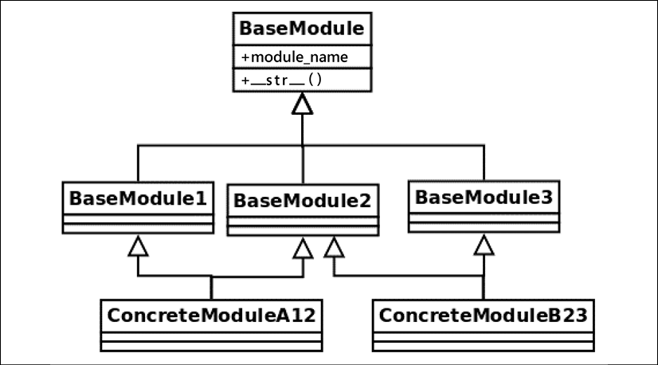

这是一本关于使用 Python 构建软件的书。好的软件源于好的设计。通过说诸如整洁代码之类的东西，您可能会认为我们将探索仅与软件的实现细节相关的良好实践，而不是其设计。然而，这种假设是错误的，因为代码与设计没有什么不同——代码就是设计。

代码可能是设计的最详细表示。在前两章中，我们讨论了为什么以一致的方式构建代码很重要，并且我们已经看到了编写更紧凑和惯用的代码的习惯用法。现在是时候了解整洁代码就是这样，以及更多——最终目标是使代码尽可能健壮，并以最小化缺陷或使它们在发生时完全明显的方式编写。

本章和下一章侧重于更高抽象级别的设计原则。我将介绍在 Python 中应用的软件工程的一般原则。

特别是，在本章中，我们将回顾构成良好软件设计的不同原则。高质量的软件应该围绕这些想法构建，它们将用作设计工具。这并不意味着所有这些都应该始终适用；事实上，其中一些代表了不同的观点（与防御性编程相反，契约式设计 (DbC) 方法就是这种情况）。其中一些取决于上下文，并不总是适用。

高质量代码是一个具有多个维度的概念。我们可以像思考软件架构的质量属性一样思考这一点。例如，我们希望我们的软件安全并具有良好的性能、可靠性和可维护性，仅举几个属性。

本章的目标如下：

- 了解强大软件背后的概念
- 学习如何处理应用程序工作流中的错误数据
- 设计可轻松扩展并适应新需求的可维护软件
- 设计可重用的软件
- 编写有效的代码，以保持开发团队的高生产力

## 契约式设计

我们正在开发的软件的某些部分并不打算由用户直接调用，而是由代码的其他部分调用。当我们将应用程序的职责划分为不同的组件或层时，我们就必须考虑它们之间的交互。

我们必须在每个组件后面封装一些功能，并向将要使用该功能的客户端公开一个接口，即应用程序编程接口 (API)。我们为该组件编写的函数、类或方法在某些考虑因素下具有特定的工作方式，如果不满足这些考虑因素，就会使我们的代码崩溃。相反，调用该代码的客户端期望得到特定的响应，而我们的函数未能提供此响应将表示存在缺陷。

这就是说，例如，如果我们有一个函数，它需要处理一系列整数类型的参数，而其他一些函数通过传递字符串来调用我们的函数，很明显它不应该按预期工作，但是实际上，该函数根本不应该运行，因为它被错误地调用了（客户端出错了）。此错误不应静默传递。

当然，在设计 API 时，应该记录预期的输入、输出和副作用。但是文档不能在运行时强制执行软件的行为。这些规则，代码的每一部分期望什么才能正常工作以及调用者对它们的期望，应该是设计的一部分，这就是契约概念出现的地方。

DbC 方法背后的想法是，双方都同意签订一份契约，如果违反，将引发异常，并明确说明其无法继续的原因，而不是在代码中隐含地放置每一方的期望。

在我们的上下文中，契约是一种结构，它强制执行一些在软件组件通信期间必须遵守的规则。契约主要包含前置条件和后置条件，但在某些情况下，还描述了不变量和副作用：

- 前提条件：我们可以说这些就是代码在运行前要执行的所有检查。它将检查在函数可以继续之前必须满足的所有条件。通常，它是通过验证传递的参数中提供的数据集来实现的，但是如果我们执行以下操作，则没有什么可以阻止我们运行各种验证（例如，验证数据库中的集合、文件或之前调用的其他方法）考虑到这些验证的重要性掩盖了它们的副作用。请注意，这对调用者施加了约束。
- 后置条件：与前置条件相反，这里的验证是在函数调用返回后完成的。运行后置条件验证以验证调用者对该组件的期望。
- 不变量：可选地，最好在函数的文档字符串中记录不变量，即函数代码运行时保持不变的事物，作为函数逻辑的正确表达.
- 副作用：可选地，我们可以在文档字符串中提及我们的代码的任何副作用。

### 前提条件

前提条件是函数或方法为正常工作而期望获得的所有保证。在一般的编程术语中，这通常意味着提供格式正确的数据，例如已初始化的对象、非空值等等。对于 Python，特别是动态类型，这也意味着有时我们需要检查提供的数据的确切类型。这与类型检查并不完全相同， mypy 类型会这样做，而是验证所需的确切值。

这些检查的一部分可以通过使用静态分析工具（例如 mypy，我们在第 1 章介绍、代码格式和工具中已经介绍过）及早检测到，但这些检查还不够。函数应该对其将要处理的信息进行适当的验证。

现在，这就提出了将验证逻辑放在哪里的问题，这取决于我们是让客户端在调用函数之前验证所有数据，还是允许客户端在运行自己的逻辑之前验证它收到的所有数据。前者等同于一种宽容的方法（因为函数本身仍然允许任何数据，也可能是格式错误的数据），而后者等同于一种苛刻的方法。

出于本次分析的目的，我们更喜欢在 DbC 方面采用苛刻的方法，因为就稳健性而言，它通常是最安全的选择，并且通常是行业中最常见的做法。

无论我们决定采用哪种方法，我们都应该始终牢记非冗余原则，该原则指出，函数的每个前提条件的执行只能由契约的两个部分中的一个来完成，而不是同时完成。这意味着我们将验证逻辑放在客户端，或者我们将它留给函数本身，但在任何情况下我们都不应该复制它（这也涉及到 DRY 原则，我们将在本章稍后讨论）。

### 后置条件

后置条件是契约的一部分，负责在方法或函数返回后强制执行状态。

假设已使用正确的属性调用函数或方法（即满足其前提条件），则后置条件将保证保留某些属性。

这个想法是使用后置条件来检查和验证客户端可能需要的一切。如果方法正确执行，并且后置条件验证通过，那么调用该代码的任何客户端都应该能够毫无问题地使用返回的对象，因为合同已经完成。

### Pythonic 合约

在撰写本书时，名为 Programming by Contract for Python 的 PEP-316 被推迟。这并不意味着我们不能在 Python 中实现它，因为正如本章开头所介绍的，这是一个通用的设计原则。

强制执行此操作的最佳方法可能是向我们的方法、函数和类添加控制机制，如果它们失败，则引发 RuntimeError 异常或 ValueError。很难为正确的异常类型制定一般规则，因为这在很大程度上取决于具体的应用程序。前面提到的这些异常是最常见的异常类型，但如果它们不能准确地解决问题，那么创建自定义异常将是最佳选择。

我们还希望尽可能保持代码隔离。也就是说，一部分是前置条件的代码，另一部分是后置条件的代码，函数的核心是分开的。我们可以通过创建更小的函数来实现这种分离，但在某些情况下，实现装饰器将是一个有趣的选择。

### 契约设计——结论

这个设计原则的主要价值是有效地识别问题所在。通过定义契约，当运行时出现故障时，将清楚代码的哪部分被破坏，以及是什么破坏了契约。

由于遵循此原则，代码将更加健壮。每个组件都在执行自己的约束并维护一些不变量，只要保留这些不变量，就可以证明程序是正确的。

它还有助于更好地阐明程序的结构。契约不是试图运行临时验证，或试图克服所有可能的失败情况，而是明确指定每个函数或方法期望正常工作的内容，以及对它们的期望。

当然，遵循这些原则也会增加额外的工作，因为我们不仅要编写主应用程序的核心逻辑，还要编写契约。此外，我们可能还想考虑为这些合约添加单元测试。然而，从长远来看，这种方法获得的质量是值得的。因此，对应用程序的关键组件实施此原则是一个好主意。

尽管如此，为了使这种方法有效，我们应该仔细考虑我们愿意验证什么，这必须是一个有意义的值。例如，定义仅检查提供给函数的参数的正确数据类型的合约没有多大意义。许多程序员会争辩说，这就像试图使 Python 成为一种静态类型语言。无论如何，诸如 mypy 之类的工具与注释的使用相结合，可以更好、更省力地实现这一目的。考虑到这一点，设计契约以使其具有实际价值，例如检查传递和返回的对象的属性、它们必须遵守的条件等。

## 防御性编程

防御性编程遵循与 DbC 略有不同的方法。与其说明必须在合同中包含的所有条件，如果未满足，将引发异常并使程序失败，这更多的是让代码的所有部分（对象、函数或方法）能够保护自己针对无效输入。

防御性编程是一种具有多个方面的技术，如果与其他设计原则结合使用，它会特别有用（这意味着它遵循与 DbC 不同的哲学这一事实并不意味着它是其中之一或其他——这可能意味着它们可能相互补充）。

关于防御性编程主题的主要思想是如何处理我们可能预期发生的场景的错误，以及如何处理不应该发生的错误（当不可能的情况发生时）。前者属于错误处理程序，后者属于断言。以下各节将探讨这两个主题。

### 错误处理

在我们的程序中，对于我们预计容易导致错误的情况，我们会采用错误处理程序。这通常是数据输入的情况。

错误处理背后的想法是优雅地响应这些预期错误，以尝试继续我们的程序执行或在错误无法克服时决定失败。

我们可以通过多种不同的方法处理程序中的错误，但并非所有方法都始终适用。其中一些方法如下：

- 价值替代
- 错误记录
- 异常处理

在接下来的两节中，我们将关注值替换和异常处理，因为这些错误处理形式提供了更有趣的分析。错误记录是一种补充做法（也是一种很好的做法；我们应该始终记录错误），但大多数时候我们只在没有其他事情要做时才记录，因此其他方法提供了更有趣的替代方法。

#### 价值替代
在某些情况下，当出现错误并且存在软件产生错误值或完全失败的风险时，我们可能能够用另一个更安全的值替换结果。我们称此为值替换，因为我们实际上是将实际错误结果替换为一个被认为是非破坏性的值（它可以是默认值、众所周知的常量、哨兵值，或者只是一些根本不会影响结果，例如在将结果应用于求和的情况下返回零）。

然而，价值替代并不总是可行的。对于替代值是安全选项的情况，必须谨慎选择此策略。做出这个决定是健壮性和正确性之间的权衡。一个软件程序在它没有失败时是健壮的，即使在出现错误的情况下也是如此。但这也不正确。

对于某些类型的软件，这可能是不可接受的。如果应用程序很关键，或者正在处理的数据过于敏感，这不是一个选项，因为我们无法为用户（或应用程序的其他部分）提供错误的结果。在这些情况下，我们选择正确性，而不是让程序在产生错误结果时爆炸。

此决定的一个稍微不同且更安全的版本是对未提供的数据使用默认值。这可能适用于可以使用默认行为的代码部分，例如，未设置的环境变量的默认值、配置文件中缺少的条目或函数参数的默认值。

我们可以在其 API 的不同方法中找到支持此方法的 Python 示例，例如，字典有一个 get 方法，其（可选）第二个参数允许您指示默认值：

```python
>>> configuration = {"dbport": 5432}
>>> configuration.get("dbhost", "localhost")
'localhost'
>>> configuration.get("dbport")
5432
```

环境变量有一个类似的 API：

```python
>>> import os
>>> os.getenv("DBHOST")
'localhost'
>>> os.getenv("DPORT", 5432)
5432
```

在前面的两个例子中，如果没有提供第二个参数，None 将被返回，因为它是这些函数定义的默认值。 我们还可以为我们自己的函数的参数定义默认值：

```python
>>> def connect_database(host="localhost", port=5432):
...     logger.info("connecting to database server at %s:%i", host, port)
```

一般来说，用默认值替换缺失的参数是可以接受的，但是用合法的接近值替换错误的数据更危险，并且可以掩盖一些错误。在决定此方法时，请考虑此标准。

#### 异常处理

在存在不正确或缺失的输入数据的情况下，有时可以通过一些示例来纠正这种情况，例如上一节中提到的那些。然而，在其他情况下，最好阻止程序继续使用错误的数据运行，而不是让它在错误的假设下进行计算。在这些情况下，失败并通知调用者有问题是一种很好的方法，这就是违反先决条件的情况，正如我们在 DbC 中看到的那样。

尽管如此，错误的输入数据并不是函数出错的唯一可能方式。毕竟，函数不仅仅是传递数据；它们也有副作用并连接到外部组件。

函数调用中的故障可能是由于这些外部组件之一的问题，而不是我们的函数本身的问题。如果是这种情况，我们的函数应该正确地传达这一点。这将使调试更容易。该函数应该清楚地、明确地通知应用程序的其余部分关于不能忽略的错误，以便可以相应地解决它们。

实现这一点的机制是一个例外。需要强调的是，这就是异常应该用来做什么——清楚地宣布异常情况，而不是根据业务逻辑改变程序的流程。

如果代码试图使用异常来处理预期的场景或业务逻辑，程序的流程将变得更难阅读。这将导致异常被用作一种 go-to 语句的情况，它（更糟的是）可能跨越调用堆栈上的多个级别（直到调用者函数），违反了将逻辑封装到其正确的抽象级别。如果这些除外块将业务逻辑与代码试图防御的真正异常情况混合在一起，情况可能会变得更糟；在这种情况下，将更难区分我们必须维护的核心逻辑和要处理的错误。

> 不要将异常用作业务逻辑的首选机制。当调用者需要注意的代码有问题时引发异常。

最后一个概念很重要；例外通常是关于通知调用者有什么不对劲的。这意味着应谨慎使用异常，因为它们削弱了封装性。一个函数的异常越多，调用者函数就越需要预测，因此了解它正在调用的函数。如果一个函数引发太多异常，这意味着它不是上下文无关的，因为每次我们想要调用它时，我们都必须牢记所有可能的副作用。

这可以用作一种启发式方法，以判断函数何时不够内聚且责任过多。 如果它引发太多异常，则可能表明它必须分解为多个较小的异常。

以下是一些与 Python 中的异常相关的建议。

**在正确的抽象级别处理异常**

异常也是主要功能的一部分，它们只做一件事，而且只做一件事。 函数正在处理（或引发）的异常必须与其封装的逻辑一致。

在下面的例子中，我们可以看到混合不同级别的抽象意味着什么。 想象一个对象在我们的应用程序中充当某些数据的传输。 它连接到外部组件，数据将在解码时发送到该组件。 在下面的清单中，我们将重点介绍 delivery_event 方法：

```python
class DataTransport:
    """An example of an object handling exceptions of different levels."""
    _RETRY_BACKOFF: int = 5
    _RETRY_TIMES: int = 3
    def __init__(self, connector: Connector) -> None:
        self._connector = connector
        self.connection = None
    def deliver_event(self, event: Event):
        try:
            self.connect()
            data = event.decode()
            self.send(data)
        except ConnectionError as e:
            logger.info("connection error detected: %s", e)
            raise
        except ValueError as e:
            logger.error("%r contains incorrect data: %s", event, e)
            raise
    def connect(self):
        for _ in range(self._RETRY_TIMES):
            try:
                self.connection = self._connector.connect()
            except ConnectionError as e:
                logger.info(
                    "%s: attempting new connection in %is", e, self._RETRY_BACKOFF,
                )
                time.sleep(self._RETRY_BACKOFF)
            else:
                return self.connection
        raise ConnectionError(f"Couldn't connect after {self._RETRY_TIMES} times")
    def send(self, data: bytes):
        return self.connection.send(data)
```

对于我们的分析，让我们放大并关注deliver_event() 方法如何处理异常。

ValueError 与 ConnectionError 有什么关系？不多。通过查看这两种截然不同的错误类型，我们可以了解应该如何划分责任。

ConnectionError 应该在 connect 方法内部处理。这允许明确分离行为。例如，如果此方法需要支持重试，则处理所述异常将是一种方法。

反之，ValueError 属于事件的解码方法。有了这个新的实现（如下例所示），这个方法不需要捕获任何异常——我们之前担心的异常要么由内部方法处理，要么故意留待引发。

我们应该将这些片段分成不同的方法或函数。对于连接管理，一个小功能就足够了。这个函数将负责尝试建立连接，捕捉异常（如果发生），并相应地记录它们：

```python
def connect_with_retry(connector: Connector, retry_n_times: int, retry_backoff: int = 5):
    """Tries to establish the connection of <connector> retrying
    <retry_n_times>, and waiting <retry_backoff> seconds between attempts.
    If it can connect, returns the connection object.
    If it's not possible to connect after the retries have been exhausted, raises ``ConnectionError``.
    :param connector:         An object with a ``.connect()`` method.
    :param retry_n_times int: The number of times to try to call
                              ``connector.connect()``.
    :param retry_backoff int: The time lapse between retry calls.
    """
    for _ in range(retry_n_times):
        try:
            return connector.connect()
        except ConnectionError as e:
            logger.info("%s: attempting new connection in %is", e, retry_backoff)
            time.sleep(retry_backoff)
    exc = ConnectionError(f"Couldn't connect after {retry_n_times} times")
    logger.exception(exc)
    raise exc
```

然后，我们将在我们的方法中调用这个函数。 对于事件上的 ValueError 异常，我们可以将其与一个新对象分开并进行组合，但对于这种有限的情况，这将是矫枉过正，因此只需将逻辑移至单独的方法就足够了。 考虑到这两个因素，该方法的新版本看起来更加紧凑和易于阅读：

```python
class DataTransport:
    """An example of an object that separates the exception handling by
    abstraction levels.
    """
    _RETRY_BACKOFF: int = 5
    _RETRY_TIMES: int = 3
    def __init__(self, connector: Connector) -> None:
        self._connector = connector
        self.connection = None
    def deliver_event(self, event: Event):
        self.connection = connect_with_retry(self._connector, self._RETRY_TIMES, self._RETRY_BACKOFF)
        self.send(event)
    def send(self, event: Event):
        try:
            return self.connection.send(event.decode())
        except ValueError as e:
            logger.error("%r contains incorrect data: %s", event, e)
            raise
```

现在看看异常类的分离如何也界定了职责的分离。在显示的第一个示例中，所有内容都是混合的，并且没有明确的关注点分离。然后我们决定将连接作为自身的关注点，因此在下一个示例中，创建了 connect_with_retry 函数，如果我们需要修改该函数（正如我们所做的那样），ConnectionError 将作为该函数的一部分进行处理。另一方面， ValueError 不是同一逻辑的一部分，所以它留在了它所属的 send 方法中。

例外是有意义的。出于这个原因，在正确的抽象级别处理每种类型的异常很重要（这意味着，取决于它们所属的应用程序层）。但有时它们也可以携带重要信息。由于这些信息可能很敏感，我们不希望它落入坏人之手，因此在下一节中，我们将讨论异常的安全影响。

**不要向最终用户公开回溯**

这是一个安全考虑。在处理异常时，如果错误太重要，让它们传播可能是可以接受的，如果这是针对特定场景的决定，并且正确性优先于健壮性，甚至可能让程序失败。

当出现表示问题的异常时，重要的是尽可能详细地登录（包括回溯信息、消息和我们可以收集的所有信息），以便可以有效地纠正问题。同时，我们希望为我们自己包含尽可能多的细节——我们不希望这些细节对用户可见。

在 Python 中，异常回溯包含非常丰富和有用的调试信息。不幸的是，这些信息对于想要尝试破坏应用程序的攻击者或恶意用户也非常有用，更不用说泄漏将代表重要的信息泄露，危及您组织的知识产权（因为部分代码将裸露）。

如果您选择让异常传播，请确保不要透露任何敏感信息。此外，如果您必须将问题通知用户，请选择通用消息（例如出现问题或找不到页面）。这是在发生 HTTP 错误时显示通用信息性消息的 Web 应用程序中使用的常用技术。

**避免空块除外**

这甚至被称为最邪恶的 Python 反模式（REAL 01）。虽然预测和保护我们的程序免受一些错误的影响是好的，但过于防御可能会导致更严重的问题。特别是，过于防御的唯一问题是有一个空的 except 块，它什么也不做就默默地过去了。

Python 非常灵活，它允许我们编写可能出错但不会引发错误的代码，如下所示：

```python
try:
    process_data()
except:
    pass
```

问题在于它永远不会失败，即使它应该失败。如果您从 Python 之禅中记得错误永远不应该无声无息地传递，那么它也是非 Pythonic 的。

> 配置您的持续集成环境（使用第 1 章介绍、代码格式和工具中介绍的工具）以自动报告空异常块。

如果发生异常，这块代码不会失败，这可能是我们首先想要的。但是如果有缺陷呢？ process_data() 函数运行时可能会发生实际故障，我们想知道我们的逻辑是否存在错误以便能够纠正它。编写这样的块会掩盖问题，使事情更难维护。

有两种选择：

- 捕获更具体的异常（不要太宽泛，例如异常）。事实上，当代码处理的异常范围太广时，一些 linting 工具和 IDE 会在某些情况下向您发出警告。
- 对 except 块执行一些实际的错误处理。

最好的办法是应用这两个建议。处理更具体的异常（例如，AttributeError 或 KeyError）将使程序更易于维护，因为读者将知道会发生什么并且可以了解其原因。它还会让其他异常自由地被引发，如果发生这种情况，这可能意味着一个错误，只有这一次才能被发现。

处理异常本身可能意味着很多事情。在最简单的形式中，它可能只是记录异常（确保使用 logger.exception 或 logger.error 来提供所发生事件的完整上下文）。其他替代方法可能是返回默认值（替换，仅在这种情况下是在检测到错误之后，而不是在导致错误之前），或引发不同的异常。

> 如果您选择引发不同的异常，请包括导致问题的原始异常（请参阅下一节）。

避免使用空的 except 块（使用 pass）的另一个原因是它的隐性：它不会告诉代码的读者我们实际上希望忽略该异常。一种更明确的方法是使用 contextlib.suppress 函数，它可以接受所有异常作为要忽略的参数，并且可以用作上下文管理器。

在我们的示例中，它可能如下所示：

```python
import contextlib
with contextlib.suppress(KeyError):
    process_data()
```

同样，与前一种情况一样，尽量避免将一般 Exception 传递给此上下文管理器，因为效果是相同的。

**包括原始异常**

作为错误处理逻辑的一部分，我们可能会决定提出一个不同的逻辑，甚至可能改变它的消息。 如果是这种情况，建议包括导致这种情况的原始异常。

我们可以使用 <original_exception> 语法中的 raise <e> (PEP-3134)。 使用此构造时，原始回溯将嵌入到新异常中，原始异常将设置在结果异常的 \_\_cause\_\_ 属性中。

例如，如果我们希望在项目内部使用自定义异常包装默认异常，我们仍然可以这样做，同时包含有关根异常的信息：

```python
class InternalDataError(Exception):
    """An exception with the data of our domain problem."""
def process(data_dictionary, record_id):
    try:
        return data_dictionary[record_id]
    except KeyError as e:
        raise InternalDataError("Record not present") from e
```

> 更改异常类型时，始终使用 raise <e> from <o> 语法。

使用此语法将使回溯包含有关刚刚发生的异常或错误的更多信息，这将在调试时有很大帮助。

### 在 Python 中使用断言

断言用于不应该发生的情况，因此断言语句上的表达式必须表示不可能的条件。如果发生这种情况，则意味着软件存在缺陷。

与错误处理方法相反，在某些情况下，如果发生特定错误，我们不希望程序继续执行。这是因为，在某些情况下，错误无法克服，我们的程序无法纠正其执行过程（或自愈），因此最好快速失败，并让错误被注意到，因此可以通过下个版本升级。

使用断言的想法是防止程序在出现此类无效场景时造成进一步损害。有时，最好停止并让程序崩溃，而不是让它在错误的假设下继续处理。

根据定义，断言是代码中的布尔条件，必须为真才能使程序正确。如果程序由于 AssertionError 而失败，则意味着刚刚发现了一个缺陷。

因此，断言不应与业务逻辑混合，也不应用作软件的控制流机制。下面的例子是一个坏主意：

```python
try:
    assert condition.holds(), "Condition is not satisfied"
except AssertionError:
    alternative_procedure()
```

> 不要捕获 AssertionError 异常，因为它可能会让代码的读者感到困惑。如果您希望代码的某些部分引发异常，请尝试使用更具体的部分。

前面关于捕获 AssertionError 的建议是不要让你的程序静默失败。但它可能会优雅地失败。因此，您可以捕获 AssertionError 并显示通用错误消息，而不是让应用程序严重崩溃，同时仍将所有内部错误详细信息记录到您公司的日志记录平台。关键不在于是否要捕获此异常，而是断言错误是一个有价值的信息来源，可以帮助您提高软件质量。

确保程序在断言失败时终止。这意味着断言通常放在代码中以识别程序的错误部分。许多编程语言倾向于认为，当程序在生产中运行时可以抑制断言，但这违背了它的目的，因为它们的目的是让我们准确地知道程序中需要修复的那些部分.

特别是在 Python 中，使用 –O 标志运行将抑制断言语句，但由于上述原因，不鼓励这样做。

> 不要用 python –O 运行你的生产程序……因为你想利用代码中的断言来纠正缺陷。

在断言语句中包含描述性错误消息并记录错误以确保您以后可以正确调试和更正问题。

前面代码不好的另一个重要原因是，除了捕获 AssertionError 之外，断言中的语句是一个函数调用。函数调用可能有副作用，而且它们并不总是可重复的（我们不知道再次调用 condition.holds() 是否会产生相同的结果）。此外，如果我们在该行停止调试器，我们可能无法方便地看到导致错误的结果，同样，即使我们再次调用该函数，我们也不知道这是否是有问题的值。

更好的替代方案需要多几行代码，但提供了更多有用的信息：

```python
result = condition.holds()
assert result > 0, f"Error with {result}"
```

> 使用断言时，尽量避免直接使用函数调用，用局部变量来写表达式。

断言和异常处理之间有什么关系？鉴于异常处理，有些人可能会问断言是否没有实际意义。如果我们可以使用 if 语句检查并引发异常，为什么要为条件断言？但是，有一个微妙的区别。通常，异常用于处理与我们的程序要考虑的业务逻辑相关的意外情况，而断言就像代码中的自检机制，以验证（断言）其正确性。

出于这个原因，异常引发将比断言语句更常见。断言的典型用途是算法维护必须始终保持不变的逻辑的情况：在这种情况下，您可能希望为不变量断言。如果这在某个时候被破坏，则意味着算法错误或实现不佳。

我们已经探索了 Python 中的防御性编程，以及一些有关异常处理的相关主题。现在，我们继续下一个大话题，因为下一节将讨论关注点分离。

## 关注点分离

这是一个适用于多个层次的设计原则。它不仅与低级设计（代码）有关，而且在更高的抽象层次上也是相关的，因此稍后我们讨论架构时会提到它。

应用程序的不同组件、层或模块应承担不同的职责。程序的每个部分都应该只负责一部分功能（我们称之为关注点），而对其余部分一无所知。

在软件中分离关注点的目标是通过最小化涟漪效应来增强可维护性。涟漪效应意味着从起点开始传播软件中的变化。这可能是一个错误或异常触发一系列其他异常的情况，导致失败，从而导致应用程序的远程部分出现缺陷。也可能由于函数定义的简单更改，我们必须更改分散在代码库多个部分的大量代码。

显然，我们不希望这些场景发生。软件必须易于更改。如果我们必须修改或重构代码的某些部分，这必须对应用程序的其余部分产生最小的影响，而实现这一点的方法是通过适当的封装。

以类似的方式，我们希望包含任何潜在的错误，以便它们不会造成重大损害。

这个概念与 DbC 原则有关，因为每个关注点都可以通过合同强制执行。当合同被违反，并且由于这种违反而引发异常时，我们知道程序的哪个部分失败了，以及没有履行哪些责任。

尽管有这种相似性，但关注点分离更进一步。我们通常会想到函数、方法或类之间的契约，虽然这也适用于必须分离的职责，但关注点分离的想法也适用于 Python 模块、包和基本上任何软件组件。

### 内聚与耦合

这些是良好软件设计的重要概念。

一方面，内聚意味着对象应该有一个小而明确的目的，并且它们应该尽可能少做。它遵循与 Unix 命令类似的哲学，只做一件事并且做得很好。我们的对象越有凝聚力，它们就越有用和可重用，从而使我们的设计更好。

另一方面，耦合是指两个或多个对象如何相互依赖的概念。这种依赖性造成了限制。如果代码的两部分（对象或方法）过于依赖彼此，它们会带来一些不良后果：

- 没有代码重用：如果一个函数过于依赖某个特定的对象，或者接受太多的参数，它就会与这个对象耦合，这意味着在不同的上下文中使用该函数将非常困难（为此，我们将必须找到一个符合非常严格的接口的合适参数）。
- 涟漪效应：两部分之一的变化肯定会影响另一部分，因为它们太接近了。
- 低抽象级别：当两个功能如此密切相关时，很难将它们视为解决不同抽象级别问题的不同关注点。

> 经验法则：定义明确的软件将实现高内聚和低耦合。

## 生活的缩略语

在本节中，我们将回顾一些产生一些好的设计理念的原则。关键是通过易于记忆的首字母缩略词快速关联良好的软件实践，作为一种助记符规则。如果您牢记这些词，您将能够更轻松地将它们与良好实践联系起来，并且会更快地找到您正在查看的特定代码行背后的正确想法。

这些绝不是正式的或学术的定义，而更像是在软件行业多年工作中产生的经验性想法。其中一些确实出现在书中，因为它们是由重要作者创造的（请参阅参考资料以更详细地研究它们），而其他一些则可能源于博客文章、论文或会议演讲。

### DRY/OAOO

**Don't Repeat Yourself (DRY)** 和**Once and Only Once (OAOO)** 的想法密切相关，因此将它们包含在此处。它们是不言自明的，您应该不惜一切代价避免重复。

代码中的事物、知识只能在一个地方定义一次。当您必须对代码进行更改时，应该只有一个正确的位置可以修改。不这样做是系统设计不佳的标志。

代码重复是一个直接影响可维护性的问题。代码重复是非常不可取的，因为它有很多负面后果：

- 容易出错：当某些逻辑在整个代码中重复多次，并且需要更改时，这意味着我们依赖于使用此逻辑有效地纠正所有实例，而不会忘记它们中的任何一个，因为在这种情况下会出现错误.
- 它很昂贵：与上一点相关联，在多个地方进行更改比只定义一次需要更多的时间（开发和测试工作）。这会让团队慢下来。
- 这是不可靠的：同样与第一点有关，当上下文中的单个更改需要更改多个位置时，您依靠编写代码的人记住必须进行修改的所有实例。没有单一的真相来源。
    

重复通常是由于忽略（或忘记）代码代表知识造成的。通过赋予代码的某些部分意义，我们正在识别和标记这些知识。

让我们通过一个例子来看看这意味着什么。想象一下，在一个学习中心，学生按照以下标准进行排名：每门考试通过 11 分，每门考试失败减去 5 分，在机构中每年减去 2 分。以下不是实际代码，而只是表示它可能如何分散在实际代码库中：

```python
def process_students_list(students):
    # do some processing...
    students_ranking = sorted(
        students, key=lambda s: s.passed * 11 - s.failed * 5 - s.years * 2
    )
    # more processing
    for student in students_ranking:
        print(
            "Name: {0}, Score: {1}".format(
                student.name,
                (student.passed * 11 - student.failed * 5 - student.years * 2),
            )
        )
```

请注意位于已排序函数的键中的 lambda 如何表示领域问题中的一些有效知识，但它并没有反映它（它没有名称，没有适当的位置，没有任何意义 分配给该代码，什么都没有）。 代码中缺乏意义导致我们在列出耙子时打印分数时发现重复。

我们应该在我们的代码中反映我们对领域问题的了解，这样我们的代码就不会受到重复的影响并且更容易理解：

```python
def score_for_student(student):
    return student.passed * 11 - student.failed * 5 - student.years * 2
def process_students_list(students):
    # do some processing...
    students_ranking = sorted(students, key=score_for_student)
    # more processing
    for student in students_ranking:
        print(
            "Name: {0}, Score: {1}".format(
                student.name, score_for_student(student)
            )
        )
```

公平的免责声明：这只是对代码重复特征之一的分析。实际上，代码重复有更多的情况、类型和分类法。整个章节都可以专门讨论这个主题，但在这里我们专注于一个特定的方面，以明确首字母缩略词背后的想法。

在这个例子中，我们采用了可能是消除重复的最简单的方法：创建一个函数。根据情况，最佳解决方案会有所不同。在某些情况下，可能需要创建一个全新的对象（可能缺少整个抽象）。在其他情况下，我们可以使用上下文管理器消除重复。迭代器或生成器（在第 7 章，生成器、迭代器和异步编程中描述）也有助于避免代码中的重复，而装饰器（在第 5 章，使用装饰器改进我们的代码中解释）也有帮助。

不幸的是，在解决代码重复问题时，没有通用的规则或模式来告诉你 Python 的哪些特性最适合，但希望在看到本书中的示例以及 Python 元素的使用方式后，读者将能够发展自己的直觉。

### YAGNI

YAGNI（You Ain't Gonna Need It 的缩写）是一个您在编写解决方案时可能需要经常记住的想法，如果您不想对其进行过度设计。

我们希望能够轻松修改我们的程序，因此我们希望使它们面向未来。与此一致的是，许多开发人员认为他们必须预测所有未来的需求并创建非常复杂的解决方案，因此创建了难以阅读、维护和理解的抽象。一段时间后，事实证明那些预期的需求没有出现，或者它们以不同的方式出现（惊讶！），并且原本应该精确处理的原始代码不起作用。

问题是现在重构和扩展我们的程序更加困难。发生的事情是原始解决方案没有正确处理原始需求，当前的解决方案也没有，仅仅是因为它是错误的抽象。

拥有可维护的软件并不是要预测未来的需求（不要做未来学！）。它是关于编写只满足当前需求的软件，以便以后可以（并且很容易）进行更改。换句话说，在设计时，请确保您的决定不会束缚您，并且您将能够继续构建，但不要构建超过必要的数量。

在某些情况下，如果我们知道我们认为可能适用或为我们节省时间的原则，通常很容易不遵循这个想法。例如，在本书后面，我们将回顾设计模式，它们是面向对象设计典型情况的常见解决方案。虽然研究设计模式很重要，但我们必须拒绝过早应用它们的诱惑，因为它可能违反 YAGNI 原则。

例如，假设您正在创建一个类来封装组件的行为。你知道它是需要的，但是你认为将来会有更多（和类似的）需求，所以创建一个基类（如定义一个具有必须实现的方法的接口），然后使您刚刚创建实现该接口的子类的类。出于多种原因，这是错误的。首先，您现在需要的只是最初创建的类（投入更多时间过度概括我们不知道我们需要的解决方案并不是管理资源的好方法）。然后，该基类受到当前需求的影响，因此它可能不是正确的抽象。

最好的方法是以不妨碍进一步改进的方式只编写现在需要的内容。如果以后有更多的需求进来，我们可以考虑创建一个基类，抽象一些方法，也许我们会发现为我们的解决方案出现的设计模式。这也是面向对象设计应该工作的方式：自下而上。

最后，我想强调的是，YAGNI 是一个也适用于软件架构的想法（不仅仅是详细的代码）。

### KIS

KIS（保持简单）与前一点非常相关。在设计软件组件时，请避免对其进行过度设计。问问自己，您的解决方案是否是适合问题的最小解决方案。

实现最少的功能，以正确解决问题，并且不会使您的解决方案变得过于复杂。请记住，设计越简单，它就越易于维护。

这个设计原则是我们想要在所有抽象级别牢记的想法，无论我们是在考虑高级设计还是处理特定的代码行。

在较高的层次上，考虑我们正在创建的组件。我们真的需要所有这些吗？这个模块现在真的需要完全可扩展吗？强调最后一部分——也许我们想让那个组件可扩展，但现在不是合适的时间，或者不合适这样做，因为我们仍然没有足够的信息来创建适当的抽象，并试图提出此时的通用接口只会导致更严重的问题。

在代码方面，保持简单通常意味着使用适合问题的最小数据结构。您很可能会在标准库中找到它。

有时，我们可能会过度复杂化代码，创建不必要的函数或方法。下面的类从一组提供的关键字参数创建一个命名空间，但它有一个相当复杂的代码接口：

```python
class ComplicatedNamespace:
    """A convoluted example of initializing an object with some properties."""
    ACCEPTED_VALUES = ("id_", "user", "location")
    @classmethod
    def init_with_data(cls, **data):
        instance = cls()
        for key, value in data.items():
            if key in cls.ACCEPTED_VALUES:
                setattr(instance, key, value)
        return instance
```

似乎没有必要使用额外的类方法来初始化对象。 然后，迭代和里面对 setattr 的调用让事情变得更加奇怪，呈现给用户的界面不是很清楚：

```python
>>> cn = ComplicatedNamespace.init_with_data(
...     id_=42, user="root", location="127.0.0.1", extra="excluded"
... )
>>> cn.id_, cn.user, cn.location
(42, 'root', '127.0.0.1')
>>> hasattr(cn, "extra")
False
```

用户必须知道这种其他方法的存在，这很不方便。 最好保持简单，就像我们在 Python 中初始化任何其他对象一样（毕竟，有一个方法）使用 \_\_init\_\_ 方法初始化对象：

```python
class Namespace:
    """Create an object from keyword arguments."""
 
    ACCEPTED_VALUES = ("id_", "user", "location")
 
    def __init__(self, **data):
        for attr_name, attr_value in data.items():
            if attr_name in self.ACCEPTED_VALUES:
                setattr(self, attr_name, attr_value)
```

记住 Python 之禅：简单胜于复杂。

在 Python 中有许多场景，我们希望在其中保持代码简单。其中之一与我们之前探索过的东西有关：代码重复。在 Python 中抽象代码的一种常用方法是使用装饰器（我们将在后面的第 5 章使用装饰器改进我们的代码中看到）。但是，如果我们试图避免一小部分的重复，比如说三行代码呢？在这种情况下，编写装饰器可能会占用更多的行并且对于我们试图解决的简单重复行来说会更加麻烦。在这种情况下，运用常识并务实。接受少量的重复可能比复杂的函数更好（也就是说，当然，除非您找到一种更简单的方法来消除重复并保持代码简单！）。

作为保持代码简单的一部分，我建议避免使用 Python 的高级功能，如元类（或任何与元编程相关的一般），因为不仅几乎不需要这些功能（使用它们有非常特殊的理由） !)，而且它们使代码更难阅读，更难维护。

### EAFP/LBYL

EAFP 代表比许可更容易请求宽恕，而 LBYL 代表在你跳跃之前先看看。

EAFP 的想法是我们编写代码使其直接执行一个操作，然后我们会在以后处理后果，以防它不起作用。通常，这意味着尝试运行一些代码，期望它能够工作，但如果没有，则捕获异常，然后在 except 块上处理更正代码。

这与LBYL相反。顾名思义，在跳跃前的观察中，我们首先检查我们将要使用的内容。例如，我们可能想在尝试操作之前检查文件是否可用：

```python
if os.path.exists(filename):
    with open(filename) as f:
        ...
```

先前代码的 EAFP 版本将如下所示：

```python
try:
    with open(filename) as f:
        ...
except FileNotFoundError as e:
    logger.error(e)
```

如果您来自其他没有例外的语言，例如 C，那么您会发现 LBYL 方法更有用。在其他语言（如 C++）中，出于性能考虑，不鼓励使用异常，但这在 Python 中通常不适用。

特定情况当然可能适用，但大多数时候，您会发现 EAFP 版本更能揭示意图。以这种方式编写的代码更易于阅读，因为它直接执行所需的任务，而不是预防性地检查条件。换言之，在最后一个示例中，您将看到尝试打开文件然后对其进行处理的代码的一部分。如果文件不存在，那么我们处理这种情况。在第一个示例中，我们将看到一个函数检查文件是否存在，然后尝试执行某些操作。您可能会争辩说这也很清楚，但我们不确定。也许被询问的文件是一个不同的文件，或者是属于程序不同层的函数，或者是剩余的，等等。当您第一眼查看代码时，第二种方法不太容易出错。

您可以应用这两种想法，因为它们在您的特定代码中有意义，但一般来说，以 EAFP 方式编写的代码乍一看更容易选择，因此如有疑问，我建议您选择此变体。

## Python中的继承

在面向对象的软件设计中，经常会讨论如何利用范式的主要思想（多态、继承和封装）来解决一些问题。

这些想法中最常用的可能是继承——开发人员通常首先用他们需要的类创建一个类层次结构，然后决定每个人应该实现的方法。

虽然继承是一个强大的概念，但它确实伴随着危险。主要的一点是，每次我们扩展一个基类时，我们都会创建一个与父类紧密耦合的新基类。正如我们已经讨论过的，耦合是我们在设计软件时希望减少到最低限度的事情之一。

开发人员与继承相关的主要场景之一是代码重用。虽然我们应该始终拥抱代码重用，但仅仅因为我们从父类免费获取方法就强迫我们的设计使用继承来重用代码并不是一个好主意。重用代码的正确方法是拥有可以轻松组合并且可以在多个上下文中工作的高度内聚的对象。

### 当继承是一个好的决定时

我们在创建派生类时必须小心，因为这是一把双刃剑——一方面，它的优点是我们可以免费从父类中获取所有方法的代码，但另一方面，我们将所有这些都带入一个新类，这意味着我们可能在新定义中放置了太多功能。

在创建一个新的子类时，我们必须考虑它是否真的要使用它刚刚继承的所有方法，作为一种启发式来查看该类是否被正确定义。如果相反，我们发现我们不需要大多数方法，而必须覆盖或替换它们，这可能是由多种原因引起的设计错误：

- 超类定义模糊，包含太多责任，而不是定义良好的接口
- 子类不是它试图扩展的超类的适当特化

使用继承的一个很好的例子是这样一种情况，当您有一个类定义某些组件，其行为由此类的接口（其公共方法和属性）定义，然后您需要按顺序专门化此类创建具有相同功能但添加其他内容或更改其行为的某些特定部分的对象。

您可以在 Python 标准库本身中找到很好地使用继承的示例。例如，在http.server包（https://docs.python.org/3/library/http.server.html#http.server.BaseHTTPRequestHandler）中，我们可以找到BaseHTTPRequestHandler这样的基类，以及这样的子类作为 SimpleHTTPRequestHandler，它通过添加或更改其基本接口的一部分来扩展它。

说到接口定义，这是继承的另一个很好的用途。当我们想要强制某些对象的接口时，我们可以创建一个抽象基类，它不实现行为本身，而只是定义接口——每个扩展这个类的类都必须实现这些作为适当的子类型。

最后，继承的另一个好例子是异常。我们可以看到 Python 中的标准异常是从 Exception 派生出来的。这就是允许您拥有一个通用子句的原因，例如except Exception，它将捕获所有可能的错误。重要的一点是概念上的；它们是从 Exception 派生的类，因为它们是更具体的异常。这也适用于众所周知的库，例如请求，例如，其中 HTTPError 是 RequestException，而后者又是 IOError。

### 继承的反模式

如果上一节必须用一个词来概括，那就是专业化。继承的正确用法是专门化对象并从基础对象开始创建更详细的抽象。

父（或基）类是新派生类的公共定义的一部分。这是因为继承的方法将成为这个新类的接口的一部分。为此，当我们读取类的公共方法时，它们必须与父类定义的一致。

例如，如果我们看到一个派生自 BaseHTTPRequestHandler 的类实现了一个名为 handle() 的方法，这将是有意义的，因为它覆盖了父类之一。如果它有任何其他方法，其名称与与 HTTP 请求有关的操作相关，那么我们也可以认为它是正确放置的（但如果我们在该类上找到了名为 process_purchase() 的东西，我们就不会认为）。

前面的例子可能看起来很明显，但它经常发生，特别是当开发人员试图以重用代码为唯一目标时使用继承。在下一个例子中，我们将看到一个代表 Python 中常见反模式的典型情况——必须表示一个领域问题，并为该问题设计了一个合适的数据结构，而不是创建一个对象使用这样的数据结构，对象就变成了数据结构本身。

让我们通过一个例子来更具体地看看这些问题。想象一下，我们有一个管理保险的系统，其中有一个模块负责将政策应用于不同的客户。我们需要在内存中保留当时正在处理的一组客户，以便在进一步处理或持久化之前应用这些更改。我们需要的基本操作是将新客户及其记录存储为卫星数据、对策略应用更改或编辑一些数据，仅举几例。我们还需要支持批量操作。也就是说，当政策本身的某些内容发生变化（此模块当前正在处理的内容）时，我们必须将这些更改整体应用于当前交易的客户。

考虑到我们需要的数据结构，我们意识到在恒定时间内访问特定客户的记录是一个很好的特性。因此，诸如 policy_transaction[customer_id] 之类的东西看起来是一个不错的界面。由此，我们可能会认为可下标的对象是一个好主意，再进一步，我们可能会认为我们需要的对象是字典：

```python
class TransactionalPolicy(collections.UserDict):
    """Example of an incorrect use of inheritance."""
    def change_in_policy(self, customer_id, **new_policy_data):
        self[customer_id].update(**new_policy_data)
```

使用此代码，我们可以通过其标识符获取有关客户策略的信息：

```python
>>> policy = TransactionalPolicy({
...     "client001": { 
...         "fee": 1000.0, 
...         "expiration_date": datetime(2020, 1, 3), 
...     } 
... }) 
>>> policy["client001"]
{'fee': 1000.0, 'expiration_date': datetime.datetime(2020, 1, 3, 0, 0)}
>>> policy.change_in_policy("client001", expiration_date=datetime(2020, 1, 4))
>>> policy["client001"]
{'fee': 1000.0, 'expiration_date': datetime.datetime(2020, 1, 4, 0, 0)}
```

当然，我们首先实现了我们想要的界面，但代价是什么？ 现在，这个类通过执行不必要的方法有很多额外的行为：

```python
>>> dir(policy)
[ # all magic and special method have been omitted for brevity...
 'change_in_policy', 'clear', 'copy', 'data', 'fromkeys', 'get', 'items', 'keys', 'pop', 'popitem', 'setdefault', 'update', 'values']
```

这种设计（至少）有两个主要问题。一方面，等级制度是错误的。从概念上从基础类创建一个新类意味着它是它所扩展的类的一个更具体的版本（因此得名）。 TransactionalPolicy 是字典是怎么回事？这有意义吗？请记住，这是对象公共接口的一部分，因此用户会看到这个类及其层次结构，并会注意到这种奇怪的特化及其公共方法。

这就引出了第二个问题——耦合。事务策略的接口现在包括字典中的所有方法。事务策略真的需要 pop() 或 items() 之类的方法吗？然而，它们就在那里。它们也是公开的，因此该接口的任何用户都有权调用它们，无论它们可能带来什么不良副作用。关于这一点的更多信息 - 我们并没有通过扩展字典获得太多收益。它实际需要为受当前策略更改影响的所有客户更新的唯一方法 (change_in_policy()) 不在基类上，因此我们必须以任何一种方式自己定义它。

这是一个将实现对象与领域对象混合的问题。字典是一种实现对象，一种数据结构，适用于某些类型的操作，并且与所有数据结构一样具有权衡。事务策略应该代表域问题中的某些东西，一个实体，它是我们试图解决的问题的一部分。

不要将实现数据结构与同一层次结构中的业务领域类混合在一起。

像这样的层次结构是不正确的，仅仅因为我们从基类中获得了一些魔法方法（通过扩展字典使对象可下标）并不足以创建这样的扩展。在创建其他更具体的实现类时，应单独扩展实现类。换句话说，如果您想创建另一个（更具体或稍作修改的）字典，请扩展字典。相同的规则适用于域问题的类。

这里的正确解决方案是使用组合。 TransactionalPolicy 不是字典——它使用字典。它应该在私有属性中存储一个字典，并通过从该字典代理来实现 \_\_getitem\_\_() 然后只实现它需要的其余公共方法：

```python
class TransactionalPolicy:
    """Example refactored to use composition."""
    def __init__(self, policy_data, **extra_data):
        self._data = {**policy_data, **extra_data}
    def change_in_policy(self, customer_id, **new_policy_data):
        self._data[customer_id].update(**new_policy_data)
    def __getitem__(self, customer_id):
        return self._data[customer_id]
    def __len__(self):
        return len(self._data)
```

这种方式不仅在概念上是正确的，而且更具扩展性。如果将来更改底层数据结构（现在是字典），则只要维护该接口，该对象的调用者就不会受到影响。这减少了耦合，最小化了涟漪效应，允许更好的重构（不应更改单元测试），并使代码更易于维护。

### Python中的多重继承

Python 支持多重继承。由于继承在使用不当时会导致设计问题，您也可以预期多重继承在未正确实现时也会产生更大的问题。

因此，多重继承是一把双刃剑。在某些情况下，它也非常有益。需要明确的是，多重继承并没有错——它唯一的问题是当它没有正确实现时，问题会成倍增加。

如果使用得当，多重继承是一个非常有效的解决方案，这会开辟新的模式（例如我们在第 9 章，通用设计模式中讨论的适配器模式）和 mixin。

多重继承最强大的应用之一可能是能够创建 mixin。在探索 mixin 之前，我们需要了解多重继承是如何工作的，以及如何在复杂的层次结构中解析方法。

#### 方法解析顺序 (MRO)

有些人不喜欢多重继承，因为它在其他编程语言中存在限制，例如所谓的菱形问题。当一个类从两个或多个类扩展而来，并且所有这些类也从其他基类扩展而来时，底层类将有多种方法来解析来自顶层类的方法。问题是：使用了这些实现中的哪一个？

考虑下图，它具有多重继承的结构。顶级类有一个 class 属性并实现了 \_\_str\_\_ 方法。想想任何一个具体的类，例如 ConcreteModuleA12——它从 BaseModule1 和 BaseModule2 扩展而来，它们中的每一个都将从 BaseModule 中获取 \_\_str\_\_ 的实现。这两种方法中的哪一种是 ConcreteModuleA12 的方法？



使用 class 属性的值，这将变得显而易见：

```python
class BaseModule:
    module_name = "top"
    def __init__(self, module_name):
        self.name = module_name
    def __str__(self):
        return f"{self.module_name}:{self.name}"
class BaseModule1(BaseModule):
    module_name = "module-1"
class BaseModule2(BaseModule):
    module_name = "module-2"
class BaseModule3(BaseModule):
    module_name = "module-3"
class ConcreteModuleA12(BaseModule1, BaseModule2):
    """Extend 1 & 2"""
class ConcreteModuleB23(BaseModule2, BaseModule3):
    """Extend 2 & 3"""
```

现在，让我们测试一下，看看调用的是什么方法：

```python
>>> str(ConcreteModuleA12("test"))
'module-1:test'
```

没有碰撞。 Python 通过使用称为 C3 线性化或 MRO 的算法来解决此问题，该算法定义了将调用方法的确定性方式。

实际上，我们可以专门询问该类的解析顺序：

```python
>>> [cls.__name__ for cls in ConcreteModuleA12.mro()]
['ConcreteModuleA', 'BaseModule1', 'BaseModule2', 'BaseModule', 'object']
```

知道如何在层次结构中解析方法可以在设计类时利用我们的优势，因为我们可以使用 mixin。

##### 混合

mixin 是一个基类，它封装了一些以重用代码为目标的常见行为。 通常，mixin 类本身并没有用，单独扩展这个类肯定不起作用，因为大多数时候它依赖于其他类中定义的方法和属性。 这个想法是通过多重继承将 mixin 类与其他类一起使用，以便在 mixin 上使用的方法或属性将可用。

想象一下，我们有一个简单的解析器，它接受一个字符串并通过用连字符 (-) 分隔的值对其进行迭代：

```python
class BaseTokenizer:
    def __init__(self, str_token):
        self.str_token = str_token
    def __iter__(self):
        yield from self.str_token.split("-")
```

这很简单：

```python
>>> tk = BaseTokenizer("28a2320b-fd3f-4627-9792-a2b38e3c46b0")
>>> list(tk)
['28a2320b', 'fd3f', '4627', '9792', 'a2b38e3c46b0']
```

但是现在我们希望以大写形式发送值，而不改变基类。 对于这个简单的例子，我们可以创建一个新类，但想象一下，很多类已经从 BaseTokenizer 扩展而来，我们不想替换所有的类。 我们可以将一个新类混合到处理这种转换的层次结构中：

```python
class UpperIterableMixin:
    def __iter__(self):
        return map(str.upper, super().__iter__())
class Tokenizer(UpperIterableMixin, BaseTokenizer):
    pass
```

新的 Tokenizer 类非常简单。它不需要任何代码，因为它利用了 mixin。这种类型的 mixin 充当一种装饰器。根据我们刚刚看到的，Tokenizer 将从 mixin 中获取 __iter__，而这个又委托给行上的下一个类（通过调用 super()），即 BaseTokenizer，但它将其值转换为大写，从而创造出想要的效果。

正如我们在 Python 中讨论的继承一样，我们已经看到了诸如内聚和耦合之类的主题，这些主题对我们的软件设计很重要。这些概念在软件设计中反复出现，也可以从函数及其参数的角度进行分析，我们将在下一节中进行探讨。

## 函数和方法中的参数

在 Python 中，函数可以定义为以多种不同方式接收参数，并且这些参数也可以由调用者以多种方式提供。

还有一套行业范围的实践，用于在软件工程中定义接口，这些实践与函数中参数的定义密切相关。

在本节中，我们将首先探索 Python 函数中参数的机制，然后回顾与该主题的良好实践相关的软件工程的一般原则，最终将这两个概念联系起来。

### 函数参数在 Python 中的工作原理

首先，让我们回顾一下 Python 中如何将参数传递给函数的特殊性。

通过首先了解 Python 提供的处理参数的可能性，我们将能够更容易地吸收一般规则，并且这样做后，我们可以轻松得出关于处理参数时哪些好的模式或习惯用法的结论。然后，我们可以确定 Pythonic 方法在哪些情况下是正确的，以及在哪些情况下我们可能会滥用该语言的功能。

#### 如何将参数复制到函数

Python 中的第一条规则是所有参数都通过一个值传递。总是。这意味着在将值传递给函数时，它们被分配给函数签名定义上的变量，以便稍后在其上使用。

你会注意到一个函数可能会也可能不会改变它接收到的参数，这取决于它们的类型。如果我们传递可变对象，并且函数体修改了它，那么当然，我们会产生副作用，即在函数返回时它们将被更改。

在下面，我们可以看到不同之处：

```python
>>> def function(argument):
...     argument += " in function"
...     print(argument)
... 
>>> immutable = "hello"
>>> function(immutable)
hello in function
>>> mutable = list("hello")
>>> immutable
'hello'
>>> function(mutable)
['h', 'e', 'l', 'l', 'o', ' ', 'i', 'n', ' ', 'f', 'u', 'n', 'c', 't', 'i', 'o', 'n']
>>> mutable
['h', 'e', 'l', 'l', 'o', ' ', 'i', 'n', ' ', 'f', 'u', 'n', 'c', 't', 'i', 'o', 'n']
>>>
```

这可能看起来像不一致，但事实并非如此。当我们传递第一个参数，一个字符串时，它被分配给函数的参数。由于字符串对象是不可变的，因此像argument += <expression> 这样的语句实际上会创建新对象argument + <expression>，并将其分配回参数。此时，参数只是函数作用域内的一个局部变量，与调用者中的原始变量无关。

另一方面，当我们传递一个可变对象 list 时，该语句具有不同的含义（相当于在该列表上调用 .extend()）。该运算符通过在保存对原始列表对象的引用的变量上修改列表来执行操作，从而修改它。在第二种情况下发生的事情是列表的引用通过一个值传递给函数。但是因为它是一个引用，它正在改变原始列表对象，所以我们在函数完成后看到了改变。大致相当于：

```python
>>> a = list(range(5))
>>> b = a  # the function call is doing something like this
>>> b.append(99)
>>> b
[0, 1, 2, 3, 4, 99]
>>> a
[0, 1, 2, 3, 4, 99]
```

我们在处理可变对象时必须小心，因为它会导致意想不到的副作用。除非您绝对确定以这种方式操作可变参数是正确的，否则我建议避免它并寻找没有这些问题的替代方案。

> 不要改变函数参数。一般来说，尽量避免函数中不必要的副作用。

Python 中的参数可以按位置传递，就像在许多其他编程语言中一样，但也可以按关键字传递。这意味着我们可以明确地告诉函数我们想要它的哪些参数的值。唯一需要注意的是，通过关键字传递参数后，后面的其余部分也必须以这种方式传递，否则将引发 SyntaxError。

#### 可变数量的参数

Python 和其他语言一样，具有可以接受可变数量参数的内置函数和结构。例如，考虑字符串插值函数（无论是使用 % 运算符还是字符串的格式方法），它遵循与 C 中的 printf 函数类似的结构，第一个具有字符串格式的位置参数，后跟任意数字将放置在该格式字符串的标记上的参数。

除了利用 Python 中可用的这些函数外，我们还可以创建自己的函数，它们的工作方式类似。在本节中，我们将介绍具有可变数量参数的函数的基本原理，以及一些建议，以便在下一节中，我们可以探索如何在处理常见问题时利用这些特性，问题，如果函数有太多参数，函数可能会有约束。

对于可变数量的位置参数，在打包这些参数的变量名称之前使用星号 (*)。这通过 Python 的打包机制起作用。

假设有一个函数接受三个位置参数。在代码的一部分中，我们碰巧将要传递给函数的参数放在一个列表中，其顺序与函数期望的顺序相同。

我们可以使用打包机制，而不是按位置一个一个地传递它们（即，将 list[0] 传递给第一个元素，将 list[1] 传递给第二个元素，依此类推），这将是真正的非 Pythonic并在一条指令中将它们一起传递：

```python
>>> def f(first, second, third):
...     print(first)
...     print(second)
...     print(third)
... 
>>> l = [1, 2, 3]
>>> f(*l)
1
2
3
```

打包机制的好处在于它也可以反过来工作。 如果我们想将一个列表的值提取到变量中，根据它们各自的位置，我们可以像这样分配它们：

```python
>>> a, b, c = [1, 2, 3]
>>> a
1
>>> b
2
>>> c
3
```

也可以部分拆包。 假设我们只对序列的第一个值（这可以是列表、元组或其他东西）感兴趣，并且在某个时间点之后我们只想将其余的值放在一起。 我们可以分配我们需要的变量，并将其余的放在打包列表中。 我们拆包的顺序不受限制。 如果在其中一个解压缩的小节中没有可放置的内容，则结果将是一个空列表。 在 Python 终端上尝试以下示例，并探索解包如何与生成器一起工作：

```python
>>> def show(e, rest):
...     print("Element: {0} - Rest: {1}".format(e, rest))
... 
>>> first, *rest = [1, 2, 3, 4, 5]
>>> show(first, rest)
Element: 1 - Rest: [2, 3, 4, 5]
>>> *rest, last = range(6)
>>> show(last, rest)
Element: 5 - Rest: [0, 1, 2, 3, 4]
>>> first, *middle, last = range(6)
>>> first
0
>>> middle
[1, 2, 3, 4]
>>> last
5
>>> first, last, *empty = 1, 2
>>> first
1
>>> last
2
>>> empty
[]
```

在迭代中可以找到解包变量的最佳用途之一。 当我们必须迭代一个元素序列，而每个元素又是一个序列时，最好在迭代每个元素的同时解包。 为了看到一个实际的例子，我们将假设我们有一个接收数据库行列表的函数，它负责从这些数据中创建用户。 第一个实现从行中每一列的位置获取用于构造用户的值，这根本不是惯用的。 第二个实现在迭代时使用解包：

```python
from dataclasses import dataclass
 
 
USERS = [
    (i, f"first_name_{i}", f"last_name_{i}")
    for i in range(1_000)
]
 
@dataclass
class User:
    user_id: int
    first_name: str
    last_name: str
def bad_users_from_rows(dbrows) -> list:
    """A bad case (non-pythonic) of creating ``User``s from DB rows."""
    return [User(row[0], row[1], row[2]) for row in dbrows]
def users_from_rows(dbrows) -> list:
    """Create ``User``s from DB rows."""
    return [
        User(user_id, first_name, last_name)
        for (user_id, first_name, last_name) in dbrows
    ]
```

请注意，第二个版本更容易阅读。 在函数的第一个版本 (bad_users_from_rows) 中，我们的数据以 row[0]、row[1] 和 row[2] 的形式表示，但没有告诉我们它们是什么。 另一方面，user_id、first_name 和 last_name 等变量不言自明。

我们还可以在构造 User 对象时使用星号运算符来传递元组中的所有位置参数：

```python
[User(*row) for row in dbrows]
```

在设计我们自己的功能时，我们可以利用这种功能来发挥我们的优势。

我们可以在标准库中找到的一个例子是 max 函数，它的定义如下：

```python
max(...)
    max(iterable, *[, default=obj, key=func]) -> value
    max(arg1, arg2, *args, *[, key=func]) -> value
    
    With a single iterable argument, return its biggest item. The
    default keyword-only argument specifies an object to return if
    the provided iterable is empty.
    With two or more arguments, return the largest argument.
```

有一个类似的表示法，用两颗星 (**) 表示关键字参数。 如果我们有一个字典并且我们将它用双星传递给一个函数，它会选择键作为参数的名称，并将该键的值作为该函数中该参数的值传递。

例如，看看这个：

```python
function(**{"key": "value"})
```

它与以下内容相同：

```python
function(key="value")
```

相反，如果我们定义一个参数以两个星号开头的函数，则会发生相反的情况——关键字提供的参数将被打包到字典中：

```python
>>> def function(**kwargs):
...     print(kwargs)
... 
>>> function(key="value")
{'key': 'value'}
```

Python 的这个特性非常强大，因为它让我们可以动态地选择要传递给函数的值。 但是，滥用此功能并过度使用它会使代码更难理解。

当我们在前面的例子中定义一个函数时，它的一个参数有一个双星，这意味着允许任意关键字参数，Python 会将它们放在我们可以随意访问的字典中。 从之前定义的函数来看， kwargs 参数是一个字典。 一个好的建议是不要使用这本字典从中提取特定值。

即，不要查找字典的特定键。 相反，直接在函数定义上提取这些参数。

例如，不要做这样的事情：

```python
def function(**kwargs):  # wrong
    timeout = kwargs.get("timeout", DEFAULT_TIMEOUT)
    ...
```

让 Python 进行解包并在签名处设置默认参数：

```python
def function(timeout=DEFAULT_TIMEOUT, **kwargs):  # better
    ...
```

在此示例中，超时并非严格仅限于关键字。 我们将在几节中看到如何制作仅关键字参数，但应该占上风的想法是不操纵 kwargs 字典，而是在签名级别执行适当的解包。

在深入研究仅关键字参数之前，让我们先从那些仅位置参数开始。

#### 位置参数

正如我们已经看到的，位置参数（变量与否）是首先提供给 Python 函数的参数。 这些参数的值根据它们提供给函数的位置进行解释，这意味着它们分别分配给函数定义中的参数。

如果我们在定义函数参数时不使用任何特殊语法，默认情况下，它们可以通过位置或关键字传递。 例如，在以下函数中，对该函数的所有调用都是等效的：

```python
>>> def my_function(x, y):
...     print(f"{x=}, {y=}")
...
>>> my_function(1, 2) 
x=1, y=2 
>>> my_function(x=1, y=2) 
x=1, y=2
>>> my_function(y=2, x=1) 
x=1, y=2
>>> my_function(1, y=2)
x=1, y=2
```

这意味着，在第一种情况下，我们传递值 1 和 2，并根据它们的位置，将它们分别分配给参数 x 和 y。 使用这种语法，如果需要（例如，更明确），我们就可以通过关键字（甚至以相反的顺序）传递相同的参数。 这里唯一的限制是，如果我们将一个参数作为关键字传递，那么以下所有参数也必须作为关键字提供（最后一个示例不适用于反转参数）。

但是，从 Python 3.8 (PEP-570) 开始，引入了新语法，允许定义严格定位的参数（这意味着在传递值时我们无法提供它们的名称）。 要使用它，必须在最后一个仅位置参数的末尾添加 /）。 例如：

```python
>>> def my_function(x, y, /):
...     print(f"{x=}, {y=}")
...
>>> my_function(1, 2)
x=1, y=2
>>> my_function(x=1, y=2)
Traceback (most recent call last):
 File "<stdin>", line 1, in <module>
TypeError: my_function() got some positional-only arguments passed as keyword arguments: 'x, y'
```

注意函数的第一次调用是如何工作的（就像以前一样），但从现在开始，任何传递关键字参数的尝试都将失败。引发的异常将在其消息中告诉我们试图作为仅关键字传递的仅位置参数。通常，使用关键字参数会使代码更具可读性，因为您始终知道为哪些参数提供了哪些值，但在某些情况下此语法很有用，例如，在参数名称没有意义（因为它们不可能，不是因为我们在命名它们方面做得不好！），并且尝试使用它们的名字会适得其反。

举一个非常简单的例子，想象一个函数来检查两个单词是否是字谜。该函数接受两个字符串并进行一些处理。我们如何命名这两个字符串并不重要（坦率地说，它们的顺序并不重要，它只是第一个单词和第二个单词）。试图为这些参数想出好的名字没有多大意义，在调用函数时也不会分配它们的关键字值。

对于其余情况，应该避免这种情况。

> 不要强迫有意义的论据是仅限位置的。

在非常特殊的情况下，仅位置参数可能是一个好主意，但大多数情况下这不是必需的。但总的来说，这不是您想要多次使用的功能，因为我们可以利用将参数作为关键字传递，因为这样可以更容易地理解哪些值被传递给哪些参数。出于这个原因，相反的情况是你想要更频繁地做的事情，使参数仅限关键字，我们将在下一节中讨论。

#### 关键字参数

与前一个功能类似的是可以将某些参数设为仅关键字。这可能更有意义，因为我们可以在函数调用上分配关键字参数时找到意义，现在我们可以强制执行这种明确性。

在这种情况下（与前一种相反），我们使用 * 符号来表示仅关键字参数何时开始。在函数签名中，可变数量的位置参数 (*args) 之后的所有内容都将是仅关键字的。

例如，以下定义采用两个位置参数，然后是任意数量的位置参数，然后是两个最终参数，它们将作为仅关键字传递。最后一个有一个默认值（虽然这不是强制性的，如第三种情况）：

```python
>>> def my_function(x, y, *args, kw1, kw2=0):
...     print(f"{x=}, {y=}, {kw1=}, {kw2=}")
...
>>> my_function(1, 2, kw1=3, kw2=4)
x=1, y=2, kw1=3, kw2=4
>>> my_function(1, 2, kw1=3)
x=1, y=2, kw1=3, kw2=0
```

函数调用清楚地说明了它的行为方式。如果我们不想在前两个之后有任何数量的位置参数，我们可以简单地用 * 代替 *args。

此功能对于以向后兼容的方式扩展已经定义（和正在使用）的函数或类很有用。例如，如果您有一个带有两个参数的函数，并且在整个代码中多次调用它（有时按位置使用参数，有时按关键字），并且您想添加第三个参数，则如果您希望当前调用继续工作，则必须为其设置默认值。但更好的是将最后一个参数设为仅关键字，因此新调用必须明确表明他们打算使用新定义。

同样，此功能在重构和保持兼容性时也很有用。假设您有一个函数要用新的实现替换，但您将原始函数保留为包装器，以保持兼容性。让我们分析如下函数调用之间的区别：

```python
result = my_function(1, 2, True)
```

另一个调用如下：

```python
result = my_function(1, 2, use_new_implementation=True)
```

很明显，第二个例子更加明确，只要你看一眼函数调用，你就会清楚地知道发生了什么。出于这个原因，使新参数（确定要使用的实现）仅作为关键字是有意义的。

在这种情况下，有一个参数确实需要上下文才能被理解，使该参数仅使用关键字是一个好主意。

这些是关于参数和参数如何在 Python 函数中工作的基础知识。现在我们可以使用这些知识来讨论这个好的设计理念。

### 函数中的参数数量

在本节中，我们同意这样一种观点，即函数或方法接受太多参数是糟糕设计的标志（代码异味）。然后，我们提出处理这个问题的方法。

第一个选择是软件设计的一个更一般的原则——具体化（为我们传递的所有这些参数创建一个新对象，这可能是我们缺少的抽象）。将多个参数压缩到一个新对象中并不是 Python 特有的解决方案，而是我们可以在任何编程语言中应用的东西。

另一种选择是使用我们在上一节中看到的 Python 特定功能，利用可变位置和关键字参数来创建具有动态签名的函数。虽然这可能是一种 Pythonic 的处理方式，但我们必须小心不要滥用该功能，因为我们可能正在创建一些动态的难以维护的东西。在这种情况下，我们应该看看函数体。不管签名如何，也不管参数是否正确，如果函数对参数的值做了太多不同的事情，那么它是一个标志，它必须被分解成多个更小的函数（记住，函数应该做一件事，而且只做一件事！）。

#### 函数参数和耦合

函数签名的参数越多，这个函数签名与调用者函数紧密耦合的可能性就越大。

假设我们有两个函数，f1 和 f2，后者有五个参数。 f2 接受的参数越多，任何试图调用该函数来收集所有信息并将其传递以使其能够正常工作的人就越困难。

现在， f1 似乎拥有所有这些信息，因为它可以正确调用它。由此，我们可以得出两个结论。首先，f2 可能是一个有漏洞的抽象，这意味着由于 f1 知道 f2 需要的一切，它几乎可以弄清楚它在内部做什么，并且能够自己完成。

所以，总而言之， f2 并没有抽象那么多。其次，看起来 f2 只对 f1 有用，很难想象在不同的上下文中使用这个函数，使其更难重用。

当函数具有更通用的接口并且能够使用更高级别的抽象时，它们变得更可重用。

这适用于各种函数和对象方法，包括类的 \_\_init\_\_ 方法。像这样的方法的存在通常（但不总是）意味着应该传递一个新的更高级别的抽象，或者缺少一个对象。

如果函数需要太多参数才能正常工作，请将其视为代码异味。

事实上，这是一个设计问题，静态分析工具如 pylint（在第 1 章介绍、代码格式和工具中讨论）在遇到这种情况时默认会发出警告。发生这种情况时，不要抑制警告——而是重构它。

#### 带有太多参数的紧凑函数签名
假设我们发现一个需要太多参数的函数。 我们知道我们不能像那样离开代码库，重构过程是必不可少的。 但是有哪些选择呢？

根据具体情况，以下一些规则可能适用。 这绝不是广泛的，但它确实提供了如何解决一些经常发生的情况的想法。

有时，如果我们可以看到它们中的大多数属于一个公共对象，那么有一种简单的方法可以更改参数。 例如，考虑这样的函数调用：

```python
track_request(request.headers, request.ip_addr, request.request_id)
```

现在，该函数可能会也可能不会接受额外的参数，但这里有一点很明显：所有参数都取决于请求，那么为什么不传递请求对象呢？这是一个简单的更改，但它显着改进了代码。正确的函数调用应该是 track_request(request)——更不用说，从语义上讲，它也更有意义。

虽然鼓励像这样传递参数，但在我们将可变对象传递给函数的所有情况下，我们必须非常小心副作用。我们正在调用的函数不应该对我们传递的对象进行任何修改，因为这会改变对象，产生不希望的副作用。除非这实际上是预期的效果（在这种情况下，必须明确说明），否则不鼓励这种行为。即使我们真的想改变我们正在处理的对象上的某些东西，更好的选择是复制它并返回它的（新的）修改版本。

> 使用不可变对象并尽可能避免副作用。

这给我们带来了一个类似的主题——分组参数。在前面的示例中，参数已分组，但未使用组（在本例中为请求对象）。但是其他情况没有那么明显，我们可能希望将参数中的所有数据分组到一个充当容器的对象中。不用说，这种分组必须有意义。这里的想法是具体化：创建我们设计中缺少的抽象。

如果之前的策略不起作用，作为最后的手段，我们可以更改函数的签名以接受可变数量的参数。如果参数的数量太大，使用 *args 或 **kwargs 会使事情变得更难理解，所以我们必须确保接口被正确记录并正确使用，但在某些情况下，这是值得做的。

确实，用 *args 和 **kwargs 定义的函数确实非常灵活和适应性强，但缺点是它失去了签名，因此失去了它的部分含义，以及几乎所有的易读性。我们已经看到了变量名（包括函数参数）如何使代码更易于阅读的示例。如果一个函数将接受任意数量的参数（位置或关键字），我们可能会发现，当我们将来想要查看该函数时，我们可能不会确切知道它应该用它的参数做什么, 除非它有一个很好的文档字符串。

> 当您想要完美包装另一个函数（例如，将调用 super() 或装饰器的方法）时，请尝试仅定义具有最通用参数 (*args, **kwargs) 的函数。

## 关于软件设计良好实践的最后评论

良好的软件设计涉及遵循软件工程的良好实践和利用语言的大部分功能的组合。使用 Python 所提供的一切都有很大的价值，但滥用它并试图将复杂的功能融入简单的设计中也有很大的风险。

除了这个一般原则之外，最好添加一些最终建议。

### 软件中的正交性

这个词很笼统，可以有多种含义或解释。在数学中，正交意味着两个元素是独立的。如果两个向量正交，则它们的标量积为零。这也意味着它们根本没有关系。其中一个的变化根本不会影响另一个。这就是我们应该考虑我们的软件的方式。

更改模块、类或函数应该不会对正在修改的组件的外部世界产生影响。当然，这是非常可取的，但并非总是可能的。但即使在不可能的情况下，一个好的设计也会尽量减少影响。我们已经看到了诸如关注点分离、内聚和组件隔离等想法。

就软件的运行时结构而言，正交性可以解释为在本地进行更改（或副作用）的过程。这意味着，例如，在对象上调用方法不应改变其他（不相关）对象的内部状态。我们已经（并将继续这样做）在本书中强调了在我们的代码中最小化副作用的重要性。

在带有 mixin 类的示例中，我们创建了一个返回可迭代对象的标记器对象。 \_\_iter\_\_ 方法返回一个新的生成器这一事实增加了所有三个类（基础类、混合类和具体类）正交的可能性。如果这返回了一些具体的东西（比方说是一个列表），这将创建对其余类的依赖，因为当我们将列表更改为其他内容时，我们可能需要更新代码的其他部分，揭示了这些类并不像它们应该的那样独立。

让我们向您展示一个快速示例。 Python 允许通过参数传递函数，因为它们只是常规对象。我们可以使用这个特性来实现一些正交性。我们有一个计算价格的函数，包括税收和折扣，但之后我们想要格式化获得的最终价格：

```python
def calculate_price(base_price: float, tax: float, discount: float) -> float:
    return (base_price * (1 + tax)) * (1 - discount)
def show_price(price: float) -> str:
    return "$ {0:,.2f}".format(price)
def str_final_price(
    base_price: float, tax: float, discount: float, fmt_function=str
) -> str:
    return fmt_function(calculate_price(base_price, tax, discount))
```

请注意，顶层函数由两个正交函数组成。 需要注意的一件事是我们如何计算价格，这就是另一个价格的表示方式。 改变一个不会改变另一个。 如果我们不特别传递任何东西，它将使用字符串转换作为默认表示函数，如果我们选择传递自定义函数，则生成的字符串将发生变化。 但是，show_price 的变化不会影响calculate_price。 我们可以对任一函数进行更改，因为知道另一个函数将保持原样：

```python
>>> str_final_price(10, 0.2, 0.5)
'6.0'
>>> str_final_price(1000, 0.2, 0)
'1200.0'
>>> str_final_price(1000, 0.2, 0.1, fmt_function=show_price)
'$ 1,080.00'
```

有一个有趣的质量方面与正交性有关。如果代码的两个部分是正交的，则意味着一个可以更改而不会影响另一个。这意味着更改的部分具有与应用程序其余部分的单元测试正交的单元测试。在这种假设下，如果这些测试通过，我们可以假设（在一定程度上）应用程序是正确的，而无需进行全面的回归测试。

更广泛地说，可以根据特征来考虑正交性。应用程序的两个功能可以完全独立，以便可以测试和发布它们，而不必担心一个可能会破坏另一个（或其余代码，就此而言）。想象一下，该项目需要一种新的身份验证机制（比方说 oauth2，但只是为了示例），同时另一个团队也在处理新的报告。

除非该系统存在根本性错误，否则这些功能都不应该影响另一个。无论其中哪一个先合并，另一个都不应该受到影响。

### 构建代码

代码的组织方式也会影响团队的绩效及其可维护性。

特别是，拥有包含大量定义（类、函数、常量等）的大文件是一种不好的做法，不应该被劝阻。这并不意味着要极端地为每个文件放置一个定义，而是一个好的代码库将按照相似性构建和排列组件。

幸运的是，在大多数情况下，将大文件转换为小文件在 Python 中并不是一项艰巨的任务。即使代码的其他多个部分依赖于对该文件所做的定义，也可以将其分解为一个包，并保持完全兼容性。这个想法是创建一个带有 \_\_init\_\_.py 文件的新目录（这将使它成为一个 Python 包）。除了这个文件，我们还有多个文件，每个文件都包含所有特定的定义（按特定标准分组的更少的函数和类）。然后， \_\_init\_\_.py 文件将从所有其他文件中导入它以前拥有的定义（这是保证其兼容性的原因）。此外，这些定义可以在模块的 \_\_all\_\_ 变量中提及，以使其可导出。

这有很多优点。除了每个文件将更容易导航，并且更容易找到之外，我们可以认为它会更有效，原因如下：

当模块被导入时，它包含更少的对象来解析和加载到内存中。
模块本身可能会导入更少的模块，因为它需要更少的依赖项，就像以前一样。
它还有助于为项目制定一个约定。例如，我们可以创建一个特定于要在项目中使用的常量值的文件，而不是在所有文件中放置常量，然后从那里导入它：

```python
from myproject.constants import CONNECTION_TIMEOUT
```

以这种方式集中信息可以更轻松地重用代码并有助于避免无意中的重复。

有关分离模块和创建 Python 包的更多详细信息，将在第 10 章“清洁架构”中讨论，届时我们将在软件架构的上下文中对此进行探讨。

## 总结

在本章中，我们探索了实现简洁设计的几个原则。理解代码是设计的一部分是实现高质量软件的关键。本章和下一章正是专注于这一点。

有了这些想法，我们现在可以构建更健壮的代码。例如，通过应用 DbC，我们可以创建保证在其约束范围内工作的组件。更重要的是，如果发生错误，这不会是突然发生的，相反，我们将清楚地知道谁是违规者以及代码的哪一部分违反了合同。这种划分是有效调试的关键。

按照类似的思路，如果每个组件能够防御恶意意图或错误输入，那么它就可以变得更加健壮。虽然这个想法与 DbC 的方向不同，但它可能会很好地补充它。防御性编程是一个好主意，尤其是对于应用程序的关键部分。

对于这两种方法（DbC 和防御性编程），正确处理断言很重要。请记住它们应该如何在 Python 中使用，并且不要将断言用作程序控制流逻辑的一部分。也不要捕捉这个异常。

说到异常，知道如何以及何时使用它们很重要，这里最重要的概念是避免将异常用作控制流（go-to）类型的构造。

我们探讨了面向对象设计中的一个反复出现的主题——决定使用继承还是组合。这里的主要教训不是使用一个而不是另一个，而是使用更好的选项；我们还应该避免一些常见的反模式，我们可能经常在 Python 中看到（特别是考虑到它的高度动态性）。

最后，我们讨论了函数中参数的数量，以及简洁设计的启发式方法，始终牢记 Python 的特殊性。

这些概念是基本的设计思想，为下一章的内容奠定了基础。我们需要首先了解这些想法，以便我们可以继续讨论更高级的主题，例如 SOLID 原则。

## 参考

以下是您可以参考的信息列表：

PEP-570：Python 仅位置参数（https://www.python.org/dev/peps/pep-0570/）
PEP-3102：仅关键字参数（https://www.python.org/dev/peps/pep-3102/）
面向对象的软件构造，第二版，由 Bertrand Meyer 编写
The Pragmatic Programmer: From Journeyman to Master，Andrew Hunt 和 David Thomas 着，Addison-Wesley 出版，2000 年。
PEP-316：Python 契约式编程 (https://www.python.org/dev/peps/pep-0316/)
真实 01：最邪恶的 Python 反模式（https://realpython.com/blog/python/the-most-diabolical-python-antipattern/）
PEP-3134：异常链和嵌入式回溯：（https://www.python.org/dev/peps/pep-3134/）
惯用 Python：EAFP 与 LBYL：https://blogs.msdn.microsoft.com/pythonengineering/2016/06/29/idiomatic-python-eafp-versus-lbyl/
组合与继承：如何选择？ https://www.thoughtworks.com/insights/blog/composition-vs-inheritance-how-choose
Python HTTP：https://docs.python.org/3/library/http.server.html#http.server.BaseHTTPRequestHandler
请求库中异常的源参考：http://docs.python-requests.org/en/master/_modules/requests/exceptions/
Code Complete: A Practical Handbook of Software Construction，第二版，由 Steve McConnell 编写