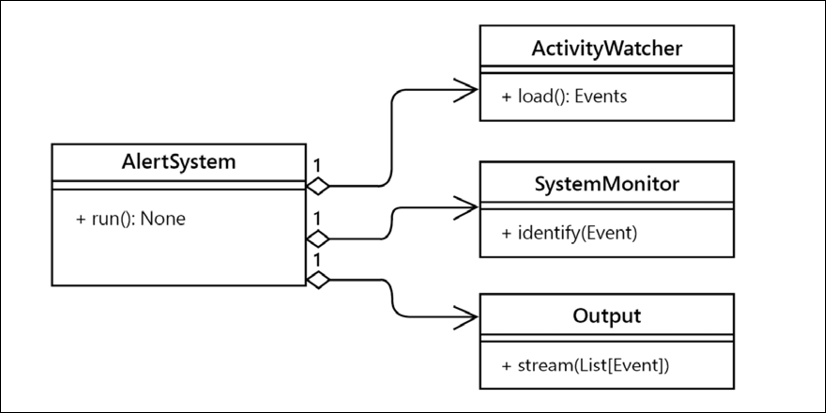
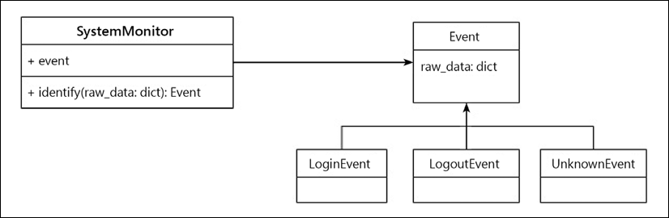
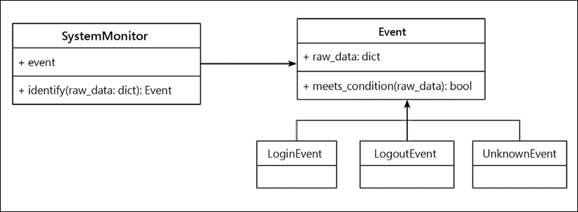
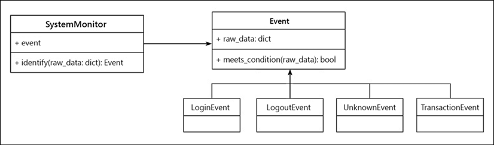
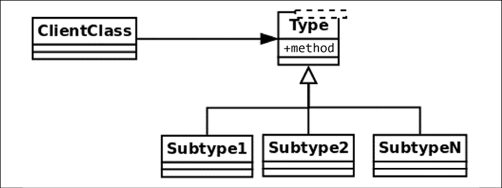
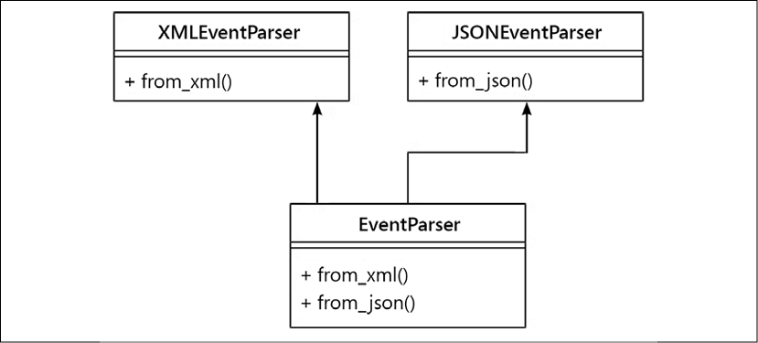
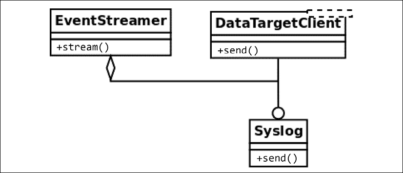

在本章中，我们将继续探索适用于 Python 的简洁设计概念。特别是，我们将回顾 SOLID 原则以及如何以 Pythonic 的方式实现它们。这些原则需要一系列良好的实践来实现更高质量的软件。如果你们中的一些人不知道 SOLID 代表什么，这里是：

- S：单一职责原则
- O：开闭原则
- L：L氏替换原则
- I：接口隔离原则
- D：依赖倒置原则

本章的目标如下：

- 熟悉软件设计的SOLID原则
- 设计遵循单一职责原则的软件组件
- 通过开闭原则实现更可维护的代码
- 通过遵守 Liskov 替换原则，在面向对象设计中实现适当的类层次结构
- 使用接口隔离和依赖倒置进行设计

## 单一责任原则

单一职责原则 (SRP) 规定一个软件组件（通常是一个类）必须只有一个职责。类具有唯一责任这一事实意味着它只负责做一件具体的事情，因此，我们可以得出结论，它必须只有一个改变的理由。

只有当域问题上的一件事发生变化时，才必须更新该类。如果我们因为不同的原因不得不对一个类进行修改，就说明抽象不正确，这个类的职责太多了。这可能表明至少缺少一个抽象：需要创建更多对象来解决重载当前相关类的额外责任。

正如在第 2 章 Pythonic 代码中介绍的那样，这个设计原则帮助我们构建了更具凝聚力的抽象——按照 Unix 哲学，对象只做一件事，只做一件事。在所有情况下，我们想要避免的对象是具有多重职责的对象（通常称为上帝对象，因为它们知道的太多，或者比它们应该知道的更多）。这些对象将不同的（大多是不相关的）行为分组在一起，从而使它们更难维护。

同样，类越小越好。

SRP 与软件设计中的内聚思想密切相关，我们已经在第 3 章“优秀代码的一般特征”中讨论了软件中的关注点分离。我们在这里努力实现的是，类的设计方式是，大多数情况下，它们的大部分属性和属性都被它们的方法使用。当这种情况发生时，我们知道它们是相关的概念，因此将它们分组在同一抽象下是有意义的。

在某种程度上，这个想法有点类似于关系数据库设计中的规范化概念。当我们检测到一个对象的接口的属性或方法上有分区时，它们也可能被移到其他地方——这表明它们是两个或多个不同的抽象混合在一起的。

还有另一种看待这个原则的方式。如果在查看一个类时，我们发现方法相互排斥且彼此不相关，则它们是不同的职责，必须分解为更小的类。

### 一个责任太多的类

在此示例中，我们将为负责从源（可能是日志文件、数据库或更多源）读取事件信息的应用程序创建一个案例，并确定与每个特定的操作相对应的操作 日志。

不符合 SRP 的设计如下所示：

图 4.1：一个有太多职责的类


在不考虑实现的情况下，类的代码可能如下所示：

```python
# srp_1.py
class SystemMonitor:
    def load_activity(self):
        """Get the events from a source, to be processed."""
    def identify_events(self):
        """Parse the source raw data into events (domain objects)."""
    def stream_events(self):
        """Send the parsed events to an external agent."""
```

这个类的问题在于它定义了一个接口，其中包含一组方法，这些方法对应于正交的操作：每个操作都可以独立于其余操作完成。

这种设计缺陷使类变得僵化、不灵活且容易出错，因为它难以维护。在这个例子中，每个方法代表一个类的职责。每个责任都包含一个可能需要修改类的原因。在这种情况下，每个方法都代表必须修改类的各种原因之一。

考虑 loader 方法，它从特定来源检索信息。不管这是如何完成的（我们可以在这里抽象出实现细节），它都有自己的步骤序列，例如，连接到数据源、加载数据、将其解析为预期的格式等等。如果我们需要更改某些内容（例如，我们想要更改用于保存数据的数据结构），则 SystemMonitor 类将需要更改。问问自己这是否有意义。系统监视器对象是否必须因为我们改变了数据的表示而改变？不。

相同的推理适用于其他两种方法。如果我们改变指纹事件的方式，或者我们如何将它们传送到另一个数据源，我们最终会对同一个类进行更改。

现在应该很清楚了，这个类相当脆弱，而且不是很容易维护。有很多不同的原因会影响这个类的变化。相反，我们希望外部因素尽可能少地影响我们的代码。同样，解决方案是创建更小、更有凝聚力的抽象。

### 分配责任

为了使解决方案更易于维护，我们将每个方法分成不同的类。这样，每个类将有一个单一的责任：

图 4.2：在整个类中分配职责



通过使用与这些新类的实例交互的对象，将这些对象用作协作者，可以实现相同的行为，但想法仍然是每个类封装一组特定的方法，这些方法独立于其他类。现在的想法是，对这些类中的任何一个进行更改都不会影响其他类，并且所有这些类都具有明确而具体的含义。如果我们需要更改从数据源加载事件的方式，警报系统甚至不知道这些更改，因此我们不必修改系统监视器上的任何内容（只要合同仍然保留），并且数据目标也未修改。

更改现在是本地的，影响最小，每个类都更容易维护。

新类定义的接口不仅更易于维护，而且可重用。想象一下，现在，在应用程序的另一部分，我们还需要从日志中读取活动，但出于不同的目的。通过这种设计，我们可以简单地使用 ActivityWatcher 类型的对象（它实际上是一个接口，但就本节而言，该细节无关紧要，稍后将针对下一个原则进行解释）。这是有道理的，而在以前的设计中它没有意义，因为尝试重用我们定义的唯一类也会携带根本不需要的额外方法（例如 identify_events() 或 stream_events()） .

一个重要的说明是，该原则根本不意味着每个类都必须有一个方法。任何新类都可能有额外的方法，只要它们对应于该类负责处理的相同逻辑。

对我们在本章中探索的大部分（如果不是全部）原则的一个有趣观察是，我们不应该试图从最初的设计中就使它们正确。这个想法是设计可以轻松扩展和更改的软件，并且可以向更稳定的版本发展。

特别是，您可以将 SRP 用作思考过程。例如，如果您正在设计一个组件（假设是一个类），并且有很多不同的事情需要完成（如前面的示例），那么从一开始您就可以预期这不会结束嗯，你需要分开责任。这是一个好的开始，但接下来的问题是：划分职责的正确界限是什么？因此，要理解这一点，您可以开始编写一个整体类，以了解内部协作是什么以及职责是如何分配的。这将帮助您更清楚地了解需要创建的新抽象。

## 开闭原则

开放/封闭原则 (OCP) 规定一个模块应该是开放的和封闭的（但涉及不同的方面）。

例如，在设计一个类时，我们应该仔细封装实现细节，使其具有良好的维护性，这意味着我们希望它对扩展开放，对修改关闭。

简单来说，这意味着，当然，我们希望我们的代码是可扩展的，以适应新的需求或领域问题的变化。这意味着当域问题出现新的东西时，我们只想向我们的模型添加新的东西，而不是改变任何现有的无法修改的东西。

如果出于某种原因，当必须添加新内容时，我们发现自己修改了代码，那么该逻辑可能设计得很差。理想情况下，当需求发生变化时，我们只想用新的行为扩展模块，而不必显着改变当前的逻辑。

这个原则适用于几个软件抽象。它可以是我们正在谈论的一个类甚至一个模块，但想法保持不变。我们将在以下两个小节中看到每个示例。

### 不遵循 OCP 的可维护性风险示例

让我们从一个以不遵循 OCP 的方式设计的系统的示例开始，以了解它带来的可维护性问题，以及这种设计的不灵活性。

这个想法是我们有一个系统的一部分，负责识别在另一个系统中发生的事件，该系统正在被监控。在每一点上，我们都希望这个组件根据之前收集的数据的值正确地识别事件的类型（为简单起见，我们假设它被打包到一个字典中，并且之前是通过另一种方式检索的，例如作为日志、查询等）。我们有一个基于此数据将检索事件的类，它是另一种具有自己层次结构的类型。

从图 4.3 中的类图中，我们看到一个与接口一起使用的对象（一个基类，有几个可以多态使用的子类）：



乍一看，这看起来像是一个可扩展的设计：添加一个新事件就是创建一个新的 Event 子类，然后系统监视器应该能够使用它们。 但是，这并不十分准确，因为这完全取决于系统监视器类中使用的方法中的实际实现。

解决此问题的第一次尝试可能如下所示：

```python
# openclosed_1.py
@dataclass
class Event:
    raw_data: dict 
class UnknownEvent(Event):
    """A type of event that cannot be identified from its data."""
class LoginEvent(Event):
    """A event representing a user that has just entered the system."""
class LogoutEvent(Event):
    """An event representing a user that has just left the system."""
class SystemMonitor:
    """Identify events that occurred in the system."""
    def __init__(self, event_data):
        self.event_data = event_data
    def identify_event(self):
        if (
            self.event_data["before"]["session"] == 0
            and self.event_data["after"]["session"] == 1
        ):
            return LoginEvent(self.event_data)
        elif (
            self.event_data["before"]["session"] == 1
            and self.event_data["after"]["session"] == 0
        ):
            return LogoutEvent(self.event_data)
        return UnknownEvent(self.event_data)
```

以下是上述代码的预期行为：

```python
>>> l1 = SystemMonitor({"before": {"session": 0}, "after": {"session": 1}})
>>> l1.identify_event().__class__.__name__
'LoginEvent'
>>> l2 = SystemMonitor({"before": {"session": 1}, "after": {"session": 0}})
>>> l2.identify_event().__class__.__name__
'LogoutEvent'
>>> l3 = SystemMonitor({"before": {"session": 1}, "after": {"session": 1}})
>>> l3.identify_event().__class__.__name__
'UnknownEvent'
```

注意事件类型的层次结构，以及构建它们的一些业务逻辑。例如，当没有会话的先前标志，但现在有时，我们将该记录标识为登录事件。相反，当相反的情况发生时，则意味着这是一个注销事件。如果无法识别事件，则返回类型为 unknown 的事件。这是通过遵循空对象模式来保持多态性（而不是返回 None，它使用一些默认逻辑检索相应类型的对象）。空对象模式在第 9 章，通用设计模式中描述。

这种设计有一些问题。第一个问题是确定事件类型的逻辑集中在一个整体方法中。随着我们想要支持的事件数量的增加，这种方法也会增加，它最终可能是一个很长的方法，这很糟糕，因为正如我们已经讨论过的，它不会只做一件事和一件事好。

在同一行，我们可以看到这个方法没有关闭修改。每次我们想要向系统添加新类型的事件时，我们都必须在此方法中进行一些更改（更不用说 elif 语句链将是阅读的噩梦！）。

我们希望能够添加新类型的事件而无需更改此方法（已关闭以进行修改）。我们还希望能够支持新类型的事件（对扩展开放），以便在添加新事件时，我们只需添加代码，而无需更改已存在的代码。

### 重构事件系统以实现可扩展性

上一个示例的问题在于 SystemMonitor 类直接与它要检索的具体类进行交互。

为了实现尊重开放/封闭原则的设计，我们必须向抽象进行设计。

一种可能的替代方法是将此类视为与事件协作，然后我们将每种特定类型事件的逻辑委托给其对应的类：



然后我们必须为每种类型的事件添加一个新的（多态）方法，唯一的责任是确定它是否对应于正在传递的数据，我们还必须更改逻辑以遍历所有事件，找到正确的 一。

新代码应如下所示：

```python
# openclosed_2.py
class Event:
    def __init__(self, raw_data):
        self.raw_data = raw_data
    @staticmethod
    def meets_condition(event_data: dict) -> bool:
        return False
class UnknownEvent(Event):
    """A type of event that cannot be identified from its data"""
class LoginEvent(Event):
    @staticmethod
    def meets_condition(event_data: dict):
        return (
            event_data["before"]["session"] == 0
            and event_data["after"]["session"] == 1
        )
class LogoutEvent(Event):
    @staticmethod
    def meets_condition(event_data: dict):
        return (
            event_data["before"]["session"] == 1
            and event_data["after"]["session"] == 0
        )
class SystemMonitor:
    """Identify events that occurred in the system."""
    def __init__(self, event_data):
        self.event_data = event_data
    def identify_event(self):
        for event_cls in Event.__subclasses__():
            try:
                if event_cls.meets_condition(self.event_data):
                    return event_cls(self.event_data)
            except KeyError:
                continue
        return UnknownEvent(self.event_data)
```

注意交互现在是如何面向抽象的（在这种情况下，它将是通用基类 Event，它甚至可能是抽象基类或接口，但对于本示例而言，拥有一个具体的基类就足够了基类）。该方法不再适用于特定类型的事件，而仅适用于遵循公共接口的通用事件——它们对于 meet_condition 方法来说都是多态的。

注意事件是如何通过 \_\_subclasses\_\_() 方法发现的。支持新类型的事件现在只是为该事件创建一个新类，该类必须根据其特定标准扩展 Event 并实现其自己的 meet_condition() 方法。

这个例子依赖于 \_\_subclasses\_\_() 方法，因为它足以说明可扩展设计的思想。也可以使用其他替代方法，例如使用 abc 模块注册类，或者创建我们自己的注册表，但主要思想是相同的，对象之间的关系不会改变。

通过这种设计，原始的 identify_event 方法是关闭的：当我们向我们的域添加新类型的事件时不必修改它。相反，事件的层次结构可以扩展：当域中出现新事件时，我们只需要创建一个新实体并根据它实现的接口定义其标准。

扩展事件系统

现在，让我们证明这个设计实际上是我们想要的那样可扩展。想象一下，出现了一个新的需求，我们还必须支持与用户在受监控系统上执行的事务相对应的事件。

设计的类图必须包含这个新的事件类型，如图 4.5 所示：



我们创建新类，在它的 meet_condition 方法上实现标准，其余的逻辑应该像以前一样继续工作（包括新行为）。

假设之前的所有其他定义都没有改变，下面是新类的代码：

```python
# openclosed_3.py
class TransactionEvent(Event):
    """Represents a transaction that has just occurred on the system."""
    @staticmethod
    def meets_condition(event_data: dict):
        return event_data["after"].get("transaction") is not None
```

我们可以验证之前的案例是否像以前一样工作，并且新事件也被正确识别：

```python
>>> l1 = SystemMonitor({"before": {"session": 0}, "after": {"session": 1}})
>>> l1.identify_event().__class__.__name__
'LoginEvent'
>>> l2 = SystemMonitor({"before": {"session": 1}, "after": {"session": 0}})
>>> l2.identify_event().__class__.__name__
'LogoutEvent'
>>> l3 = SystemMonitor({"before": {"session": 1}, "after": {"session": 1}})
>>> l3.identify_event().__class__.__name__
'UnknownEvent'
>>> l4 = SystemMonitor({"after": {"transaction": "Tx001"}})
>>> l4.identify_event().__class__.__name__
'TransactionEvent'
```

请注意，当我们添加新的事件类型时， SystemMonitor.identify_event() 方法根本没有改变。因此我们说这个方法对于新类型的事件是封闭的。

相反，Event 类允许我们在需要时添加新类型的事件。然后我们说事件对于新类型的扩展是开放的。

这就是这条原则的真正本质——当领域问题出现新的东西时，我们只想添加新代码，而不是修改任何现有代码。

### 关于 OCP 的最终想法

您可能已经注意到，该原则与多态性的有效使用密切相关。我们希望致力于设计尊重客户端可以使用的多态契约的抽象，设计一个足够通用的结构，只要保留多态关系，就可以扩展模型。

这个原则解决了软件工程中的一个重要问题：可维护性。不遵循 OCP 的危险是软件中的连锁反应和问题，其中单个更改会触发整个代码库的更改，或者有破坏代码其他部分的风险。

最后一个重要的注意事项是，为了实现这种不更改代码以扩展行为的设计，我们需要能够针对我们想要保护的抽象创建适当的闭包（在本例中，新类型的事件）。这在所有程序中并不总是可行的，因为一些抽象可能会发生冲突（例如，我们可能有一个适当的抽象，它提供了针对需求的闭包，但不适用于其他类型的需求）。在这些情况下，我们需要有选择性并应用一种策略，为需要最可扩展的需求类型提供最佳关闭。

## Liskov 替换原则

Liskov 的替换原则 (LSP) 指出，对象类型必须保持一系列属性才能保持其设计的可靠性。

LSP 背后的主要思想是，对于任何类，客户端应该能够毫无区别地使用其任何子类型，甚至不会注意到，因此不会影响运行时的预期行为。这意味着客户端是完全隔离的并且不知道类层次结构的变化。

更正式地说，这是 LSP 的原始定义 (LISKOV 01)：如果 S 是 T 的子类型，那么类型 T 的对象可以被类型 S 的对象替换，而不会破坏程序。

这可以在通用图表的帮助下理解，例如以下图表。想象一下，有一些客户端类需要（包含）另一种类型的对象。一般来说，我们希望这个客户端与某种类型的对象进行交互，即通过接口工作。

现在，这种类型也可能只是一个通用接口定义、抽象类或接口，而不是具有行为本身的类。可能有几个扩展这种类型的子类（在图 4.6 中使用名称子类型描述，最多 N）。该原则背后的想法是，如果正确实现了层次结构，则客户端类必须能够在没有注意到的情况下使用任何子类的实例。这些对象应该可以互换，如图 4.6 所示：



这与我们已经访问过的其他设计原则有关，例如为界面设计。一个好的类必须定义一个清晰简洁的接口，只要子类遵循该接口，程序就会保持正确。

因此，该原则也与合同设计背后的想法有关。给定类型和客户端之间存在契约。通过遵循 LSP 的规则，设计将确保子类尊重父类定义的契约。

### 使用工具检测 LSP 问题

有一些关于 LSP 的场景非常错误，以至于我们可以通过我们在第 1 章介绍、代码格式和工具（主要是 mypy 和 pylint）中学到的配置工具轻松识别它们。

#### 使用 mypy 检测不正确的方法签名

通过在我们的代码中使用类型注解（如前面第 1 章介绍、代码格式和工具中所推荐的），并配置 mypy，我们可以及早快速检测一些基本错误，并免费检查与 LSP 的基本合规性。

如果 Event 类的子类之一以不兼容的方式覆盖方法，mypy 会通过检查注释来注意到这一点：

```python
class Event:
    ...
    def meets_condition(self, event_data: dict) -> bool:
        return False
class LoginEvent(Event):
    def meets_condition(self, event_data: list) -> bool:
        return bool(event_data)
```

当我们在这个文件上运行 mypy 时，我们将收到一条错误消息，内容如下：

```python
error: Argument 1 of "meets_condition" incompatible with supertype "Event"
```

对 LSP 的违反是很明显的——因为派生类使用的 event_data 参数类型与基类上定义的类型不同，我们不能指望它们同等工作。请记住，根据此原则，此层次结构的任何调用者都必须能够透明地使用 Event 或 LoginEvent，而不会注意到任何区别。交换这两种类型的对象不应使应用程序失败。如果不这样做，将破坏层次结构上的多态性。

如果返回类型更改为布尔值以外的其他内容，则会发生相同的错误。基本原理是此代码的客户端期望使用布尔值。如果派生类之一更改了此返回类型，将违反约定，并且我们不能期望程序继续正常工作。

关于不相同但共享公共接口的类型的快速说明：尽管这只是一个演示错误的简单示例，但字典和列表仍然有一些共同点；它们都是可迭代的。这意味着在某些情况下，一个方法需要字典而另一个方法需要接收列表可能是有效的，只要两者都通过可迭代接口处理参数。在这种情况下，问题不在于逻辑本身（LSP 可能仍然适用），而在于签名类型的定义，它不应该读取 list 和 dict，而是两者的联合。无论哪种情况，都必须修改某些内容，无论是方法的代码、整个设计，还是只是类型注释，但在任何情况下，我们都不应该忽略警告并忽略 mypy 给出的错误。

不要使用 # type: ignore 或类似的东西来忽略诸如此类的错误。重构或更改代码以解决实际问题。这些工具出于正当理由报告了实际的设计缺陷。

从面向对象设计的角度来看，这个原则也是有意义的。请记住，子类化应该创建更具体的类型，但每个子类都必须是父类声明的。对于上一节中的示例，系统监视器希望能够交替使用任何事件类型。但是这些事件类型中的每一种都是事件（LoginEvent 必须是事件，其余的子类也必须是事件）。如果这些对象中的任何一个通过不实现来自基类 Event 类的消息、实现另一个未在该类中声明的公共方法或更改方法的签名来破坏层次结构，则 identify_event 方法可能不再起作用。

#### 使用 pylint 检测不兼容的签名

另一个严重违反 LSP 的情况是，方法的签名完全不同，而不是改变层次结构上参数的类型。这似乎是一个大错，但检测它可能并不总是那么容易记住。 Python 是解释型的，因此没有编译器可以在早期检测到这些类型的错误，因此它们直到运行时才会被捕获。幸运的是，我们有静态代码分析器，例如 mypy 和 pylint，可以尽早捕获诸如此类的错误。

虽然 mypy 也会捕获这些类型的错误，但最好也运行 pylint 以获得更多洞察力。

如果存在破坏层次结构定义的兼容性的类（例如，通过更改方法的签名、添加额外的参数等），例如：

```python
# lsp_1.py
class LogoutEvent(Event):
    def meets_condition(self, event_data: dict, override: bool) -> bool:
        if override:
            return True
        ...
```

pylint 会检测到它，打印一个信息性错误：

```python
Parameters differ from overridden 'meets_condition' method (arguments-differ)
```

再一次，与前一种情况一样，不要抑制这些错误。注意工具给出的警告和错误，并相应地调整代码。

### 更微妙的 LSP 违规案例

然而，在其他情况下，LSP 被破坏的方式并不那么清楚或明显，以至于工具可以自动为我们识别它，我们在进行代码审查时必须依靠仔细的代码检查。

合同被修改的情况特别难以自动检测。鉴于 LSP 的整个想法是子类可以像它们的父类一样被客户端使用，合同在层次结构上正确保留也必须是正确的。

记得在第 3 章，良好代码的一般特征，在通过契约设计时，客户和供应商之间的契约设置了一些规则——客户必须为方法提供先决条件，供应商可能会验证这些先决条件，并将一些结果返回给供应商客户端，它将以后置条件的形式检查。

父类定义了与其客户的契约。这个的子类必须尊重这样的契约。这意味着例如：

- 子类永远不能使先决条件比在父类上定义的更严格
- 子类永远不能使后置条件比它们在父类上定义的更弱

考虑上一节中定义的事件层次结构示例，但现在进行更改以说明 LSP 和 DbC 之间的关系。

这一次，我们将假设基于数据检查条件的方法有一个前提条件，提供的参数必须是一个包含键“before”和“after”的字典，并且它们的值也是嵌套字典.这让我们可以进一步封装，因为现在客户端不需要捕获 KeyError 异常，而只是调用 precondition 方法（假设如果系统在错误的假设下运行，失败是可以接受的）。

作为旁注，我们可以从客户端中删除它是件好事，因为现在，SystemMonitor 不需要知道协作者类的方法可能引发哪些类型的异常（请记住，异常削弱了封装，因为它们需要调用者了解有关他们正在调用的对象的额外信息）。

这样的设计可以通过代码中的以下更改来表示：

```python
# lsp_2.py
from collections.abc import Mapping
 
 
class Event:
    def __init__(self, raw_data):
        self.raw_data = raw_data
 
    @staticmethod
    def meets_condition(event_data: dict) -> bool:
        return False
 
    @staticmethod
    def validate_precondition(event_data: dict):
        """Precondition of the contract of this interface.
 
        Validate that the ``event_data`` parameter is properly formed.
        """
        if not isinstance(event_data, Mapping):
            raise ValueError(f"{event_data!r} is not a dict")
        for moment in ("before", "after"):
            if moment not in event_data:
                raise ValueError(f"{moment} not in {event_data}")
            if not isinstance(event_data[moment], Mapping):
                raise ValueError(f"event_data[{moment!r}] is not a dict")
```

现在，尝试检测正确事件类型的代码只检查一次前提条件，然后继续查找正确的事件类型：

```python
# lsp_2.py
class SystemMonitor:
    """Identify events that occurred in the system."""
    def __init__(self, event_data):
        self.event_data = event_data
    def identify_event(self):
        Event.validate_precondition(self.event_data)
        event_cls = next(
            (
                event_cls
                for event_cls in Event.__subclasses__()
                if event_cls.meets_condition(self.event_data)
            ),
            UnknownEvent,
        )
        return event_cls(self.event_data)
```

该合约仅声明顶级键“before”和“after”是强制性的，并且它们的值也应该是字典。 任何在子类中要求更严格参数的尝试都将失败。

事务事件的类最初是正确设计的。 看代码如何不对名为“transaction”的内部键施加限制； 它仅在存在时才使用其值，但这不是强制性的：

```python
# lsp_2.py
class TransactionEvent(Event):
    """Represents a transaction that has just occurred on the system."""
    @staticmethod
    def meets_condition(event_data: dict) -> bool:
        return event_data["after"].get("transaction") is not None
```

但是，原来的两种方法是不正确的，因为它们要求存在一个名为“session”的密钥，而这不是原始合约的一部分。 这违反了约定，现在客户端不能像使用其余类一样使用这些类，因为它会引发 KeyError。

解决这个问题后（改变 .get() 方法的方括号），LSP 上的顺序已经重新建立，多态盛行：

```python
>>> l1 = SystemMonitor({"before": {"session": 0}, "after": {"session": 1}})
>>> l1.identify_event().__class__.__name__
'LoginEvent'
>>> l2 = SystemMonitor({"before": {"session": 1}, "after": {"session": 0}})
>>> l2.identify_event().__class__.__name__
'LogoutEvent'
>>> l3 = SystemMonitor({"before": {"session": 1}, "after": {"session": 1}})
>>> l3.identify_event().__class__.__name__'UnknownEvent'
>>> l4 = SystemMonitor({"before": {}, "after": {"transaction": "Tx001"}})
>>> l4.identify_event().__class__.__name__
'TransactionEvent'
```

期望自动化工具（无论它们有多好和多有用）来检测这样的案例是不合理的。我们在设计类时必须小心，不要以与客户最初期望的方式不兼容的方式意外更改方法的输入或输出。

### LSP 备注

LSP 是良好的面向对象软件设计的基础，因为它强调其核心特征之一——多态性。它是关于创建正确的层次结构，以便从基类派生的类沿着父类是多态的，就其接口上的方法而言。

注意到这个原则与前一个原则的关系也很有趣——如果我们试图用一个不兼容的新类来扩展一个类，它将失败，与客户的合同将被破坏，结果是这样的扩展将不可能（或者，为了使其成为可能，我们将不得不打破原则的另一端并修改客户端中应该关闭以进行修改的代码，这是完全不可取和不可接受的）。

按照 LSP 建议的方式仔细考虑新类有助于我们正确扩展层次结构。然后我们可以说 LSP 对 OCP 有贡献。

## 接口隔离

接口隔离原则 (ISP) 为我们已经反复重申的一个想法提供了一些指导方针：接口应该很小。

在面向对象的术语中，接口由对象公开的一组方法和属性表示。也就是说，一个对象能够接收或解释的所有消息构成了它的接口，这也是其他客户端可以请求的。接口将类的公开行为的定义与其实现分开。

在 Python 中，接口是由类根据其方法隐式定义的。这是因为 Python 遵循所谓的鸭子类型原则。

传统上，鸭子类型背后的想法是任何对象都由它拥有的方法以及它能够做什么来真正表示。这意味着，无论类的类型、名称、文档字符串、类属性或实例属性如何，最终定义对象本质的是它拥有的方法。类中定义的方法（它知道如何做）决定了该对象将是什么。之所以称为鸭子打字，是因为“如果它走路像鸭子，叫起来像鸭子，那它一定是鸭子。”

长期以来，鸭子类型是 Python 中定义接口的唯一方式。后来，PEP-3119 引入了抽象基类的概念，作为以不同方式定义接口的一种方式。抽象基类的基本思想是它们定义了一些派生类负责实现的基本行为或接口。这在我们想要确保某些关键方法实际上被覆盖的情况下很有用，并且它也可以作为一种机制来覆盖或扩展方法的功能，例如 isinstance()。

抽象基类的引入是为了为开发人员提供一个有用且强大的工具来指示必须实际实现的事物。例如，考虑到之前公开的原则（LSP），如果我们有一个通用的 Event 类，我们不想使用该类本身（因为它自己并不意味着什么），所以我们可能想要处理与实际事件之一（例如，子类，如 LoginEvent）。在这种情况下，我们可以将 Event 定义为抽象基类，以使其明确。然后系统监视器处理一种类型的事件，而 Event 类的作用就像一个接口（作为“任何具有这种行为的对象”的说法）。我们可以更进一步，确定 meet_condition 方法的默认实现是不够的（或者有时接口无法提供实现），并强制每个派生类实现它。为此，我们将使用@abstractmethod 装饰器。

abc 模块还包含一种将某些类型注册为层次结构的一部分的方法，称为虚拟子类。这个想法是通过添加一个新标准来进一步扩展鸭子类型的概念——像鸭子一样走路，像鸭子一样嘎嘎叫，或者......它说它是一只鸭子。

Python 如何解释接口的这些概念对于理解这一原则和下一个原则很重要。

抽象地说，ISP 表示，当我们定义一个提供多种方法的接口时，最好将其分解为多个，每个包含较少的方法（最好只有一个），并具有非常具体和准确的范围。通过将接口分成尽可能小的单元，以支持代码可重用性，每个想要实现这些接口之一的类很可能是高度内聚的，因为它具有非常明确的行为和职责集。

### 提供太多的接口

现在，我们希望能够解析来自不同格式（例如 XML 和 JSON）的多个数据源的事件。遵循良好做法，我们决定将接口作为我们的依赖项而不是具体类，并设计了如下内容：


为了在 Python 中将其创建为接口，我们将使用抽象基类并将方法（from_xml() 和 from_json()）定义为抽象的，以强制派生类实现它们。从这个抽象基类派生并实现这些方法的事件将能够使用它们相应的类型。

但是如果一个特定的类不需要 XML 方法，而只能从 JSON 构造呢？它仍然会携带来自接口的 from_xml() 方法，因为它不需要它，所以它必须通过。这不是很灵活，因为它会产生耦合并强制接口的客户端使用他们不需要的方法。

### 接口越小越好

最好将其分成两个不同的接口，每个接口一个。我们仍然可以通过让我们的事件解析器类实现两个接口来实现相同的功能（因为接口或抽象基类只是具有一些增强约束的常规类，而 Python 支持多重继承）。现在的区别在于，我们在更具体的接口中声明了每个方法，如果我们在代码中的其他地方需要它，我们可以重用它：



通过这种设计，从 XMLEventParser 派生并实现 from_xml() 方法的对象将知道如何从 XML 构造，对于 JSON 文件也是如此，但最重要的是，我们保持了两个独立函数的正交性，并保留了 系统的灵活性，而不会失去通过组合新的较小对象仍然可以实现的任何功能。

下面是代码寻找图 4.8 表示的方式：

```python
from abc import ABCMeta, abstractmethod
class XMLEventParser(metaclass=ABCMeta):
    @abstractmethod
    def from_xml(xml_data: str):
        """Parse an event from a source in XML representation."""
 
class JSONEventParser(metaclass=ABCMeta):
    @abstractmethod
    def from_json(json_data: str):
        """Parse an event from a source in JSON format."""
 
class EventParser(XMLEventParser, JSONEventParser):
    """An event parser that can create an event from source data either in XML or JSON format.
    """
 
    def from_xml(xml_data):
        pass
 
    def from_json(json_data: str):
        pass
```

请注意，接口所需的抽象方法必须在具体类中实现（尽管它们的实际实现与示例无关）。 如果我们不实施它们，则会触发运行时错误，例如：

```python
>>> from src.isp import EventParser
>>> EventParser()
Traceback (most recent call last):
  File "<stdin>", line 1, in <module>
TypeError: Can't instantiate abstract class EventParser with abstract methods from_json, from_xml
```

与 SRP 有一些相似之处，但主要区别在于这里我们谈论的是接口，因此它是行为的抽象定义。没有理由改变，因为在实际实现接口之前什么都没有。但是，不遵守这一原则将创建一个与正交功能耦合的接口，并且这个派生类也将不遵守 SRP（它将有多个更改的原因）。

### 接口应该有多小？

上一节中的观点是有效的，但它也需要一个警告——如果它被误解或走极端，请避免危险的路径。

基类（抽象或非抽象）为所有其他类定义了一个接口来扩展它。这应该尽可能小这一事实必须从凝聚力的角度来理解——它应该做一件事。这并不意味着它必须有一种方法。在前面的例子中，两种方法都在做脱节的事情是巧合；因此将它们分成不同的类是有意义的。

但也有可能不止一种方法理所当然地属于同一个类。想象一下，您想提供一个 mixin 类来抽象上下文管理器中的某些逻辑，以便从该 mixin 派生的所有类免费获得该上下文管理器逻辑。正如我们已经知道的，上下文管理器需要两种方法：\_\_enter\_\_ 和 \_\_exit\_\_。它们必须一起使用，否则结果将根本不是有效的上下文管理器！

未能将这两种方法放在同一个类中将导致组件损坏，这不仅无用而且很危险。希望这个夸张的例子可以作为上一节中的例子的平衡，并且你可以更准确地了解设计界面。

## 依赖倒置

这是一个非常强大的想法，当我们在第 9 章，通用设计模式和第 10 章，清洁架构中探索一些设计模式时，它会再次出现。

依赖倒置原则 (DIP) 提出了一个有趣的设计原则，我们通过该原则保护我们的代码，使其独立于脆弱、易变或不受我们控制的事物。反转依赖的想法是我们的代码不应该适应细节或具体实现，而是相反：我们希望通过某种 API 强制任何实现或细节适应我们的代码。

抽象必须以这样的方式组织，即它们不依赖于细节，而是相反——细节（具体实现）应该依赖于抽象。

想象一下，我们设计中的两个对象 A 和 B 需要协作。 A 与 B 的实例一起工作，但事实证明，我们的模块并不直接控制 B（它可能是外部库，或由另一个团队，等等）。如果我们的代码严重依赖于 B，那么当它发生变化时，代码就会中断。为了防止这种情况，我们必须反转依赖关系：使 B 必须适应 A。这是通过呈现一个接口并强制我们的代码不依赖于 B 的具体实现，而是依赖于我们定义的接口来完成的。然后 B 有责任遵守该接口。

与前面部分探讨的概念一致，抽象也以接口（或 Python 中的抽象基类）的形式出现。

一般来说，我们可以期望具体实现比抽象组件更频繁地更改。正是出于这个原因，我们将抽象（接口）作为灵活性点，我们希望我们的系统可以更改、修改或扩展，而无需更改抽象本身。

### 刚性依赖的案例

我们事件监控系统的最后一部分是将识别出的事件传送到数据收集器进行进一步分析。这种想法的一个天真的实现包括拥有一个与数据目的地交互的事件流媒体类，例如，Syslog：


但是，这种设计并不是很好，因为我们有一个高级类（EventStreamer）依赖于一个低级类（Syslog 是一个实现细节）。 如果我们希望向 Syslog 发送数据的方式发生变化，则必须修改 EventStreamer。 如果我们想为不同的目标更改数据目标或在运行时添加新目标，我们也会遇到麻烦，因为我们会发现自己不断修改 stream() 方法以使其适应这些要求。

### 反转依赖关系

解决这些问题的方法是让 EventStreamer 使用一个接口，而不是一个具体的类。 这样，实现这个接口取决于包含实现细节的低级类：



现在有一个接口表示将要发送数据的通用数据目标。请注意依赖关系现在是如何倒置的，因为 EventStreamer 不依赖于特定数据目标的具体实现，它不必随着这个数据目标的变化而改变，并且实现接口取决于每个特定数据目标并在必要时适应变化。

换句话说，第一个实现的原始 EventStreamer 仅适用于 Syslog 类型的对象，这不是很灵活。然后我们意识到它可以与任何可以响应 .send() 消息的对象一起使用，并将此方法标识为它需要遵守的接口。现在，在这个版本中，Syslog 实际上扩展了名为 DataTargetClient 的抽象基类，它定义了 send() 方法。从现在开始，每个新类型的数据目标（例如电子邮件）都需要扩展这个抽象基类并实现 send() 方法。

我们甚至可以在运行时为实现 send() 方法的任何其他对象修改此属性，它仍然可以工作。这就是常被称为依赖注入的原因：因为依赖是可以动态提供（注入）的。

精明的读者可能想知道为什么这是必要的。 Python 足够灵活（有时过于灵活），并且允许我们为 EventStreamer 之类的对象提供任何特定的数据目标对象，而无需遵守任何接口，因为它是动态类型的。问题是：当我们可以简单地将一个带有 send() 方法的对象传递给它时，为什么我们还需要定义抽象基类（接口）？

平心而论，这是真的。实际上没有必要这样做，该程序将正常工作。毕竟，多态并不意味着（或要求）继承必须起作用。然而，定义抽象基类是一个很好的做法，它有一些优点，第一个是鸭子类型。连同鸭子类型，我们可以提到模型变得更具可读性这一事实——记住继承遵循的是 a 的规则，所以通过声明抽象基类并从它扩展，我们说，例如，Syslog 是 DataTargetClient ，这是您的代码用户可以阅读和理解的内容（同样，这是鸭子类型）。

总而言之，定义抽象基类不是强制性的，但为了实现更清晰的设计，这是可取的。这就是本书的目的之一——帮助程序员避免容易犯的错误，仅仅因为 Python 太灵活了，我们可以侥幸逃脱。

### 依赖注入

上一节中探讨的概念给了我们一个强大的想法：不要让我们的代码依赖于特定的具体实现，让我们创建一个强大的抽象，作为介于两者之间的层。在示例中，我们讨论了依赖 Syslog 如何导致设计僵化，因此我们为所有客户端创建了一个接口，并决定 Syslog 恰好是其中之一，因为它实现了 DataTargetClient 接口。这为我们将来要添加的更多客户端打开了大门：只需创建一个实现接口并定义发送方法的新类。该设计现在对扩展开放，对修改关闭（我们开始看到这些原则如何相互关联）。

现在，这些对象之间将如何协作？在这一部分中，我们将探讨如何将依赖项提供给实际需要它的对象。

一种方法是通过直接创建它需要的对象来声明事件流媒体工作，在这种情况下是一个系统日志：

```python
class EventStreamer:
    def __init__(self):
        self._target = Syslog()
    def stream(self, events: list[Event]) -> None:
        for event in events:
            self._target.send(event.serialise())
```

然而，这不是一个非常灵活的设计，它没有充分利用我们创建的界面。 请注意，这种设计也更难测试：如果要为此类编写单元测试，则必须修补 Syslog 对象的创建或在它刚刚创建后覆盖它。 如果 Syslog 在创建时有副作用（通常不是好的做法，但在某些情况下可以，例如，当您可能想要建立连接时），那么这些副作用也会被带到这个初始化中。 确实，这可以通过使用惰性属性来克服，但实际控制我们提供的对象的不灵活性仍然存在。

更好的设计将使用依赖注入，并让目标提供给事件流传输器：

```python
class EventStreamer:
    def __init__(self, target: DataTargetClient):
        self._target = target
    def stream(self, events: list[Event]) -> None:
        for event in events:
            self._target.send(event.serialise())
```

这利用了接口并启用了多态性。现在我们可以在初始化时传递任何实现了这个接口的对象，这也使得事件流处理器与这种对象一起工作变得更加明确。

与前一种情况相反，此版本也更易于测试。如果我们不想在我们的单元测试中处理 Syslog，我们可以提供一个测试替身（只是一个符合接口的新类，对我们需要测试的任何东西都有用）。

> 不要在初始化方法中强制创建依赖项。相反，通过在 \_\_init\_\_ 方法中使用参数，让您的用户以更灵活的方式定义依赖项。

在某些情况下，当对象有更复杂的初始化（更多参数），或者有很多时，最好在依赖图中声明对象之间的交互，然后让库来做实际的工作为您创建对象（即删除绑定不同对象的胶水代码的样板）。

pinject (https://github.com/google/pinject) 就是此类库的一个示例，它允许您声明对象如何交互。在我们的简单示例中，一种可能性是编写如下代码：

```python
class EventStreamer:
    def __init__(self, target: DataTargetClient):
        self.target = target
    def stream(self, events: list[Event]) -> None:
        for event in events:
            self.target.send(event.serialise())
class _EventStreamerBindingSpec(pinject.BindingSpec):
    def provide_target(self):
        return Syslog()
object_graph = pinject.new_object_graph(
    binding_specs=[_EventStreamerBindingSpec()])
```

使用与之前相同的类定义，我们可以定义一个绑定规范，它是一个知道如何注入依赖项的对象。 在这个对象中，任何名为 provide_<dependency> 的方法都应该返回具有该名称作为后缀的依赖项（我们在我们的简单示例中选择了 Syslog）。

然后我们创建图形对象，我们将使用它来获取已提供依赖项的对象； 例如

```python
event_streamer = object_graph.provide(EventStreamer)
```

会给我们一个 event_streamer 对象，它的目标是一个 Syslog 的实例。

当对象之间有多个依赖项或相互关系时，最好将它们编写为声明式并让工具为您处理初始化。在这种情况下，我们的想法是，对于这些类型的对象，我们在一个地方定义它们的创建方式，并让工具为我们完成（从这个意义上说，它类似于工厂对象）。

请记住，这不会失去最初从我们的设计中获得的灵活性。对象图是一个知道如何根据所做的定义构建其他实体的对象，但我们仍然可以完全控制我们创建的 EventStreamer 类，并且可以像以前一样使用它，通过在初始化中传递任何对象符合所需接口的方法。

## 总结

SOLID 原则是良好的面向对象软件设计的关键指南。

构建软件是一项非常艰巨的任务——代码的逻辑很复杂，它在运行时的行为很难（有时甚至可能的话）预测，需求和环境都在不断变化，并且有很多事情可能会出错.

此外，有多种方法可以使用不同的技术、范式或工具来构建软件，它们可以协同工作以特定方式解决特定问题。然而，并不是所有这些方法都会随着时间的推移和需求的变化或演变而被证明是正确的。然而，此时，对不正确的设计采取措施已经为时已晚，因为它是僵化的、不灵活的，因此很难将重构更改为正确的解决方案。

这意味着，如果我们设计错误，将来我们将付出很大代价。那么我们如何才能实现一个最终会带来回报的好设计呢？答案是我们不确定。我们正在应对未来，而未来是不确定的——无法确定我们的设计是否正确，以及我们的软件在未来几年是否具有灵活性和适应性。正是因为这个原因，我们必须坚持原则。

这就是 SOLID 原则发挥作用的地方。它们不是魔法规则（毕竟，软件工程中没有灵丹妙药），但它们提供了很好的指导方针，这些指导方针已被证明在过去的项目中有效，并且将使我们的软件更有可能成功。我们的想法不是从第一个版本中就获得所有要求，而是实现一个可扩展且足够灵活以进行更改的设计，以便我们可以根据需要对其进行调整。

在本章中，我们探索了 SOLID 原则，目的是理解简洁设计。在接下来的章节中，我们将继续探索该语言的细节，并了解在某些情况下如何将这些工具和特性与这些原则结合使用。

第 5 章，使用装饰器改进我们的代码，探索如何利用装饰器改进我们的代码。与本章更侧重于软件工程的抽象思想不同，第 5 章，使用装饰器改进我们的代码，将更侧重于 Python，但我们将使用我们刚刚学到的原则。

## 参考

以下是您可以参考的信息列表：

SRP 01：单一职责原则（https://8thlight.com/blog/uncle-bob/2014/05/08/SingleReponsibilityPrinciple.html）
PEP-3119：引入抽象基类 (https://www.python.org/dev/peps/pep-3119/)
面向对象的软件构造，第二版，由 Bertrand Meyer 编写
LISKOV 01：Barbara Liskov 撰写的一篇名为 Data Abstraction and Hierarchy 的论文 (https://www.cs.tufts.edu/~nr/cs257/archive/barbara-liskov/data-abstraction-and-hierarchy.pdf)