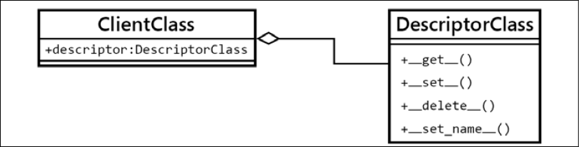

本章介绍了一个在 Python 开发中更高级的新概念，因为它具有描述符。此外，描述符不是其他语言的程序员所熟悉的东西，因此没有简单的类比或并行性。

描述符是 Python 的另一个显着特征，它将面向对象编程提升到另一个层次，它们的潜力允许用户构建更强大和可重用的抽象。大多数时候，在库或框架中可以观察到描述符的全部潜力。

在本章中，我们将实现以下与描述符相关的目标：

了解什么是描述符、它们如何工作以及如何有效地实现它们
分析两类描述符（数据和非数据描述符）的概念差异和实现细节
通过描述符有效地重用代码
分析描述符的良好使用示例，以及如何将它们用于我们的 API 库

## 首先看一下描述符

首先，我们将探索描述符背后的主要思想，以了解它们的机制和内部工作原理。一旦清楚这一点，就更容易理解不同类型的描述符如何工作，我们将在下一节中探讨。

一旦我们对描述符背后的思想有了一个大致的了解，我们将看一个例子，在这个例子中，它们的使用为我们提供了一个更清晰、更 Pythonic 的实现。

### 描述符背后的机制

描述符的工作方式并不是那么复杂，但它们的问题是需要考虑很多注意事项，因此实现细节在这里至关重要。

要实现描述符，我们至少需要两个类。对于这个通用示例，客户端类将利用我们想要在描述符中实现的功能（这通常只是一个域模型类，我们为解决方案创建的常规抽象），描述符类将实现描述符本身。

因此，描述符只是一个对象，它是实现描述符协议的类的实例。这意味着此类的接口必须至少包含以下魔术方法之一（Python 3.6+ 的描述符协议的一部分）：

- \_\_get\_\_
- \_\_set\_\_
- \_\_delete\_\_
- \_\_set_name\_\_

出于此初始高级介绍的目的，将使用以下命名约定：

| 名字            | 含义                                                         |
| --------------- | ------------------------------------------------------------ |
| ClientClass     | 将利用描述符实现的功能的域级抽象。 此类被称为描述符的客户端。<br/>这个类包含一个类属性（按照这个约定命名为描述符），它是 DescriptorClass 的一个实例。 |
| DescriptorClass | 实现描述符本身的类。 这个类应该实现前面提到的一些需要描述符协议的魔术方法。 |
| client          | ClientClass 的一个实例。                                     |
| descriptor      | DescriptorClass 的一个实例。<br/>descriptor = DescriptorClass().<br/>此对象是放置在 ClientClass 中的类属性。 |

这种关系如图 6.1 所示：



要记住的一个非常重要的观察是要使该协议工作，必须将描述符对象定义为类属性。将此对象创建为实例属性将不起作用，因此它必须在类的主体中，而不是在 __init__ 方法中。

始终将描述符对象作为类属性放置！

更重要的是，读者还可以注意到，可以部分实现描述符协议——并非所有方法都必须始终定义；相反，我们只能实现我们需要的那些，我们很快就会看到。

所以，现在我们已经有了结构——我们知道设置了哪些元素以及它们如何交互。我们需要一个描述符的类，另一个类将使用描述符的逻辑，反过来，它将有一个描述符对象（DescriptorClass 的实例）作为类属性，以及将遵循描述符协议的 ClientClass 实例当我们调用名为描述符的属性时。但是现在呢？所有这些如何在运行时就位？

通常，当我们有一个常规类并访问它的属性时，我们只需按照我们的预期获取对象，甚至是它们的属性，如下例所示：

```python
>>> class Attribute:
...     value = 42
... 
>>> class Client:
...     attribute = Attribute()
... 
>>> Client().attribute
<__main__.Attribute object at 0x...>
>>> Client().attribute.value
42
```

但是，在描述符的情况下，会发生一些不同的事情。 当一个对象被定义为一个类属性（而这个属性是一个描述符）时，当客户端请求这个属性时，而不是获取对象本身（正如我们从前面的例子中所期望的那样），我们得到了调用 __get__ 魔术方法。

让我们从一些只记录上下文信息的简单代码开始，并返回相同的客户端对象：

```python
class DescriptorClass:
    def __get__(self, instance, owner):
        if instance is None:
            return self
        logger.info(
            "Call: %s.__get__(%r, %r)",
            self.__class__.__name__,
            instance,
            owner
        )
        return instance
class ClientClass:
    descriptor = DescriptorClass()
```

当运行这段代码，并请求 ClientClass 实例的描述符属性时，我们会发现我们实际上并没有获取 DescriptorClass 的实例，而是无论它的 \_\_get\_\_() 方法返回的是什么：

```python
>>> client = ClientClass()
>>> client.descriptor
INFO:Call: DescriptorClass.__get__(<ClientClass object at 0x...>, <class 'ClientClass'>)
<ClientClass object at 0x...>
>>> client.descriptor is client
INFO:Call: DescriptorClass.__get__(ClientClass object at 0x...>, <class 'ClientClass'>)
True
```

请注意放置在 \_\_get\_\_ 方法下的日志记录行是如何被调用的，而不仅仅是返回我们创建的对象。在这种情况下，我们使该方法返回客户端本身，从而对最后一条语句进行了真实的比较。这个方法的参数在下面的小节中有更详细的解释，所以现在不要担心它们。这个例子的关键是要理解当这些属性之一是一个描述符时，属性的查找行为会有所不同（在这种情况下，因为它有一个 \_\_get\_\_ 方法）。

从这个简单但具有示范性的例子开始，我们可以开始创建更复杂的抽象和更好的装饰器，因为这里的重要说明是我们有一个新的（强大的）工具可以使用。注意这如何以完全不同的方式改变程序的控制流。有了这个工具，我们可以抽象出 \_\_get\_\_ 方法背后的各种逻辑，让描述符透明地运行各种转换，而客户端甚至不会注意到。这将封装提升到一个新的水平。

### 探索描述符协议的每种方法

到目前为止，我们已经看到了相当多的描述符示例，并且我们了解了它们的工作原理。这些例子让我们对描述符的威力有了初步的了解，但您可能想知道我们未能解决的一些实现细节和习惯用法。

由于描述符只是对象，这些方法将 self 作为第一个参数。对于所有这些，这仅意味着描述符对象本身。

在本节中，我们将详细探讨描述符协议的每种方法，解释每个参数的含义以及它们的用途。

#### 获取方法

这个魔术方法的签名如下：

```python
__get__(self, instance, owner)
```

第一个参数 instance 指的是从中调用描述符的对象。在我们的第一个示例中，这意味着客户端对象。

owner 参数是对该对象的类的引用，按照我们的示例（来自图 6.1），该类将是 ClientClass。

从上一段我们可以得出结论，\_\_get\_\_ 的签名中名为 instance 的参数是描述符对其执行操作的对象，而 owner 是实例的类。精明的读者可能想知道为什么签名是这样定义的。毕竟，类可以直接从实例中获取（owner = instance.\_\_class\_\_）。有一个边缘情况——当描述符是从类 (ClientClass) 中调用的，而不是从实例 (client) 中调用时，instance 的值为 None，但在这种情况下我们可能仍然想要做一些处理。这就是 Python 选择将类作为不同参数传递的原因。

通过以下简单的代码，我们可以演示从类或从实例调用描述符之间的区别。在这种情况下， \_\_get\_\_ 方法为每种情况做两件事：

```python
# descriptors_methods_1.py
class DescriptorClass:
    def __get__(self, instance, owner):
        if instance is None:
            return f"{self.__class__.__name__}.{owner.__name__}"
        return f"value for {instance}"
class ClientClass:
    descriptor = DescriptorClass()
```

当我们直接从 ClientClass 调用它时，它会做一件事，那就是用类的名称组成一个命名空间：

```python
>>> ClientClass.descriptor
'DescriptorClass.ClientClass'
```

然后如果我们从我们创建的对象调用它，它将返回另一个消息：

```python
>>> ClientClass().descriptor
'value for <descriptors_methods_1.ClientClass object at 0x...>'
```

一般来说，除非我们真的需要对 owner 参数做一些事情，否则最常见的习惯用法是当 instance 为 None 时只返回描述符本身。 这是因为当用户从类中调用描述符时，他们可能希望获得描述符本身，所以这是有道理的。 但是当然，这真的取决于示例（在本章后面，我们将看到不同的用法及其解释）。

#### 设置方法

该方法的签名如下：

```python
__set__(self, instance, value)
```

当我们尝试将某些内容分配给描述符时会调用此方法。 它由如下语句激活，其中描述符是实现 \_\_set\_\_() 的对象。 在这种情况下，实例参数将是客户端，而值将是“值”字符串：

```python
client.descriptor = "value"
```

您可以注意到此行为与前几章中的 @property.setter 装饰器有一些相似之处，其中 setter 函数的参数是语句的右侧值（在本例中为字符串“value”）。我们将在本章后面重新讨论这一点。

如果 client.descriptor 没有实现 __set__()，那么“value”（语句右侧的任何对象）将完全覆盖描述符。

为作为描述符的属性赋值时要小心。确保它实现了 __set__ 方法，并且我们不会造成不想要的副作用。

默认情况下，此方法最常见的用途只是将数据存储在对象中。尽管如此，到目前为止我们已经看到了描述符是多么强大，并且我们可以利用它们，例如，如果我们要创建可以多次应用的通用验证对象（同样，这是如果我们不抽象，我们最终可能会在属性的 setter 方法中重复多次）。

以下清单说明了我们如何利用此方法为属性创建通用验证对象，这些对象可以使用函数动态创建，以在将值分配给对象之前对其进行验证：

```python
class Validation:
    def __init__(
        self, validation_function: Callable[[Any], bool], error_msg: str
    ) -> None:
        self.validation_function = validation_function
        self.error_msg = error_msg
    def __call__(self, value):
        if not self.validation_function(value):
            raise ValueError(f"{value!r} {self.error_msg}")
class Field:
    def __init__(self, *validations):
        self._name = None
        self.validations = validations
    def __set_name__(self, owner, name):
        self._name = name
    def __get__(self, instance, owner):
        if instance is None:
            return self
        return instance.__dict__[self._name]
    def validate(self, value):
        for validation in self.validations:
            validation(value)
    def __set__(self, instance, value):
        self.validate(value)
        instance.__dict__[self._name] = value
class ClientClass:
    descriptor = Field(
        Validation(lambda x: isinstance(x, (int, float)), "is not a 
        number"),
        Validation(lambda x: x >= 0, "is not >= 0"),
    )
```

我们可以在下面的清单中看到这个对象的作用：

```python
>>> client = ClientClass()
>>> client.descriptor = 42
>>> client.descriptor
42
>>> client.descriptor = -42
Traceback (most recent call last):
   ...
ValueError: -42 is not >= 0
>>> client.descriptor = "invalid value"
...
ValueError: 'invalid value' is not a number
```

这个想法是我们通常放置在属性中的东西可以抽象成一个描述符，并且可以多次重用。 在这种情况下， \_\_set\_\_() 方法会做@property.setter 会做的事情。

这是一种比使用属性更通用的机制，因为正如我们稍后将看到的，属性是描述符的一种特殊情况。

#### 删除方法

delete 方法的签名更简单，它看起来像这样：

```python
__delete__(self, instance)
```

使用以下语句调用此方法，其中 self 将是描述符属性，实例将是此示例中的客户端对象：

```python
>>> del client.descriptor
```

在以下示例中，我们使用此方法创建描述符，目的是防止您在没有所需管理权限的情况下从对象中删除属性。 请注意，在这种情况下，描述符如何具有逻辑，用于使用正在使用它的对象的值进行谓词，而不是不同的相关对象：

```python
# descriptors_methods_3.py
class ProtectedAttribute:
    def __init__(self, requires_role=None) -> None: 
        self.permission_required = requires_role
        self._name = None
    def __set_name__(self, owner, name):
        self._name = name
    def __set__(self, user, value):
        if value is None:
            raise ValueError(f"{self._name} can't be set to None")
        user.__dict__[self._name] = value
    def __delete__(self, user):
        if self.permission_required in user.permissions:
            user.__dict__[self._name] = None
        else:
            raise ValueError(
                f"User {user!s} doesn't have {self.permission_required} "
                "permission"
            )
class User:
    """Only users with "admin" privileges can remove their email address."""
    email = ProtectedAttribute(requires_role="admin")
    def __init__(self, username: str, email: str, permission_list: list = None) -> None:
        self.username = username
        self.email = email
        self.permissions = permission_list or []
    def __str__(self):
        return self.username
```

在查看此对象如何工作的示例之前，重要的是要注意此描述符的一些标准。注意 User 类需要用户名和电子邮件作为强制参数。根据其 \_\_init\_\_ 方法，如果它没有 email 属性，它就不能是用户。如果我们要删除该属性并从对象中完全提取它，我们将创建一个不一致的对象，其中包含一些与类 User 定义的接口不对应的无效中间状态。像这样的细节非常重要，以避免出现问题。其他一些对象期望与此用户一起工作，并且还期望它具有电子邮件属性。

出于这个原因，决定“删除”电子邮件只会将其设置为无，这是代码清单中以粗体显示的部分。出于同样的原因，我们必须禁止某人尝试为其设置 None 值，因为这会绕过我们在 \_\_delete\_\_ 方法中放置的机制。

在这里，我们可以看到它的实际效果，假设只有具有“管理员”权限的用户才能删除他们的电子邮件地址：

```python
>>> admin = User("root", "root@d.com", ["admin"])
>>> user = User("user", "user1@d.com", ["email", "helpdesk"]) 
>>> admin.email
'root@d.com'
>>> del admin.email
>>> admin.email is None
True
>>> user.email
'user1@d.com'
>>> user.email = None
...
ValueError: email can't be set to None
>>> del user.email
...
ValueError: User user doesn't have admin permission
```

在这里，在这个简单的描述符中，我们看到我们可以从仅包含“admin”权限的用户中删除电子邮件。 至于其余的，当我们尝试对该属性调用 del 时，我们将收到 ValueError 异常。

一般来说，描述符的这种方法不像前两种那样常用，但为了完整起见，这里展示了它。

#### 设置名称方法

这是在 Python 3.6 中添加的一个相对较新的方法，具有以下结构：

```python
__set_name__(self, owner, name)
```

当我们在要使用它的类中创建描述符对象时，我们通常需要描述符知道它将要处理的属性的名称。

该属性名称是我们分别用于在 \_\_get\_\_ 和 \_\_set\_\_ 方法中读取和写入 \_\_dict\_\_ 的名称。

在 Python 3.6 之前，描述符不能自动采用这个名称，因此最通用的方法是在初始化对象时显式传递它。 这工作正常，但它有一个问题，它要求我们每次要为新属性使用描述符时都复制名称。

如果我们没有这个方法，典型的描述符是这样的：

```python
class DescriptorWithName:
    def __init__(self, name):
        self.name = name
    def __get__(self, instance, value):
        if instance is None:
            return self
        logger.info("getting %r attribute from %r", self.name, instance)
        return instance.__dict__[self.name]
    def __set__(self, instance, value):
        instance.__dict__[self.name] = value
class ClientClass:
    descriptor = DescriptorWithName("descriptor")
```

我们可以看到描述符如何使用这个值：

```python
>>> client = ClientClass()
>>> client.descriptor = "value"
>>> client.descriptor
INFO:getting 'descriptor' attribute from <ClientClass object at 0x...>
'value'
```

现在，如果我们想避免两次写入属性的名称（一次是在类内部分配的变量，另一次是作为描述符的第一个参数的名称），我们将不得不求助于一些技巧， 就像使用类装饰器，或者（甚至更糟）使用元类。

在 Python 3.6 中，添加了新方法 \_\_set_name\_\_，它接收创建该描述符的类，以及赋予该描述符的名称。 最常见的习惯用法是对描述符使用此方法，以便它可以在此方法中存储所需的名称。

为了兼容性，在 \_\_init\_\_ 方法中保留默认值通常是个好主意，但仍然利用 \_\_set_name\_\_

使用这种方法，我们可以将之前的描述符改写如下：

```python
class DescriptorWithName:
    def __init__(self, name=None):
        self.name = name
    def __set_name__(self, owner, name):
        self.name = name
    ...
```

\_\_set_name\_\_ 可用于获取描述符分配的属性的名称，但如果我们想覆盖该值， \_\_init\_\_ 方法仍将优先，因此我们保留了灵活性。

尽管我们可以随意命名我们的描述符，但我们通常使用描述符的名称（属性名称）作为客户端对象的 \_\_dict\_\_ 的键，这意味着它将被解释为属性。出于这个原因，尝试将您使用的描述符命名为有效的 Python 标识符。

如果要为描述符设置定制名称，请使用有效的 Python 标识符。

## 描述符的类型

基于我们刚刚探索的方法，我们可以根据描述符的工作方式对描述符进行重要区分。理解这种区别在有效使用描述符方面起着重要作用，并且还有助于避免在运行时出现警告或常见错误。

如果描述符实现了 \_\_set\_\_ 或 \_\_delete\_\_ 方法，则称为数据描述符。否则，仅实现 \_\_get\_\_ 的描述符是非数据描述符。请注意 \_\_set_name\_\_ 根本不影响此分类。

当尝试解析对象的属性时，数据描述符将始终优先于对象的字典，而非数据描述符则不会。这意味着在非数据描述符中，如果对象的字典中有一个与描述符同名的键，那么它将始终被调用，并且描述符本身永远不会运行。

相反，在数据描述符中，即使字典中有一个与描述符同名的键，也永远不会使用这个键，因为描述符本身总是会被调用。

以下两节通过示例更详细地解释了这一点，以更深入地了解每种类型的描述符的期望。

### 非数据描述符

我们将从一个只实现 \_\_get\_\_ 方法的描述符开始，看看它是如何使用的：

```python
class NonDataDescriptor:
    def __get__(self, instance, owner):
        if instance is None:
            return self
        return 42
class ClientClass:
    descriptor = NonDataDescriptor()
```

像往常一样，如果我们请求描述符，我们会得到它的 \_\_get\_\_ 方法的结果：

```python
>>> client = ClientClass()
>>> client.descriptor
42
```

但是如果我们将描述符属性更改为其他内容，我们将无法访问该值，而是获取分配给它的内容：

```python
>>> client.descriptor = 43
>>> client.descriptor
43
```

现在，如果我们删除描述符并再次请求它，让我们看看我们得到了什么：

```python
>>> del client.descriptor
>>> client.descriptor
42
```

让我们回顾一下刚刚发生的事情。 当我们第一次创建客户端对象时，描述符属性位于类中，而不是实例中，所以如果我们要求客户端对象的字典，它将是空的：

```python
>>> vars(client)
{}
```

然后，当我们请求 .descriptor 属性时，它在 client.\_\_dict\_\_ 中没有找到任何名为“descriptor”的键，所以它转到类，在那里它会找到它......但只是作为一个描述符，这就是为什么 它返回 \_\_get\_\_ 方法的结果。

但是随后，我们将 .descriptor 属性的值更改为其他值，这样做是将值 99 设置到实例的字典中，这意味着这次它不会为空：

```python
>>> client.descriptor = 99
>>> vars(client)
{'descriptor': 99}
```

所以，当我们在这里请求 .descriptor 属性时，它会在对象中寻找它（这次它会找到它，因为在对象的 \_\_dict\_\_ 属性中有一个名为描述符的键，正如 vars 结果向我们展示的那样） ，并返回它，而不必在类中寻找它。 出于这个原因，描述符协议永远不会被调用，下次我们请求这个属性时，它将返回我们用（99）覆盖它的值。

之后，我们通过调用del删除这个属性，这样做是从对象的字典中删除名为“descriptor”的键，让我们回到第一个场景，它会默认为descriptor协议所在的类 将被触发：

```python
>>> del client.descriptor
>>> vars(client)
{}
>>> client.descriptor
42
```

这意味着如果我们将描述符的属性设置为其他东西，我们可能会不小心破坏它。 为什么？ 因为描述符不处理删除操作（其中一些不需要）。

这被称为非数据描述符，因为它没有实现 \_\_set\_\_ 魔术方法，我们将在下一个示例中看到。

### 数据描述符

现在，让我们看看使用数据描述符的不同之处。 为此，我们将创建另一个实现 \_\_set\_\_ 方法的简单描述符：

```python
class DataDescriptor:
    def __get__(self, instance, owner):
        if instance is None:
            return self
        return 42
    def __set__(self, instance, value):
        logger.debug("setting %s.descriptor to %s", instance, value)
        instance.__dict__["descriptor"] = value
class ClientClass:
    descriptor = DataDescriptor()
```

让我们看看描述符的值返回什么：

```python
>>> client = ClientClass()
>>> client.descriptor
42
```

现在，让我们尝试将此值更改为其他值，然后查看它返回的内容：

```python
>>> client.descriptor = 99
>>> client.descriptor
42
```

描述符返回的值没有改变。 但是当我们为其分配不同的值时，它必须设置为对象的字典（就像以前一样）：

```python
>>> vars(client)
{'descriptor': 99}
>>> client.__dict__["descriptor"]
99
```

所以，调用了 \_\_set\_\_() 方法，确实它确实将值设置到了对象的字典中，只是这一次，当我们请求这个属性时，而不是使用字典的 \_\_dict\_\_ 属性，描述符优先（因为 它是一个覆盖描述符）。

还有一件事——删除属性将不再起作用：

```python
>>> del client.descriptor
Traceback (most recent call last):
   ...
AttributeError: __delete__
```

原因如下——鉴于现在描述符始终优先，对对象调用 del 不会尝试从其字典 (\_\_dict\_\_) 中删除属性，而是尝试调用描述符的 \_\_delete\_\_() 方法（ 在这个例子中没有实现，因此属性错误）。

这是数据和非数据描述符之间的区别。 如果描述符实现了 \_\_set\_\_()，那么无论对象的字典中存在什么属性，它都将始终优先。 如果没有实现这个方法，那么会先查找字典，然后再运行描述符。

您可能已经注意到一个有趣的观察结果是 set 方法上的这一行：

```python
instance.__dict__["descriptor"] = value
```

关于这条线有很多问题需要质疑，但让我们把它分解成几个部分。

首先，为什么它只改变“描述符”属性的名称？ 这只是本示例的简化，但碰巧的是，此时描述符不知道分配给它的属性的名称，因此我们只使用示例中的那个，知道它将 成为“描述符”。 这是使示例使用更少代码的简化，但可以使用我们在上一节中研究的 \_\_set_name\_\_ 方法轻松解决。

在一个真实的例子中，你会做两件事之一 - 接收名称作为参数并将其内部存储在 init 方法中，这样这个将只使用内部属性，或者更好的是，使用 \_\_set_name\_\_ 方法。

为什么要直接访问实例的 \_\_dict\_\_ 属性？ 另一个好问题，它也至少有两种解释。 首先，您可能会想为什么不直接执行以下操作？

```python
setattr(instance, "descriptor", value)
```

请记住，当我们尝试将某些内容分配给作为描述符的属性时，将调用此方法 (\_\_set\_\_)。因此，使用 setattr() 将再次调用此描述符，而后者又将再次调用它，依此类推。这将以无限递归结束。

> 不要在 \_\_set\_\_ 方法内的描述符上直接使用 setattr() 或赋值表达式，因为这会触发无限递归。

那么，为什么描述符不能保留其所有对象的属性值呢？

客户端类已经有对描述符的引用。如果我们将描述符中的引用添加回客户端对象，我们将创建循环依赖关系，并且这些对象将永远不会被垃圾收集。由于它们相互指向，它们的引用计数永远不会低于删除阈值，这将导致我们程序中的内存泄漏。

在使用描述符（或一般的对象）时要注意潜在的内存泄漏。确保您没有创建循环依赖项。

这里一个可能的替代方法是使用弱引用和weakref 模块，如果我们想这样做的话，可以创建一个弱引用键字典。这个实现将在本章后面解释，但对于本书中的实现，我们更喜欢使用这个习语（而不是weakref），因为它在编写描述符时相当普遍和被接受。

到目前为止，我们已经研究了不同类型的描述符、它们是什么以及它们是如何工作的，我们甚至初步了解了如何利用它们来发挥我们的优势。下一节正好强调最后一点：我们将看到描述符的作用。从现在开始，我们将采用更实用的方法，看看我们如何使用描述符来实现更好的代码。在那之后，我们甚至会探索好的描述符的例子。

## 描述符操作

现在我们已经了解了描述符是什么、它们是如何工作的以及它们背后的主要思想是什么，我们可以看到它们的实际应用。在本节中，我们将探索一些可以通过描述符优雅解决的情况。

在这里，我们将看一些使用描述符的示例，我们还将介绍它们的实现注意事项（创建它们的不同方式，以及它们的优缺点），最后，我们将讨论最适合描述符的场景是什么.

### 描述符的应用

我们将从一个简单的例子开始，但会导致一些代码重复。稍后，我们将设计一种将重复逻辑抽象为描述符的方法，这将解决重复问题，并且我们将观察到客户端类上的代码将大幅减少。

#### 第一次不使用描述符的尝试

我们现在要解决的问题是我们有一个带有一些属性的常规类，但我们希望跟踪特定属性随时间的所有不同值，例如，在列表中。想到的第一个解决方案是使用属性，每次在属性的 setter 方法中更改该属性的值时，我们都会将其添加到一个内部列表中，该列表将按照我们的需要保留此跟踪。

想象一下，我们的类在我们的应用程序中代表一个拥有当前城市的旅行者，并且我们希望在整个程序运行过程中跟踪用户访问过的所有城市。以下代码是满足这些要求的可能实现：

```python
class Traveler:
    def __init__(self, name, current_city):
        self.name = name
        self._current_city = current_city
        self._cities_visited = [current_city]
    @property
    def current_city(self):
        return self._current_city
    @current_city.setter
    def current_city(self, new_city):
        if new_city != self._current_city:
            self._cities_visited.append(new_city)
        self._current_city = new_city
    @property
    def cities_visited(self):
        return self._cities_visited
```

我们可以轻松检查此代码是否符合我们的要求：

```python
>>> alice = Traveler("Alice", "Barcelona")
>>> alice.current_city = "Paris"
>>> alice.current_city = "Brussels"
>>> alice.current_city = "Amsterdam"
>>> alice.cities_visited
['Barcelona', 'Paris', 'Brussels', 'Amsterdam']
```

到目前为止，这就是我们所需要的，没有其他需要实施的。就这个问题而言，该属性已绰绰有余。如果我们在应用程序的多个地方需要完全相同的逻辑会发生什么？这意味着这实际上是一个更通用的问题的实例——在另一个问题中跟踪一个属性的所有值。如果我们想对其他属性做同样的事情，比如跟踪 Alice 购买的所有机票，或者她去过的所有国家，会发生什么？我们将不得不在所有这些地方重复逻辑。

此外，如果我们在不同的类中需要相同的行为会发生什么？我们将不得不重复代码或提出通用解决方案（可能是装饰器、属性构建器或描述符）。由于属性构建器是描述符的一个特殊（并且更复杂）的情况，它们超出了本书的范围，相反，建议使用描述符作为一种更清晰的处理方式。

作为此问题的另一种解决方案，我们可以使用第 2 章 Pythonic 代码中介绍的 \_\_setattr\_\_ 魔术方法。在上一章讨论类装饰器作为使用 \_\_getattr\_\_ 的替代方法时，我们已经看到了这种解决方案。这些解决方案的考虑是类似的：我们需要创建一个新的基类来实现这个泛型方法，然后定义一些类属性来表示需要跟踪的属性，最后在方法中实现这个逻辑。这个类将是一个可以添加到类层次结构中的 mixin，但它也有之前讨论过的相同问题（更强的耦合和概念上不正确的层次结构的潜在问题）。

正如我们在前一章中看到的，我们分析了差异，我们看到了类装饰器如何比在基类中使用这个神奇的方法更好；在这里，我还假设描述符将提供更清晰的解决方案，因此将避免使用魔术方法，我们将在下一节中探讨如何使用描述符解决此问题。也就是说，非常欢迎读者实施使用 \_\_setattr\_\_ 进行比较和类似分析的解决方案。

#### 惯用的实现

我们现在将看看如何通过使用一个足够通用的描述符来解决上一节的问题，以应用于任何类。同样，这个例子并不是真正需要的，因为需求没有指定这样的通用行为（我们甚至没有遵循之前创建抽象的类似模式的三个实例的规则），但它的目的是描绘行动。

> 除非有我们试图解决的重复的实际证据，否则不要实现描述符，并且证明复杂性已经得到了回报。

现在，我们将创建一个通用描述符，为该属性指定一个名称以保存另一个属性的跟踪，并将该属性的不同值存储在一个列表中。

正如我们之前提到的，代码不仅仅是我们解决问题所需要的，但它的目的只是展示描述符在这种情况下如何帮助我们。鉴于描述符的通用性质，读者会注意到它的逻辑（它们的方法和属性的名称）与手头的域问题（Traveler 对象）无关。这是因为描述符的想法是能够在任何类型的类中使用它，可能在不同的项目中，具有相同的结果。

为了弥补这一差距，对代码的某些部分进行了注释，并在以下代码中描述了每个部分的相应解释（它的作用以及它与原始问题的关系）：

```python
class HistoryTracedAttribute:
    def __init__(self, trace_attribute_name: str) -> None:
        self.trace_attribute_name = trace_attribute_name  # [1]
        self._name = None
    def __set_name__(self, owner, name):
        self._name = name
    def __get__(self, instance, owner):
        if instance is None:
            return self
        return instance.__dict__[self._name]
    def __set__(self, instance, value):
        self._track_change_in_value_for_instance(instance, value)
        instance.__dict__[self._name] = value
    def _track_change_in_value_for_instance(self, instance, value):
        self._set_default(instance)   # [2]
        if self._needs_to_track_change(instance, value):
            instance.__dict__[self.trace_attribute_name].append(value)
    def _needs_to_track_change(self, instance, value) -> bool:
        try:
            current_value = instance.__dict__[self._name]
        except KeyError:   # [3]
            return True
        return value != current_value  # [4]
    def _set_default(self, instance):
        instance.__dict__.setdefault(self.trace_attribute_name, [])  # [6]
class Traveler:
    current_city = HistoryTracedAttribute("cities_visited")  # [1]
    def __init__(self, name: str, current_city: str) -> None:
        self.name = name
        self.current_city = current_city  # [5]
```

描述符背后的思想是，它将创建一个新属性，负责跟踪某个其他属性发生的变化。出于本说明的目的，我们可以分别称它们为 tracer 和 traced 属性。

代码中的一些注释和注释如下（列表中的数字对应上一个列表中的数字注释）：

1. 属性的名称是分配给描述符的变量之一，在本例中为 current_city（被跟踪的属性）。我们将变量的名称传递给描述符，它将在其中存储描述符变量的跟踪。在这个例子中，我们告诉我们的对象跟踪 current_city 在名为 city_visited（跟踪器）的属性中具有的所有值。
2. 我们第一次调用描述符时，在 \_\_init\_\_ 中，跟踪值的属性将不存在，在这种情况下，我们将其初始化为一个空列表，以便稍后向其附加值。
3. 在 \_\_init\_\_ 方法中，属性 current_city 的名称也不存在，所以我们也想跟踪这个变化。这相当于使用前面示例中的第一个值初始化列表。
4. 仅在新值与当前设置的值不同时跟踪更改。
5. 在 \_\_init\_\_ 方法中，描述符已经存在，该赋值指令触发了从第 2 步（创建空列表开始为其跟踪值）和第 3 步（将值附加到此列表，并将其设置为键）的动作在稍后检索的对象中）。
6. 字典中的 setdefault 方法用于避免 KeyError。在这种情况下，将为那些仍然不可用的属性返回一个空列表（请参阅 https://docs.python.org/3/library/stdtypes.html#dict.setdefault 以供参考）。

确实，描述符中的代码相当复杂。另一方面，客户端类中的代码要简单得多。当然，这种平衡只有在我们要多次使用这个描述符时才会得到回报，这是我们已经讨论过的一个问题。

此时可能不太清楚的是，描述符确实完全独立于客户端类。其中没有任何关于业务逻辑的暗示。这使它非常适合将它应用于任何其他类；即使它做了完全不同的事情，描述符也会有相同的效果。

这就是描述符真正的 Pythonic 性质。它们更适合定义库、框架和内部 API，但不太适合业务逻辑。

现在我们已经看到了一些第一个描述符的实现，我们可以看看编写描述符的不同方式。到目前为止，示例都使用了一种形式，但正如本章前面所预期的那样，我们可以通过不同的方式来实现描述符，我们将看到。

### 实现描述符的不同形式

在考虑实现它们的方法之前，我们必须首先了解一个特定于描述符性质的常见问题。首先，我们将讨论全局共享状态的问题，然后，我们将继续研究描述符的不同实现方式，同时考虑到这一点。

#### 共享状态的问题

正如我们已经提到的，描述符需要设置为类属性才能工作。大多数时候这应该不是问题，但它确实带有一些需要考虑的警告。

类属性的问题在于它们在该类的所有实例之间共享。描述符在这里也不例外，因此如果我们尝试将数据保存在描述符对象中，请记住，它们都可以访问相同的值。

让我们看看当我们错误地定义一个保留数据本身的描述符而不是将它存储在每个对象中时会发生什么：

```python
class SharedDataDescriptor:
    def __init__(self, initial_value):
        self.value = initial_value
    def __get__(self, instance, owner):
        if instance is None:
            return self
        return self.value
    def __set__(self, instance, value):
        self.value = value
class ClientClass:
    descriptor = SharedDataDescriptor("first value")
```

在这个例子中，描述符对象存储数据本身。 这带来了不便，当我们修改一个实例的值时，相同类的所有其他实例也用这个值修改。 以下代码清单将该理论付诸实践：

```python
>>> client1 = ClientClass()
>>> client1.descriptor
'first value'
>>> client2 = ClientClass()
>>> client2.descriptor
'first value'
>>> client2.descriptor = "value for client 2"
>>> client2.descriptor
'value for client 2'
>>> client1.descriptor
'value for client 2'
```

注意我们是如何改变一个对象的，突然所有的对象都来自同一个类，我们可以看到这个值被反映了。这是因为 ClientClass.descriptor 是唯一的；对于他们所有人来说，这是同一个对象。

在某些情况下，这可能是我们真正想要的（例如，如果我们要创建一种 Borg 模式实现，我们希望在该实现上在一个类的所有对象之间共享状态），但一般来说，这不是案例，我们需要区分对象。第 9 章“通用设计模式”中更详细地讨论了这种模式。

为了实现这一点，描述符需要知道每个实例的值并相应地返回它。这就是我们一直使用每个实例的字典 (\_\_dict\_\_) 并从那里设置和检索值的原因。

这是最常见的方法。我们已经介绍了为什么不能在这些方法上使用 getattr() 和 setattr()，因此修改 \_\_dict\_\_ 属性是最后一个选项，在这种情况下，是可以接受的。

#### 访问对象的字典

我们在本书中实现描述符的方式是使描述符对象将值存储在对象的字典 \_\_dict\_\_ 中，并从那里检索参数。

> 始终从实例的 \_\_dict\_\_ 属性存储和返回数据。

到目前为止，我们看到的所有示例都使用这种方法，但在下一节中，我们将看看一些替代方法。

#### 使用弱引用

另一种选择（如果我们不想使用 \_\_dict\_\_）是让描述符对象在内部映射中跟踪每个实例本身的值，并从该映射返回值。

不过，有一个警告。这个映射不能只是任何字典。由于客户端类具有对描述符的引用，现在描述符将保留对使用它的对象的引用，这将创建循环依赖关系，因此，这些对象将永远不会被垃圾收集，因为它们指向彼此。

为了解决这个问题，字典必须是弱键，如weakref (WEAKREF 01) 模块中所定义。

在这种情况下，描述符的代码可能如下所示：

```python
from weakref import WeakKeyDictionary
class DescriptorClass:
    def __init__(self, initial_value):
        self.value = initial_value
        self.mapping = WeakKeyDictionary()
    def __get__(self, instance, owner):
        if instance is None:
            return self
        return self.mapping.get(instance, self.value)
    def __set__(self, instance, value):
        self.mapping[instance] = value
```

这解决了问题，但确实有一些考虑因素：

- 对象不再保存它们的属性——而是由描述符保存。这有点有争议，从概念的角度来看，它可能并不完全准确。如果我们忘记了这个细节，我们可能会通过检查它的字典来要求对象找到不存在的东西（例如，调用 vars(client) 不会返回完整的数据，）。
- 它提出了对象需要可散列的要求。如果不是，则它们不能成为映射的一部分。这对某些应用程序的要求可能太高了（或者它可能迫使我们实现自定义的 \_\_hash\_\_ 和 \_\_eq\_\_ 魔术方法）。

出于这些原因，我们更喜欢本书到目前为止所展示的实现，它使用每个实例的字典。然而，为了完整起见，我们也展示了这个替代方案。

### 关于描述符的更多考虑

在这里，我们将讨论关于描述符的一般考虑，我们可以用它们做什么，何时使用它们是一个好主意，以及我们最初认为已经通过另一种方法解决的事情可以如何通过描述符改进。然后，我们将分析原始实现与使用描述符后的实现的优缺点。

#### 重用代码

描述符是一种通用工具和强大的抽象，我们可以使用它来避免代码重复。

描述符可能有用的一个好场景是，如果我们发现自己处于需要编写属性的情况（如在用@property @<property>.setter 或 @<property>.deleter 修饰的方法中），但我们需要多次执行相同的属性逻辑。也就是说，如果我们需要像通用属性这样的东西，否则我们会发现自己用相同的逻辑编写多个属性并重复样板。属性只是描述符的一种特殊情况（@property 装饰器是一个描述符，它实现了完整的描述符协议来定义其获取、设置和删除操作），这意味着我们甚至可以使用描述符来完成更复杂的任务。

我们见过的另一种重用代码的强大类型是装饰器，如第 5 章，使用装饰器改进我们的代码中所述。描述符可以通过确保它们也能够为类方法正确工作来帮助我们创建更好的装饰器。

说到装饰器，我们可以说始终在它们上实现 \_\_get\_\_() 方法是安全的，并将其设为描述符。在尝试确定装饰器是否值得创建时，请考虑我们在第 5 章使用装饰器改进我们的代码中所述的三问题规则，但请注意，对于描述符没有额外的考虑。

至于泛型描述符，除了前面提到的适用于装饰器（以及一般来说，任何可重用组件）的三实例规则之外，还建议记住，在要定义内部 API 的情况下应该使用描述符，这是一些会让客户端使用它的代码。这是一个更面向设计库和框架的功能，而不是一次性解决方案。

除非有很好的理由，否则代码看起来会明显更好，否则我们应该避免将业务逻辑放在描述符中。相反，描述符的代码将包含更多的实现代码而不是业务代码。它更类似于定义一个新的数据结构或对象，我们的业务逻辑的另一部分将用作工具。

> 一般来说，描述符将包含实现逻辑，而不是业务逻辑。

#### 类装饰器的替代品

如果我们回忆一下我们在第 5 章使用装饰器来改进我们的代码中使用的类装饰器，以确定事件对象将如何被序列化，我们最终得到了一个依赖于两个类装饰器的实现（对于 Python 3.7+）：

```python
@Serialization(
    username=show_original,
    password=hide_field,
    ip=show_original,
    timestamp=format_time,
)
@dataclass
class LoginEvent:
    username: str
    password: str
    ip: str
    timestamp: datetime
```

第一个从注释中获取属性来声明变量，而第二个定义如何处理每个文件。 让我们看看我们是否可以为描述符更改这两个装饰器。

我们的想法是创建一个描述符，该描述符将对每个属性的值应用转换，根据我们的要求返回修改后的版本（例如，隐藏敏感信息和正确格式化日期）：

```python
from dataclasses import dataclass
from datetime import datetime
from functools import partial
from typing import Callable
class BaseFieldTransformation:
    def __init__(self, transformation: Callable[[], str]) -> None:
        self._name = None
        self.transformation = transformation
    def __get__(self, instance, owner):
        if instance is None:
            return self
        raw_value = instance.__dict__[self._name]
        return self.transformation(raw_value)
    def __set_name__(self, owner, name):
        self._name = name
    def __set__(self, instance, value):
        instance.__dict__[self._name] = value
ShowOriginal = partial(BaseFieldTransformation, transformation=lambda x: x)
HideField = partial(
    BaseFieldTransformation, transformation=lambda x: "**redacted**"
)
FormatTime = partial(
    BaseFieldTransformation,
    transformation=lambda ft: ft.strftime("%Y-%m-%d %H:%M"),
)
```

这个描述符很有趣。 它是用一个函数创建的，该函数接受一个参数并返回一个值。 此函数将是我们要应用于该字段的转换。 从一般定义它将如何工作的基本定义，其余的描述符类被定义，只需更改每个人需要的特定功能。

该示例使用 functools.partial (https://docs.python.org/3/library/functools.html#functools.partial) 作为模拟子类的一种方式，通过对该类应用转换函数的部分应用 ，留下一个可以直接实例化的新可调用对象。

为了保持示例简单，我们将实现 \_\_init\_\_() 和 serialize() 方法，尽管它们也可以被抽象掉。 在这些考虑下，事件的类现在将定义如下：

```python
@dataclass
class LoginEvent:
    username: str = ShowOriginal()
    password: str = HideField()
    ip: str = ShowOriginal()
    timestamp: datetime = FormatTime()
    def serialize(self) -> dict:
        return {
            "username": self.username,
            "password": self.password,
            "ip": self.ip,
            "timestamp": self.timestamp,
        }
```

我们可以看到对象在运行时的行为：

```python
>>> le = LoginEvent("john", "secret password", "1.1.1.1", datetime.utcnow())
>>> vars(le)
{'username': 'john', 'password': 'secret password', 'ip': '1.1.1.1', 'timestamp': ...}
>>> le.serialize()
{'username': 'john', 'password': '**redacted**', 'ip': '1.1.1.1', 'timestamp': '...'}
>>> le.password
'**redacted**'
```

与之前使用装饰器的实现有一些不同。此示例添加了 serialize() 方法并在将字段呈现给其结果字典之前隐藏了字段，但是如果我们在任何时候从内存中的事件实例请求这些属性中的任何一个，它仍然会给我们原始值，没有对其应用任何转换（我们可以选择在设置值时应用转换，并直接在 \_\_get\_\_() 上返回它）。

根据应用程序的敏感性，这可能会也可能不会被接受，但在这种情况下，当我们要求对象的公共属性时，描述符将在呈现结果之前应用转换。仍然可以通过请求对象的字典（通过访问 \_\_dict\_\_）来访问原始值，但是当我们请求值时，默认情况下，它会返回转换后的值。

在这个例子中，所有的描述符都遵循一个共同的逻辑，这个逻辑是在基类中定义的。描述符应该将值存储在对象中，然后请求它，应用它定义的转换。我们可以创建一个类的层次结构，每个类定义自己的转换函数，以模板方法设计模式的工作方式。在这种情况下，由于派生类的变化相对较小（只有一个函数），我们选择将派生类创建为基类的部分应用程序。创建任何新的转换字段应该像定义一个新类一样简单，该类将作为基类，部分应用我们需要的函数。这甚至可以临时完成，因此可能无需为其设置名称。

不管这个实现如何，关键是因为描述符是对象，我们可以创建模型，并将面向对象编程的所有规则应用于它们。设计模式也适用于描述符。我们可以定义我们的层次结构，设置自定义行为，等等。此示例遵循我们在第 4 章 SOLID 原则中介绍的开/闭原则 (OCP)，因为添加一种新类型的转换方法只是创建一个新类，该类从具有所需功能的基类派生而来，而不必修改基类本身（公平地说，以前的装饰器实现也是 OCP 兼容的，但没有涉及每个转换机制的类）。

让我们举一个例子，我们创建一个实现 \_\_init\_\_() 和 serialize() 方法的基类，这样我们就可以简单地通过派生来定义 LoginEvent 类，如下所示：

```python
class LoginEvent(BaseEvent):
    username = ShowOriginal()
    password = HideField()
    ip = ShowOriginal()
    timestamp = FormatTime()
```

一旦我们实现了这个代码，这个类看起来就更简洁了。它只定义了它需要的属性，通过查看每个属性的类可以快速分析其逻辑。基类只会抽象出常用的方法，每个事件的类会看起来更简单、更紧凑。

不仅每个事件的类看起来更简单，而且描述符本身非常紧凑，比类装饰器简单得多。使用类装饰器的原始实现很好，但描述符使它变得更好。

## 描述符分析

到目前为止，我们已经看到了描述符的工作原理，并探索了一些有趣的情况，在这些情况下，它们通过简化逻辑和利用更紧凑的类来促进干净的设计。

到目前为止，我们知道通过使用描述符，我们可以实现更清晰的代码，抽象掉重复的逻辑和实现细节。但是我们怎么知道我们的描述符的实现是干净和正确的呢？什么是好的描述符？我们是正确使用这个工具还是过度设计它？

在本节中，我们将分析描述符以回答这些问题。

### Python 如何在内部使用描述符

什么是好的描述符？一个简单的答案是，一个好的描述符与任何其他好的 Python 对象非常相似。它与 Python 本身是一致的。遵循这个前提的想法是，分析 Python 如何使用描述符将使我们对良好的实现有一个很好的了解，以便我们知道对我们编写的描述符有什么期望。

我们将看到 Python 本身使用描述符来解决其部分内部逻辑的最常见场景，我们还将发现优雅的描述符，并且这些描述符一直存在。

#### 函数和方法

作为描述符的对象最能引起共鸣的情况可能是函数。函数实现了 \_\_get\_\_ 方法，因此在类中定义时它们可以作为方法工作。

在 Python 中，方法只是常规函数，只是它们需要一个额外的参数。按照惯例，方法的第一个参数被命名为 self，它代表定义该方法的类的一个实例。对其的修改。

换句话说，当我们定义这样的东西时：

```python
class MyClass:
    def method(self, ...):
        self.x = 1
```

它实际上就像我们定义这个一样：

```python
class MyClass: pass
def method(myclass_instance: MyClass, ...):
    myclass_instance.x = 1
 method(MyClass())
```

所以，它只是另一个函数，修改对象，只是它在类内部定义，并且说它绑定到对象。

当我们以这种形式调用某些东西时：

```python
instance = MyClass()
instance.method(...)
```

实际上，Python 正在做一些与此等效的事情：

```python
instance = MyClass()
MyClass.method(instance, ...)
```

请注意，这只是 Python 内部处理的语法转换。 其工作方式是通过描述符。

由于函数在调用方法之前实现了描述符协议（见下面的清单），首先调用 \_\_get\_\_() 方法（正如我们在本章开头看到的，这是描述符协议的一部分：当被检索的对象实现 \_\_set\_\_，这被调用并返回其结果）。 然后在这个 \_\_get\_\_ 方法中，在内部可调用对象上运行代码之前会发生一些转换：

```python
>>> def function(): pass
...
>>> function.__get__
<method-wrapper '__get__' of function object at 0x...>
```

在 instance.method(...) 语句中，在处理括号内可调用的所有参数之前，会评估“instance.method”部分。

由于 method 是一个定义为类属性的对象，并且它有一个 \_\_get\_\_ 方法，因此调用了 this。这样做是将函数转换为方法，这意味着将可调用对象绑定到它要使用的对象的实例。

让我们用一个例子来看看这个，这样我们就可以了解 Python 可能在内部做什么。

我们将在类中定义一个可调用对象，该对象将充当我们希望定义为在外部调用的一种函数或方法。 Method 类的实例应该是在不同类中使用的函数或方法。这个函数将只打印它的三个参数——它接收到的实例（这将是它被定义的类的 self 参数），以及另外两个参数。在 \_\_call\_\_() 方法中，self 参数不代表 MyClass 的实例，而是 Method 的实例。名为 instance 的参数意味着是 MyClass 类型的对象：

```python
class Method:
    def __init__(self, name):
        self.name = name
    def __call__(self, instance, arg1, arg2):
        print(f"{self.name}: {instance} called with {arg1} and {arg2}")
class MyClass:
    method = Method("Internal call")
```

在这些考虑下，在创建对象之后，基于前面的定义，以下两个调用应该是等效的：

```python
instance = MyClass()
Method("External call")(instance, "first", "second")
instance.method("first", "second")
```

但是，只有第一个按预期工作，因为第二个给出错误：

```python
Traceback (most recent call last):
File "file", line , in <module>
    instance.method("first", "second")
TypeError: __call__() missing 1 required positional argument: 'arg2'
```

我们看到了我们在第 5 章使用装饰器改进我们的代码中遇到的装饰器同样的错误。 参数向左移动一个：instance 代替 self，“first”代替 instance 传递，“second”代替 arg1。 arg2 没有什么可提供的。

为了解决这个问题，我们需要让 Method 成为一个描述符。

这样，当我们首先调用 instance.method 时，我们将调用它的 \_\_get\_\_()，在它上面我们相应地将这个 callable 绑定到对象（绕过对象作为第一个参数），然后继续：

```python
from types import MethodType
class Method:
    def __init__(self, name):
        self.name = name
    def __call__(self, instance, arg1, arg2):
        print(f"{self.name}: {instance} called with {arg1} and {arg2}")
    def __get__(self, instance, owner):
        if instance is None:
            return self
        return MethodType(self, instance)
```

现在，两个调用都按预期工作：

```python
External call: <MyClass object at 0x...> called with first and second
Internal call: <MyClass object at 0x...> called with first and second
```

我们所做的是使用 types 模块中的 MethodType 将函数（实际上是我们定义的可调用对象）转换为方法。这个类的第一个参数应该是一个可调用的（self，在这种情况下，根据定义是一个，因为它实现了 \_\_call\_\_），第二个是要绑定这个函数的对象。

与此类似的是函数对象在 Python 中使用的内容，因此当它们在类中定义时，它们可以作为方法工作。在这个例子中，MyClass 抽象试图模拟一个函数对象，因为在实际的解释器中，它是用 C 实现的，所以很难进行实验，但是通过这个例子，我们可以了解 Python 的内部是什么在调用我们对象的方法时做。

由于这是一个非常优雅的解决方案，因此在定义我们自己的对象时，值得探索它以将其作为 Pythonic 方法牢记在心。例如，如果我们要定义自己的可调用对象，最好也将其设为描述符，以便我们也可以在类中将其用作类属性。

#### 方法的内置装饰器

您可能通过查看官方文档 (PYDESCR-02) 知道，所有 @property、@classmethod 和 @staticmethod 装饰器都是描述符。

我们已经多次提到，当直接从类中调用描述符时，习惯用法使描述符返回自身。由于属性实际上是描述符，这就是为什么当我们从类中询问它时，我们没有得到计算属性的结果，而是整个属性对象：

```python
>>> class MyClass:
... @property
... def prop(self): pass
...
>>> MyClass.prop
<property object at 0x...>
```

对于类方法，描述符中的 \_\_get\_\_ 函数将确保该类是传递给被修饰函数的第一个参数，无论它是直接从类调用还是从实例调用。 对于静态方法，它将确保除了函数定义的参数之外没有其他参数被绑定，即撤消 \_\_get\_\_() 对使 self 作为该函数的第一个参数的函数所做的绑定。

让我们举个例子； 我们创建了一个 @classproperty 装饰器，它的工作方式类似于常规的 @property 装饰器，但用于类。 使用这样的装饰器，以下代码应该能够解决我们的用例：

```python
class TableEvent:
    schema = "public"
    table = "user"
    @classproperty
    def topic(cls):
        prefix = read_prefix_from_config()
        return f"{prefix}{cls.schema}.{cls.table}"
    
>>> TableEvent.topic
'public.user'
>>> TableEvent().topic 'public.user'
```

使这项工作的代码紧凑且相对简单：

```python
class classproperty:
    def __init__(self, fget):
        self.fget = fget
 
    def __get__(self, instance, owner):
        return self.fget(owner)
```

正如我们在前一章中看到的，初始化方法采用装饰器语法时将要装饰的函数。这里有趣的一点是，我们利用 \_\_get\_\_ 魔术方法在调用该函数时将该类作为参数调用。

当从类中调用时，您可以理解这个示例与 \_\_get\_\_ 方法的一般样板有何不同：在这些情况下，大多数情况下，我们询问 instance 是否为 None，并返回 self，但不是在这里。在这种情况下，我们实际上希望实例为 None（因为它是从类而不是对象调用的），因此我们确实需要所有者参数（即正在执行的类）。

#### slots

\_\_slots\_\_ 是一个类属性，用于定义该类的对象可以具有的一组固定字段。

从到目前为止给出的例子中，读者可能已经注意到，在 Python 中，对象的内部表示是用字典完成的。这就是为什么对象的属性在其 \_\_dict\_\_ 属性中存储为字符串的原因。这就是为什么我们可以为对象动态添加新属性或删除当前属性的原因。不存在为对象声明的属性的“冻结”定义。我们也可以动态注入方法（我们在前面的例子中已经这样做了）。

所有这些都随着 \_\_slots\_\_ 类属性而改变。在此属性中，我们将类中允许的属性名称定义为字符串。从那一刻起，我们将无法向此类的实例动态添加任何新属性。尝试向定义 \_\_slots\_\_ 的类动态添加额外属性将导致 AttributeError。通过定义此属性，该类将变为静态，因此它将没有 \_\_dict\_\_ 属性，您可以在其中动态添加更多对象。

那么，如果不是从对象的字典中检索它的属性呢？通过使用描述符。槽中定义的每个名称都有自己的描述符，用于存储稍后检索的值：

```python
from dataclasses import dataclass
 
@dataclass
class Coordinate2D:
    __slots__ = ("lat", "long")
    lat: float
    long: float
 
    def __repr__(self):
        return f"{self.__class__.__name__}({self.lat}, {self.long})"
```

通过使用 \_\_slots\_\_，Python 只会为创建新对象时在其上定义的属性保留足够的内存。这将使对象没有 \_\_dict\_\_ 属性，因此它们不能动态更改，并且任何尝试使用其字典（例如，通过使用函数 vars(...)）都会导致 TypeError。

并且因为没有 \_\_dict\_\_ 属性来存储实例变量的值，Python 所做的是为每个插槽创建一个描述符并将值存储在那里。这有一个副作用，我们不能将类属性与实例属性混合（例如，如果我们常用的习惯用法是使用类属性作为实例属性的默认值，使用这种方法我们将无法，因为值会被覆盖）。

虽然这是一个有趣的特性，但必须谨慎使用，因为它带走了 Python 的动态特性。一般来说，这应该只保留给我们知道是静态的对象，如果我们绝对确定我们不会在代码的其他部分动态地向它们添加任何属性。

这样做的好处是，用槽定义的对象使用更少的内存，因为它们只需要一组固定的字段来保存值，而不是整个字典。

### 在装饰器中实现描述符

我们现在了解 Python 如何在函数中使用描述符来使它们在类中定义时作为方法工作。我们还看到了一些例子，我们可以通过使用接口的 \_\_get\_\_() 方法使装饰器适应被调用的对象，使装饰器符合描述符协议，从而使装饰器工作。这解决了我们装饰器的问题，就像 Python 解决函数作为对象中的方法的问题一样。

以这种方式适应装饰器的一般方法是在其上实现 \_\_get\_\_() 方法并使用 types.MethodType 将可调用（装饰器本身）转换为绑定到它正在接收的对象的方法（接收的实例参数通过 \_\_get\_\_）。

为此，我们必须将装饰器实现为一个对象，否则，如果我们正在使用一个函数，它就会有一个 \_\_get\_\_() 方法，该方法将做一些不同的事情，除非我们对其进行调整，否则将无法正常工作.更简洁的方法是为装饰器定义一个类。

在定义要应用于类方法的装饰器时使用装饰器类，并在其上实现 \_\_get\_\_() 方法。

## 关于描述符的最后说明

为了结束我们对描述符的分析，我想分享一些关于干净代码和良好实践或经验建议的想法。

### 描述符接口

当我们在第 4 章 SOLID 原则（SOLID 中的“I”）中重新讨论接口隔离原则时，我们说过保持接口小是一种很好的做法，因此，我们可能希望将它们分成更小的接口。

这个想法在这里再次出现，不是在抽象基类中的接口意义上，而是作为描述符本身将呈现的接口。

如前所述，描述符协议需要四种方法，但允许部分实现。这意味着您不需要一直实现所有这些。事实上，如果你只实现最少的必需方法，那会更好。

大多数情况下，您会发现只需实现 \_\_get\_\_ 方法即可满足您的需求。

> 不要实现不必要的方法。您可以实现的描述符协议的方法越少越好。

此外，您会发现很少需要 \_\_delete\_\_ 方法。

### 描述符的面向对象设计

有了这个概念，我并不是说我们可以仅通过使用描述符来改进面向对象的设计能力（我们已经介绍过了）。但是由于描述符只是常规对象，面向对象设计的规则也适用于它们。例如，我们可以拥有描述符的基类，利用继承来创建更具体的类等。

请记住，良好做法的所有规则和建议也适用。例如，如果您有一个仅实现 \_\_get\_\_ 方法的描述符的基类，那么创建它的子类并实现 \_\_set\_\_ 方法就不是一个好主意，因为它不符合Liskov 的替换原则（因为我们有一个更具体的类型来实现父级不提供的增强接口）。

### 描述符上的类型注释

大多数情况下，在描述符上应用类型注释可能很复杂。

循环依赖可能存在问题（意味着包含描述符定义的 Python 文件必须从使用者的文件中读取才能获取类型，但随后客户端需要读取具有描述符定义的文件）描述符对象来使用它）。即使您通过使用字符串而不是实际类型来克服这些问题，还有另一个问题。

如果您知道注释描述符方法的确切类型，则意味着描述符可能仅对一种类型的类有用。这通常违背了描述符的目的：本书的建议是在我们知道可以从泛化中受益并重用大量代码的场景中使用描述符。如果我们不重用代码，那么拥有描述符的复杂性是不值得的。

出于这个原因，即使总是在我们的定义中添加注释通常是一种很好的做法，但对于描述符的情况，不这样做可能更简单。相反，将其视为编写有用的文档字符串以准确记录描述符行为的好机会。

## 总结

描述符是 Python 中更高级的特性，它使边界更接近元编程。他们最有趣的方面之一是他们如何清楚地表明 Python 中的类只是常规对象，因此，它们具有我们可以与之交互的属性。从这个意义上说，描述符是一个类可以拥有的最有趣的属性类型，因为它们的协议促进了更高级的、面向对象的可能性。

我们已经看到了描述符的机制、它们的方法，以及所有这些如何组合在一起，为面向对象的软件设计制作了一幅更有趣的图景。通过理解描述符，我们能够创建强大的抽象，产生干净和紧凑的类。我们已经看到了如何修复我们想要应用于函数和方法的装饰器，并且我们对 Python 内部如何工作以及描述符如何在语言的实现中扮演如此核心和关键的角色有了更多的了解。

这项关于如何在 Python 内部使用描述符的研究应该作为参考，以确定我们自己的代码中描述符的良好用法，目的是实现惯用的解决方案。

尽管描述符代表了我们的优势的所有强大选项，但我们必须记住何时正确使用它们而不会过度设计。在这一行中，我们建议我们应该为真正通用的情况保留描述符的功能，例如内部开发 API、库或框架的设计。沿着这些思路的另一个重要考虑是，一般来说，我们不应该将业务逻辑放在描述符中，而是应该将实现技术功能的逻辑放在包含业务逻辑的其他组件中。

说到高级功能，下一章还将介绍一个有趣且深入的主题：生成器。从表面上看，生成器相当简单（大多数读者可能已经熟悉它们），但它们与描述符的共同点是它们也可以很复杂，产生更高级和优雅的设计，并使 Python 成为一种独特的语言跟...共事。

## 参考

以下是一些您可以参考以获取更多信息的列表：

Python关于描述符的官方文档：https://docs.python.org/3/reference/datamodel.html#implementing-descriptors
WEAKREF 01：Python 的弱引用模块 (https://docs.python.org/3/library/weakref.html)
PYDESCR-02：内置装饰器作为描述符（https://docs.python.org/3/howto/descriptor.html#static-methods-and-class-methods）

